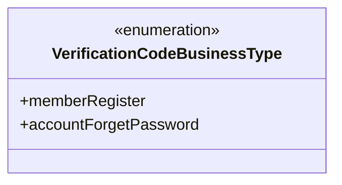
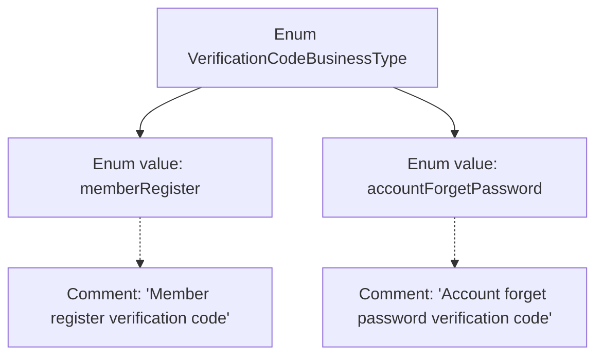

# Basic Information

|      |      |
|------|------|
| Name | VerificationCodeBusinessType |
| Language | .java |
| Code Path | WeFe/common/java/common-wefe/src/main/java/com/welab/wefe/common/wefe/enums/VerificationCodeBusinessType.java |
| Package Name | com.welab.wefe.common.wefe.enums |
| Dependencies | [] |
| Brief Description | The enumeration VerificationCodeBusinessType defines two types of verification code business scenarios: member registration and account password recovery. |

# Description

The content defines an enumeration type named VerificationCodeBusinessType, which includes two enumeration values: memberRegister and accountForgetPassword. The former is used for the member registration verification code business scenario, while the latter is used for the account forgot password verification code business scenario. Each enumeration value is accompanied by a corresponding comment explaining its purpose.

# Class Summary

| Name   | Type  | Description |
|-------|------|-------------|
| VerificationCodeBusinessType | enum | The enumeration VerificationCodeBusinessType defines two business types: member registration verification code and account forgot password verification code. |

## Class VerificationCodeBusinessType

|      |      |
|------|------|
| Access Modifier | public |
| Type | enum |
| Name | VerificationCodeBusinessType |
| Description | The enumeration VerificationCodeBusinessType defines two business types: member registration verification code and account forgot password verification code. |

### UML Class Diagram

This enumeration class defines two verification code business types: `memberRegister` represents member registration verification codes, and `accountForgetPassword` represents account password recovery verification codes. As an enumeration type, it restricts the valid range of verification code business types, ensuring the system only uses predefined business types, thereby improving code readability and security. All enumeration items are public constants and can be directly accessed via the class name.

### Internal Method Call Graph

This flowchart illustrates the structure of the VerificationCodeBusinessType enum, containing two enum values: memberRegister and accountForgetPassword, each accompanied by comments describing their purposes. memberRegister is used for member registration verification code scenarios, while accountForgetPassword is used for account password recovery verification code scenarios. The hierarchical relationships clearly present the association between the enum definition and its values, with comment explanations connected by dashed lines to distinguish primary and secondary relationships.

### Field List

| Name  | Type  | Description |
|-------|-------|------|

### Method List

| Name  | Type  | Description |
|-------|-------|------|

