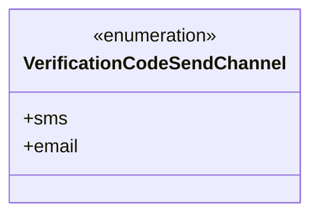
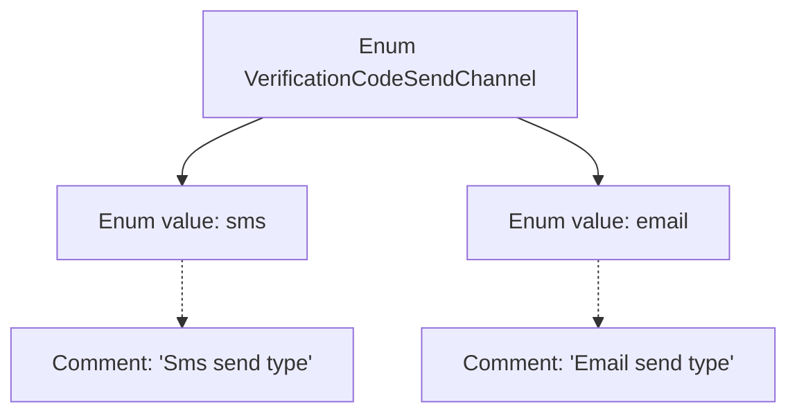

# Basic Information

|      |      |
|------|------|
| Name | VerificationCodeSendChannel |
| Language | .java |
| Code Path | WeFe/common/java/common-wefe/src/main/java/com/welab/wefe/common/wefe/enums/VerificationCodeSendChannel.java |
| Package Name | com.welab.wefe.common.wefe.enums |
| Dependencies | [] |
| Brief Description | Verification code delivery channel enumeration: sms for text message delivery, email for email delivery. |

# Description

This is a public enumeration type named VerificationCodeSendChannel, which defines two channels for sending verification codes. The first is sms, indicating the verification code is sent via SMS; the second is email, indicating the verification code is sent via email. Each value in the enumeration is accompanied by comments explaining its purpose, clearly indicating the type and function of different sending channels. The enumeration structure is concise and straightforward, suitable for scenarios requiring differentiation between various verification code delivery methods.

# Class Summary

| Name   | Type  | Description |
|-------|------|-------------|
| VerificationCodeSendChannel | enum | Verification code delivery channel enumeration: two types, sms text message and email. |

## Class VerificationCodeSendChannel

|      |      |
|------|------|
| Access Modifier | public |
| Type | enum |
| Name | VerificationCodeSendChannel |
| Description | Verification code delivery channel enumeration: two types, sms text message and email. |

### UML Class Diagram

This code defines an enumeration type named VerificationCodeSendChannel, which includes two enum constants: sms and email, representing the two channels for sending verification codes via SMS and email respectively. In the class diagram, the enumeration type is marked with <<enumeration>>, clearly illustrating the structure and usage of this type. Such a design is commonly used in scenarios requiring a restricted set of specific options, ensuring type safety and improving code readability.

### Internal Method Call Graph

This code defines an enum type named VerificationCodeSendChannel, which includes two enum values: sms and email. Each enum value has a corresponding comment explaining its purpose, where sms represents the SMS sending method and email represents the email sending method. Enum types are commonly used to represent a fixed set of constants, and here it clearly defines the two channel types for sending verification codes.

### Field List

| Name  | Type  | Description |
|-------|-------|------|

### Method List

| Name  | Type  | Description |
|-------|-------|------|

