# Basic Information

|      |      |
|------|------|
| Name | enums |
| Language | .java |
| Code Path | WeFe/common/java/common-wefe/src/main/java/com/welab/wefe/common/wefe/enums |
| Package Name | docs.common.java.common-wefe.src.main.java.com.welab.wefe.common.wefe.enums |
| Brief Description | A collection of enumeration types, including service types, environment branches, model languages, user sources, task statuses, data resource types, captcha channels, hash algorithms, federated learning modes, and over 40 business-related enumeration definitions, used for state management and type identification across various system modules. |

# Description

## Overview  
The core responsibility of this module is to provide enumeration type definitions for federated learning systems, covering key areas such as service types, environment configurations, task statuses, and data processing. Interface specifications include environment detection (e.g., `EnvName.isTestEnv`), status judgment (e.g., `JobStatus.finished`), and type conversion (e.g., `ModelExportLanguage.getLanguageSuffix`). Key data structures encompass 11 types of `ServiceType`, 7 types of `JobStatus`, and 14 types of `ModelExportLanguage`, among others. There are no external dependencies. For example, `ServiceType` identifies the `UnionService` gateway service, while `JobStatus` distinguishes between task running/success states.  

## Key Business Scenarios  
The module supports end-to-end federated learning process management, akin to a state machine pattern. It controls business branches via enumerations (e.g., `VerificationCodeSendChannel` selects SMS/email channels), state transitions (e.g., `BloomFilterProgressType` from `Pending` to `Success`), and data processing (e.g., `Binning` selects binning algorithms). Typical applications include multi-environment deployment (`EnvBranch` isolates demo branches), task lifecycle management (`ProjectFlowStatus` tracks editing to success), and access control (`DataResourcePublicLevel` restricts resource visibility). For instance, horizontal federated learning (`FederatedLearningType.horizontal`) employs the XGBoost algorithm (`Algorithm.XGBoost`) to process structured data (`DataResourceType.TableDataSet`).

### Package Internal Structure View

```mermaid
graph TD
    enums --> ServiceType.java
    enums --> env
    enums --> ModelExportLanguage.java
    enums --> BoardUserSource.java
    enums --> DeepLearningJobType.java
    enums --> MessageLevel.java
    enums --> Binning.java
    enums --> VerificationCodeSendChannel.java
    enums --> JobStatus.java
    enums --> HashOptions.java
    enums --> ProjectType.java
    enums --> FederatedLearningModel.java
    enums --> DataResourcePublicLevel.java
    enums --> TaskStatus.java
    enums --> DataResourceType.java
    enums --> ContractName.java
    enums --> SmsBusinessType.java
    enums --> PredictFeatureDataSource.java
    enums --> DataResourceStorageType.java
    enums --> ChatListType.java
    enums --> BloomFilterProgressType.java
    enums --> GatewayProcessorType.java
    enums --> ProducerType.java
    enums --> VerificationCodeBusinessType.java
    enums --> TaskResultType.java
    enums --> ProjectFlowStatisticsStatus.java
    enums --> FileRurpose.java
    enums --> JobMemberRole.java
    enums --> MessageEvent.java
    enums --> ColumnDataType.java
    enums --> FcCloudProvider.java
    enums --> ProjectFlowStatus.java
    enums --> Algorithm.java
    enums --> AuditStatus.java
    enums --> ComponentType.java
    enums --> JobBackendType.java
    enums --> DataResourceUploadStatus.java
    enums --> FlowActionType.java
    enums --> FlowLimitStrategyTypeEnum.java
    enums --> BloomFilterPublicLevel.java
    enums --> PredictType.java
    enums --> DataResourceStorageServiceType.java
    enums --> FederatedLearningType.java
    env --> EnvName.java
    env --> EnvBranch.java
```

This flowchart illustrates the hierarchical structure of enumeration classes in the WeFe project, with the root node being the "enums" directory containing 35 direct child nodes (enumeration class files) and 1 subdirectory "env". The "env" subdirectory further includes 2 enumeration class files. The entire structure clearly reflects the organization of enumeration types in the project, covering various business enumerations such as service types, environment configurations, task statuses, and more.

# File List

| Name   | Type  | Description |
|-------|------|-------------|
| [ServiceType.java](ServiceType.md) | file | The enumeration ServiceType defines 11 service types, including federation service, board service, gateway service, stream service, storage service, FC service, service service, MySQL service, file system, blockchain service, and MongoDB service. |
| [ModelExportLanguage.java](ModelExportLanguage.md) | file | The enumeration class ModelExportLanguage defines 14 programming languages and PMML, providing methods to check language existence, obtain enumeration instances, and retrieve corresponding file extensions. |
| [BoardUserSource.java](BoardUserSource.md) | file | The BoardUserSource enum defines user origins: board_register (registered users) and online_demo (online demo users). |
| [DeepLearningJobType.java](DeepLearningJobType.md) | file | The DeepLearningJobType enum defines two types of deep learning tasks: classification and object detection. |
| [MessageLevel.java](MessageLevel.md) | file | Define message-level enumerations, including four types: success, error, warning, and information. |
| [Binning.java](Binning.md) | file | The Binning enumeration includes three binning methods: Optimal (Chi-square optimal binning), Bucket (equal-width binning), and Quantile (equal-frequency binning). |
| [VerificationCodeSendChannel.java](VerificationCodeSendChannel.md) | file | Verification code delivery channel enumeration: sms for text message delivery, email for email delivery. |
| [JobStatus.java](JobStatus.md) | file | The JobStatus enumeration defines task states: Waiting to Run, Running, Waiting to End, Manually Stopped, Abnormally Terminated, Success, Waiting for Success. It includes methods to check whether a task has ended or is in the process of stopping. |
| [HashOptions.java](HashOptions.md) | file | Hash algorithm options enumeration: MD5, SHA1, NONE (no processing). |
| [ProjectType.java](ProjectType.md) | file | The ProjectType enum defines two project types: MachineLearning (traditional machine learning, using TableDataSet) and DeepLearning (deep learning, using ImageDataSet). |
| [FederatedLearningModel.java](FederatedLearningModel.md) | file | The enumeration of federated learning models includes the OOT mode (model scoring). |
| [DataResourcePublicLevel.java](DataResourcePublicLevel.md) | file | Enumeration of data resource visibility levels: Public (visible to all), PublicWithMemberList (visible to specified members), OnlyMyself (visible only to myself). |
| [TaskStatus.java](TaskStatus.md) | file | Task status enumeration: Waiting to run, Running, Error, Success, Stopped. |
| [DataResourceType.java](DataResourceType.md) | file | The DataResourceType enum defines three types of data: structured datasets (conventional machine learning), image datasets (deep learning), and filter data (Bloom filter). |
| [ContractName.java](ContractName.md) | file | The `ContractName` class contains multiple static string constants that define various contract names, such as member, dataset, permission, real-name authentication, data source, etc. |
| [SmsBusinessType.java](SmsBusinessType.md) | file | The enumeration SmsBusinessType defines two types of SMS services: member registration verification code and account password recovery verification code. |
| [PredictFeatureDataSource.java](PredictFeatureDataSource.md) | file | The PredictFeatureDataSource enumeration defines three data sources: api, code, and sql. |
| [DataResourceStorageType.java](DataResourceStorageType.md) | file | Data resource storage type enumeration: Supports CLICKHOUSE, MYSQL, and LMDB databases. |
| [ChatListType.java](ChatListType.md) | file | Chat list type enumeration: notice indicates system notification messages, chat indicates member chat messages. |
| [BloomFilterProgressType.java](BloomFilterProgressType.md) | file | The enumeration BloomFilterProgressType defines the progress states of a Bloom filter: pending, waiting, ready, running, success, failure. |
| [GatewayProcessorType.java](GatewayProcessorType.md) | file | The GatewayProcessorType enumeration defines various gateway processor types, including key functional modules such as HTTP push, database storage, cache refresh, gateway inspection, and external service management. |
| [ProducerType.java](ProducerType.md) | file | The enumeration ProducerType defines two service types: board (panel service) and gateway (gateway service). |
| [VerificationCodeBusinessType.java](VerificationCodeBusinessType.md) | file | The enumeration VerificationCodeBusinessType defines two types of verification code business scenarios: member registration and account password recovery. |
| [TaskResultType.java](TaskResultType.md) | file | Enumeration of task result types, including data, model, and metrics, covering operation types such as training, evaluation, prediction, and statistics. |
| [ProjectFlowStatisticsStatus.java](ProjectFlowStatisticsStatus.md) | file | Enumeration class defines the project flow statistics status, including four states: editing, running, success, and interrupted, providing state transition methods. |
| [FileRurpose.java](FileRurpose.md) | file | The enumeration type FilePurpose defines a value RealnameAuth for real-name authentication scenarios. |
| [JobMemberRole.java](JobMemberRole.md) | file | The enum JobMemberRole defines task member roles: promoter, provider, arbiter, each with a corresponding index number. |
| [MessageEvent.java](MessageEvent.md) | file | Message event enumeration, including project joining, data resource application and processing results, gateway errors, and email sending failure events. Returns different levels and to-do statuses based on the event type. |
| [ColumnDataType.java](ColumnDataType.md) | file | The enumeration type ColumnDataType defines seven data types: Integer, Long, Double, Boolean, Enum, String, and DateTime. |
| [FcCloudProvider.java](FcCloudProvider.md) | file | The enumeration `FcCloudProvider` defines two cloud service providers: Alibaba Cloud and Tencent Cloud. |
| [ProjectFlowStatus.java](ProjectFlowStatus.md) | file | Project process status enumeration: Editing, Running, Runtime Error, Manually Paused, Waiting to Run, Waiting to End, Success, Waiting for Success. |
| [Algorithm.java](Algorithm.md) | file | An enumeration type Algorithm is defined, containing two algorithms: LogisticRegression and XGBoost. |
| [AuditStatus.java](AuditStatus.md) | file | The enumeration AuditStatus defines three states: auditing, agree, and disagree. |
| [ComponentType.java](ComponentType.md) | file | Enumeration of Federated Learning Components, including data loading, feature processing, statistical analysis, modeling algorithms (Logistic Regression/XGBoost/Deep Learning), and evaluation types, supporting horizontal, vertical, and hybrid federated learning modes. |
| [JobBackendType.java](JobBackendType.md) | file | The JobBackendType enumeration defines three types of job backends: standalone local mode LOCAL, Spark computing framework SPARK, and function computing FC. |
| [DataResourceUploadStatus.java](DataResourceUploadStatus.md) | file | Data resource upload status enumeration: Uploading, Completed, Failed. |
| [FlowActionType.java](FlowActionType.md) | file | The FlowActionType enumeration defines three task operations: run_job to start a task, stop_job to stop a task, and resume_job to resume a task. |
| [FlowLimitStrategyTypeEnum.java](FlowLimitStrategyTypeEnum.md) | file | The FlowLimitStrategyTypeEnum enumeration defines two types of flow limiting strategies: IP and Mobile. |
| [BloomFilterPublicLevel.java](BloomFilterPublicLevel.md) | file | The BloomFilterPublicLevel enumeration defines three visibility levels: visible to everyone, visible to specified members, and visible only to oneself. |
| [PredictType.java](PredictType.md) | file | The enumeration PredictType defines three types: promoter (model initiator), provider (model provider), and debug (debugging model). |
| [DataResourceStorageServiceType.java](DataResourceStorageServiceType.md) | file | The enumeration DataResourceStorageServiceType defines two storage types: local file system and storage service. |
| [FederatedLearningType.java](FederatedLearningType.md) | file | The enumeration FederatedLearningType defines three types of federated learning: horizontal, vertical, and mix. |
| [env](env/_module.md) | package | The EnvName enumeration defines four environments: dev, fat, prod, and none, providing the isTestEnv and isProductionEnv methods to determine the environment type. The EnvBranch enumeration includes two branch types: master and online_demo. |

