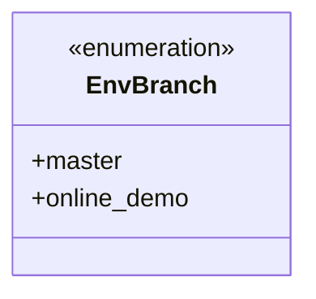
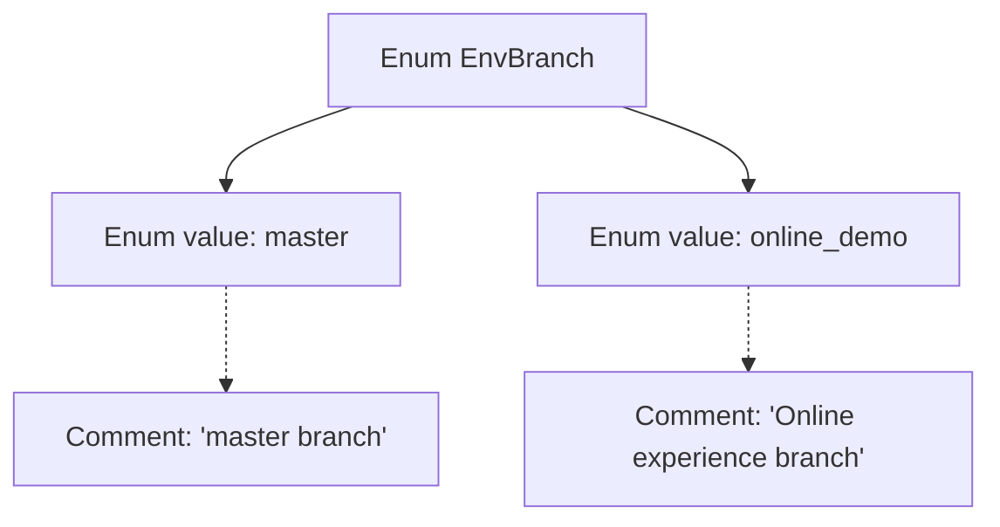

# Basic Information

|      |      |
|------|------|
| Name | EnvBranch |
| Language | .java |
| Code Path | WeFe/common/java/common-wefe/src/main/java/com/welab/wefe/common/wefe/enums/env/EnvBranch.java |
| Package Name | com.welab.wefe.common.wefe.enums.env |
| Dependencies | [] |
| Brief Description | The EnvBranch enumeration defines two branches: the master main branch and the online_demo online demo branch. |

# Description

EnvBranch is an enumeration type that includes two enum values: master and online_demo. master represents the main branch, while online_demo represents the online demo branch. This enumeration is used to distinguish between different branch types for various environments or purposes.

# Class Summary

| Name   | Type  | Description |
|-------|------|-------------|
| EnvBranch | enum | The EnvBranch enumeration defines two branches: the master main branch and the online_demo online demo branch. |

## Class EnvBranch

|      |      |
|------|------|
| Access Modifier | public |
| Type | enum |
| Name | EnvBranch |
| Description | The EnvBranch enumeration defines two branches: the master main branch and the online_demo online demo branch. |

### UML Class Diagram

This code defines an enumeration type named `EnvBranch`, containing two enum constants: `master` and `online_demo`. `master` represents the main branch, while `online_demo` represents the online demo branch. Enumeration types are used to represent a fixed set of constants, here employed to distinguish between different types of environment branches. The class diagram clearly illustrates the structure of the enumeration, with no complex dependencies—only two public enum values are included.

### Internal Method Call Graph

This flowchart illustrates the structure of the EnvBranch enum, which contains two enum values: master and online_demo, each accompanied by corresponding descriptive comments. 'master' represents the main branch, while 'online_demo' denotes the online experience branch. The arrow connections clearly depict the hierarchical relationship between the enum class and its members, as well as the association between comments and enum values. The overall structure is concise and straightforward, facilitating an easy understanding of the enum's definition and purpose.

### Field List

| Name  | Type  | Description |
|-------|-------|------|

### Method List

| Name  | Type  | Description |
|-------|-------|------|

