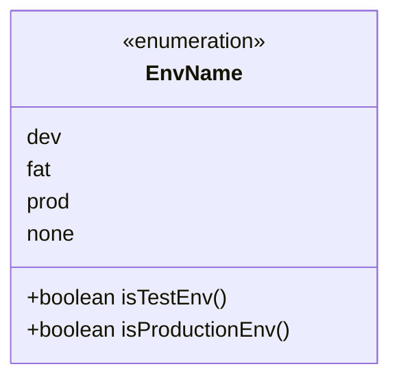
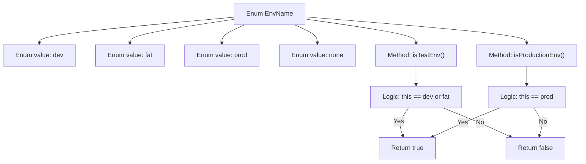

# Basic Information

|      |      |
|------|------|
| Name | EnvName |
| Language | .java |
| Code Path | WeFe/common/java/common-wefe/src/main/java/com/welab/wefe/common/wefe/enums/env/EnvName.java |
| Package Name | com.welab.wefe.common.wefe.enums.env |
| Dependencies | [] |
| Brief Description | The EnvName enumeration defines four environments: dev, fat, prod, and none, providing the isTestEnv and isProductionEnv methods to determine whether it is a test or production environment. |

# Description

The code defines an enumeration type `EnvName` with four enum values: `dev` (development environment), `fat` (testing environment), `prod` (production environment), and `none` (no environment). It provides two methods: `isTestEnv` to determine whether the current environment is a testing environment (`dev` or `fat`), and `isProductionEnv` to check if it is a production environment (`prod`). All other cases return `false`.

# Class Summary

| Name   | Type  | Description |
|-------|------|-------------|
| EnvName | enum | The EnvName enumeration defines four environments: dev, fat, prod, and none, providing the isTestEnv and isProductionEnv methods to determine whether it is a test or production environment. |

## Class EnvName

|      |      |
|------|------|
| Access Modifier | public |
| Type | enum |
| Name | EnvName |
| Description | The EnvName enumeration defines four environments: dev, fat, prod, and none, providing the isTestEnv and isProductionEnv methods to determine whether it is a test or production environment. |

### UML Class Diagram

This code defines an enumeration class named `EnvName` with four enum constants: `dev`, `fat`, `prod`, and `none`. The class provides two methods: `isTestEnv()` to determine whether the current environment is a test environment (`dev` or `fat`), and `isProductionEnv()` to check if it's a production environment (`prod`). The enumeration class implements environment type checks using simple switch-case logic, making it suitable for scenarios requiring differentiation between runtime environments, such as configuration loading or feature toggle control.

### Internal Method Call Graph

This code defines an EnvName enum class with four enum values: dev, fat, prod, and none, and provides two methods: isTestEnv() and isProductionEnv(). The isTestEnv() method returns true when the enum value is dev or fat, indicating a test environment; the isProductionEnv() method returns true only when the enum value is prod, indicating a production environment. The flowchart clearly illustrates the enum structure and the logical flow of the two judgment methods, using conditional branches to identify different environment types.

### Field List

| Name  | Type  | Description |
|-------|-------|------|

### Method List

| Name  | Type  | Description |
|-------|-------|------|

