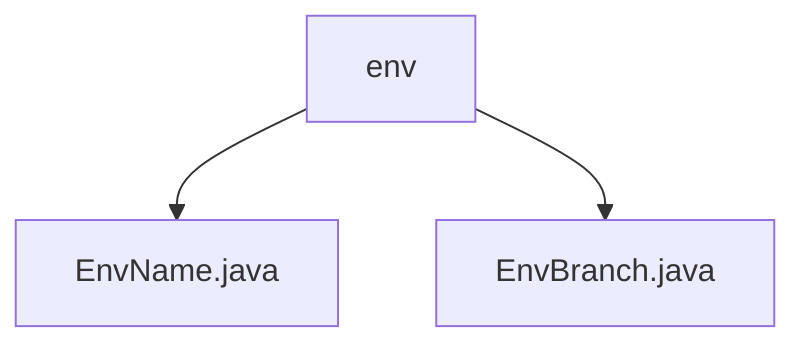

# Basic Information

|      |      |
|------|------|
| Name | env |
| Language | .java |
| Code Path | WeFe/common/java/common-wefe/src/main/java/com/welab/wefe/common/wefe/enums/env |
| Package Name | docs.common.java.common-wefe.src.main.java.com.welab.wefe.common.wefe.enums.env |
| Brief Description | The EnvName enumeration defines four environments: dev, fat, prod, and none, providing the isTestEnv and isProductionEnv methods to determine the environment type. The EnvBranch enumeration includes two branch types: master and online_demo. |

# Description

## Overview  
The core responsibility of this module is to manage environment and branch enumeration types, providing environment detection and branch differentiation functionalities. The interface specifications include the `isTestEnv`/`isProductionEnv` methods of `EnvName`, as well as the enumeration values `master`/`online_demo` of `EnvBranch`. Key data structures are `EnvName` (dev/fat/prod/none) and `EnvBranch` (master/online_demo). There are no external dependencies. For example, `EnvName` can detect test environments, while `EnvBranch` distinguishes between the main branch and demo branch.  

## Primary Business Scenarios  
The module supports multi-environment configuration management, similar to a feature toggle pattern. `EnvName` determines the runtime environment type (e.g., `fat` returns a test status), and `EnvBranch` controls branch flow (e.g., `online_demo` enables demo functionalities). Typical applications include environment-isolated deployment and branch-specific processing, such as disabling debug features in production environments or loading sample data in demo branches.

### Package Internal Structure View

This flowchart illustrates the hierarchy of environment enumeration classes in the WeFe project. The root node "env" contains two enumeration class files: EnvName.java and EnvBranch.java. Both files reside under the same package path and are used to define environment-related enumeration types. The entire structure is clear and concise, reflecting the typical containment relationship between packages and class files in Java projects.

# File List

| Name   | Type  | Description |
|-------|------|-------------|
| [EnvName.java](EnvName.md) | file | The EnvName enumeration defines four environments: dev, fat, prod, and none, and provides the isTestEnv and isProductionEnv methods to determine whether it is a test or production environment. |
| [EnvBranch.java](EnvBranch.md) | file | The EnvBranch enumeration defines two branches: the master main branch and the online_demo online demo branch. |

