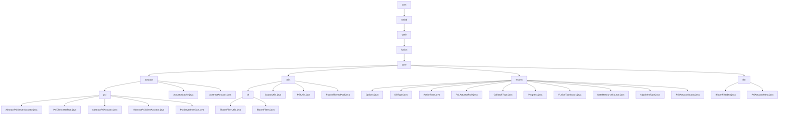

# Basic Information

|      |      |
|------|------|
| Name | com |
| Language | .java |
| Code Path | WeFe/fusion/fusion-core/src/main/java/com |
| Package Name | docs.fusion.fusion-core.src.main.java.com |
| Brief Description | The module implements the Privacy-Preserving Set Intersection (PSI) protocol, including Server/Client base classes, data conversion, and metadata processing, relying on the RSA-PSI algorithm and JObject serialization. The Bloom filter module supports efficient operations and persistence, integrating cryptographic tools and thread pool management. The enumeration module defines key federated learning dimensions such as task status and algorithm types. The DTO module encapsulates Bloom filters and metadata, supporting serialized transmission of PSI protocol components. |

# Description

## Overview  
This module implements the dual-end logic of the Privacy-Preserving Set Intersection (PSI) protocol and federated learning support components. Its core responsibilities include secure data alignment (similar to blind signature processes), Bloom filter operations, and task status management. The interface specifications cover Server/Client abstract base classes, enumeration definitions, and DTO transmission models, such as `dataTransform` for data conversion and `generateBlindingFactor` for metadata download. Key data structures include `BigInteger` encryption parameters, `BitSet` bit collections, `BloomFilterDto` transmission objects, and enumerations like `PSIActuatorRole`. External dependencies involve the `JObject` serialization framework, RSA-PSI algorithms, and Java cryptography components. For example, `ActuatorCache` manages actuator mappings, while `BloomFilterUtils` simplifies I/O operations.  

## Key Business Scenarios  
The typical workflow follows Client initialization → metadata exchange → bucket encryption → Server matching → result return, adopting a multi-threaded pagination approach similar to MapReduce. Full functionality covers data preprocessing (e.g., `parseAndMatch`), cryptographic conversion (RSA/DH algorithms), status coordination (`FusionTaskStatus` enumeration), and filter persistence (`writeTo`/`readFrom`). The interaction mode is role-based (server/client) and state-driven (e.g., `Progress.Ready` triggers execution). API types include basic operations (`add`/`contains`), cryptographic functions (`generateKeys`), and thread pool task submission. For instance, MD5 hashing ensures data consistency, `AlgorithmType.DH` supports key exchange, and the DTO pattern enables cross-node transmission.

### Package Internal Structure View

This flowchart illustrates the complete Java package structure of the WeFe Fusion Core module, starting from the root directory 'com' and expanding hierarchically to the final implementation files. The core module is divided into four main branches: actuator, utility classes (utils), enumerations (enums), and data transfer objects (dto). The actuator branch contains PSI protocol implementations, the utility classes include Bloom filter and cryptographic tools, the enumerations define all system state types, and the data objects encompass core data transmission structures.

# File List

| Name   | Type  | Description |
|-------|------|-------------|
| [welab](welab/_module.md) | package | The module implements the Private Set Intersection (PSI) protocol, including Server/Client base classes, data conversion, and metadata processing, relying on the RSA-PSI algorithm and JObject serialization. The Bloom filter module supports efficient operations and persistence, integrating cryptographic tools and thread pool management. The enumeration module defines key federated learning dimensions such as task status and algorithm types. The DTO module encapsulates Bloom filters and metadata, supporting serialized transmission of PSI protocol components. |

