# Basic Information

|      |      |
|------|------|
| Name | core |
| Language | .java |
| Code Path | WeFe/fusion/fusion-core/src/main/java/com/welab/wefe/fusion/core |
| Package Name | docs.fusion.fusion-core.src.main.java.com.welab.wefe.fusion.core |
| Brief Description | The module implements the Privacy-Preserving Set Intersection (PSI) protocol, including Server/Client base classes, data conversion, and metadata processing, relying on the RSA-PSI algorithm and JObject serialization. The Bloom filter module supports efficient operations and persistence, integrating cryptographic tools and thread pool management. The enumeration module defines key federated learning dimensions such as task status and algorithm types. The DTO module encapsulates Bloom filters and metadata, supporting serialized transmission of PSI protocol components. |

# Description

## Overview  
This module implements the dual-end logic of the Privacy-Preserving Set Intersection (PSI) protocol and federated learning support components. Its core responsibilities include secure data alignment (similar to blind signature processes), Bloom filter operations, and task state management. The interface specifications cover Server/Client abstract base classes, enumeration definitions, and DTO transmission models, such as `dataTransform` for data conversion and `generateBlindingFactor` for metadata download. Key data structures include `BigInteger` encryption parameters, `BitSet` bit collections, `BloomFilterDto` transmission objects, and enumerations like `PSIActuatorRole`. External dependencies involve the `JObject` serialization framework, RSA-PSI algorithms, and Java cryptographic components. For example, `ActuatorCache` manages executor mappings, while `BloomFilterUtils` simplifies I/O operations.  

## Key Business Scenarios  
The typical workflow follows Client initialization → metadata exchange → bucket encryption → Server matching → result return, adopting a multi-threaded pagination approach similar to MapReduce. Full functionality covers data preprocessing (e.g., `parseAndMatch`), cryptographic conversion (RSA/DH algorithms), state coordination (`FusionTaskStatus` enumeration), and filter persistence (`writeTo`/`readFrom`). The interaction mode is role-based (server/client) and state-driven (e.g., `Progress.Ready` triggers execution). API types include basic operations (`add`/`contains`), cryptographic functions (`generateKeys`), and thread pool task submission. For instance, MD5 hashing ensures data consistency, `AlgorithmType.DH` supports key exchange, and the DTO pattern enables cross-node transmission.

### Package Internal Structure View

```mermaid
graph TD
    core --> actuator
    core --> utils
    core --> enums
    core --> dto
    actuator --> psi
    actuator --> ActuatorCache.java
    actuator --> AbstractActuator.java
    psi --> AbstractPsiServerActuator.java
    psi --> PsiClientInterface.java
    psi --> AbstractPsiActuator.java
    psi --> AbstractPsiClientActuator.java
    psi --> PsiServerInterface.java
    utils --> bf
    utils --> CryptoUtils.java
    utils --> PSIUtils.java
    utils --> FusionThreadPool.java
    bf --> BloomFilterUtils.java
    bf --> BloomFilters.java
    enums --> Options.java
    enums --> DBType.java
    enums --> ActionType.java
    enums --> PSIActuatorRole.java
    enums --> CallbackType.java
    enums --> Progress.java
    enums --> FusionTaskStatus.java
    enums --> DataResourceSource.java
    enums --> AlgorithmType.java
    enums --> PSIActuatorStatus.java
    dto --> BloomFilterDto.java
    dto --> PsiActuatorMeta.java
```

This flowchart illustrates the code structure of the WeFe fusion core module, comprising four main branches: actuator executors, utils utility classes, enums enumerations, and dto data transfer objects. The actuator branch further subdivides into psi (Private Set Intersection) implementation classes, utils includes utility components such as Bloom filters, enums define various system status enumerations, and dto contains data transfer objects. The overall structure presents clear hierarchical relationships, involving a total of 32 path nodes.

# File List

| Name   | Type  | Description |
|-------|------|-------------|
| [dto](dto/_module.md) | package | The BloomFilterDto class encapsulates Bloom filter data, including count, size, bitSet attributes, and operational methods. The PsiActuatorMeta class contains e, n, bf, and bfDto attributes, providing initialization and configuration methods. |
| [enums](enums/_module.md) | package | The code defines multiple enumeration types: DBType includes six database types; ActionType has five operation types; PSIActuatorRole distinguishes between server and client; CallbackType describes four callback states; Progress and FusionTaskStatus define task progress and status respectively; DataResourceSource lists three data sources; AlgorithmType provides two algorithm choices; PSIActuatorStatus contains six actuator states. |
| [utils](utils/_module.md) | package | The Bloom Filter module supports efficient operations and persistence, designed for big data deduplication and rapid retrieval. It relies on Java standard IO, incorporating BitSet storage and MD5 hashing. Static methods are provided to simplify IO operations, with support for false positive rate initialization. |
| [actuator](actuator/_module.md) | package | This module implements the dual-end logic of the PSI protocol, including the Server and Client base classes and interfaces, supporting encrypted data alignment. The core workflow consists of Client initialization, bucket encryption, Server transformation and matching, and result transmission. It relies on the RSA-PSI algorithm and JObject serialization to ensure thread safety and data consistency. |

