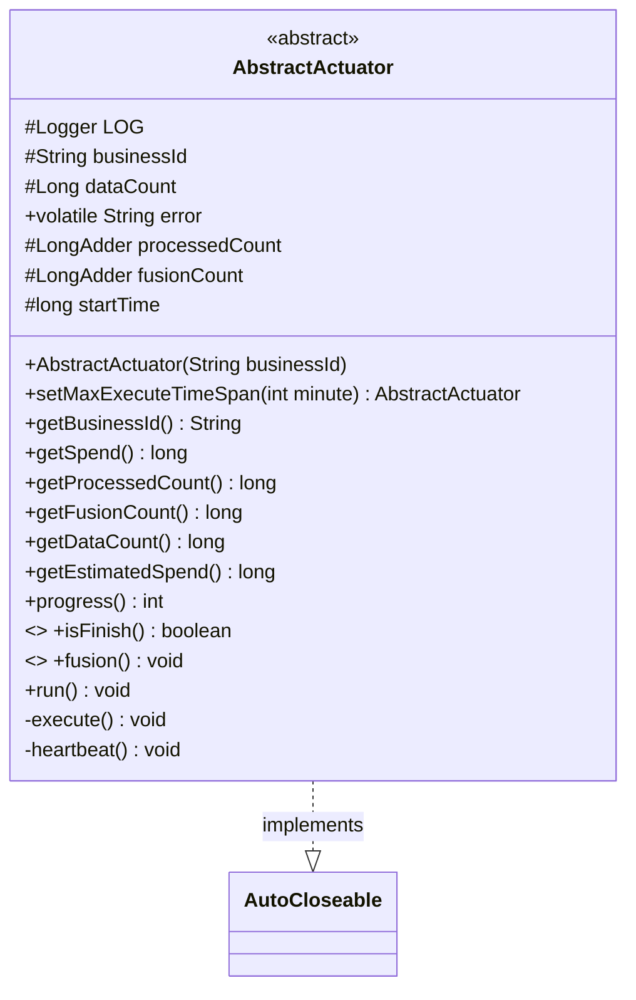

# Basic Information

|      |      |
|------|------|
| Name | AbstractActuator |
| Language | .java |
| Code Path | WeFe/fusion/fusion-core/src/main/java/com/welab/wefe/fusion/core/actuator/AbstractActuator.java |
| Package Name | com.welab.wefe.fusion.core.actuator |
| Dependencies | ['com.welab.wefe.common.TimeSpan', 'com.welab.wefe.common.exception.StatusCodeWithException', 'com.welab.wefe.common.util.StringUtil', 'com.welab.wefe.fusion.core.utils.FusionThreadPool', 'org.slf4j.Logger', 'org.slf4j.LoggerFactory', 'java.util.concurrent.atomic.LongAdder', 'com.welab.wefe.common.util.ThreadUtil.sleep'] |
| Brief Description | The abstract class AbstractActuator implements AutoCloseable, incorporating task execution, progress tracking, and heartbeat detection functionalities. It supports business IDs, data processing counts, error logging, and time consumption calculations. |

# Description

AbstractActuator is an abstract class that implements the AutoCloseable interface, designed for task execution and management. The class contains key attributes such as business ID, data count, error messages, processing count, and fusion count. It provides methods for setting maximum execution time, retrieving business ID, elapsed time, processing count, fusion count, data count, estimated remaining time, and current progress. Core functionalities include the task execution method `fusion` and the runtime method `run`, where the latter executes tasks and performs heartbeat detection via a thread pool. The heartbeat detection continuously monitors task completion or errors, closes tasks upon completion, and clears cached data. The class also incorporates logging and exception handling mechanisms to ensure task execution reliability and traceability.

# Class Summary

| Name   | Type  | Description |
|-------|------|-------------|
| AbstractActuator | class | The abstract class AbstractActuator implements AutoCloseable, incorporating functionalities for task execution, progress tracking, error handling, and heartbeat detection, supporting multi-threaded operation and automatic closure. |

## Class AbstractActuator

|      |      |
|------|------|
| Access Modifier | public abstract |
| Type | class |
| Name | AbstractActuator |
| Description | The abstract class AbstractActuator implements AutoCloseable, incorporating functionalities for task execution, progress tracking, error handling, and heartbeat detection, supporting multi-threaded operation and automatic closure. |

### UML Class Diagram

Class Diagram Description:
AbstractActuator is an abstract class that implements the AutoCloseable interface, primarily designed for task execution and monitoring. It contains core attributes such as businessId, dataCount, and processedCount for task tracking, and provides methods like progress calculation (progress) and time consumption statistics (getSpend). The abstract methods isFinish and fusion require subclass implementation to determine task completion status and execute specific tasks, respectively. Private methods execute and heartbeat handle task execution and heartbeat detection, while the run method initiates these processes via a thread pool. The class design incorporates task monitoring, exception handling, and resource cleanup.

### Internal Method Call Graph

```mermaid
graph TD
    A["Abstract Class AbstractActuator"]
    B["Attribute: Logger LOG"]
    C["Attribute: String businessId"]
    D["Attribute: Long dataCount"]
    E["Attribute: volatile String error"]
    F["Attribute: LongAdder processedCount"]
    G["Attribute: LongAdder fusionCount"]
    H["Attribute: final long startTime"]
    I["Constructor: AbstractActuator(String businessId)"]
    J["Method: setMaxExecuteTimeSpan(int minute)"]
    K["Method: getBusinessId()"]
    L["Method: getSpend()"]
    M["Method: getProcessedCount()"]
    N["Method: getFusionCount()"]
    O["Method: getDataCount()"]
    P["Method: getEstimatedSpend()"]
    Q["Method: progress()"]
    R["Abstract Method: isFinish()"]
    S["Abstract Method: fusion()"]
    T["Method: run()"]
    U["Private Method: execute()"]
    V["Private Method: heartbeat()"]
    W["Invocation: ActuatorCache.set(this)"]
    X["Invocation: FusionThreadPool.run"]
    Y["Logging Operation"]
    Z["Invocation: ActuatorCache.remove"]

    A --> B
    A --> C
    A --> D
    A --> E
    A --> F
    A --> G
    A --> H
    A --> I
    A --> J
    A --> K
    A --> L
    A --> M
    A --> N
    A --> O
    A --> P
    A --> Q
    A --> R
    A --> S
    A --> T
    T --> X
    X --> U
    X --> V
    U --> Y
    U --> S
    V --> Y
    V --> R
    V --> Z
    I --> W
```

This flowchart illustrates the complete structure of the AbstractActuator abstract class, comprising 11 attributes and 14 methods. The core process initiates via the run() method, which spawns two threads to execute execute() and heartbeat() methods: execute() handles core business logic and invokes the abstract method fusion(), while heartbeat() continuously monitors task status and performs resource cleanup upon completion. All methods log runtime status through a logging system and implement instance cache management via ActuatorCache, demonstrating a complete lifecycle of task execution, status monitoring, and resource cleanup.

### Field List

| Name  | Type  | Description |
|-------|-------|------|
| LOG = LoggerFactory.getLogger(getClass()) | Logger | Declare a protected final logger object, initialized with the current class name. |
| businessId | String | Protected business ID string variable. |
| fusionCount = new LongAdder() | LongAdder | Concurrent counter variable, using LongAdder to achieve efficient accumulation. |
| dataCount | Long | Protected long integer data count variable. |
| processedCount = new LongAdder() | LongAdder | Declare a protected LongAdder variable named processedCount for thread-safe cumulative counting. |
| startTime = System.currentTimeMillis() | long | Defined a protected final long variable startTime, with an initial value of the current system time in milliseconds. |
| error | String | Declare a volatile string variable error, visible to multiple threads. |

### Method List

| Name  | Type  | Description |
|-------|-------|------|
| getFusionCount | long | Get the fused count as a long integer value. |
| isFinish | boolean | Abstract method isFinish, returns a boolean value indicating whether it is completed. |
| getEstimatedSpend | long | Calculate estimated cost: If the number of processed items is zero, return the total cost multiplied by the total data count; otherwise, return the unit processing cost multiplied by the remaining unprocessed count. |
| progress | int | This method calculates the processing progress percentage by dividing the processed quantity by the total quantity, multiplying by 100, and returning the rounded result. |
| execute | void | The method `execute` performs the task, calls `fusion()`, logs the start and end, and captures exceptions to record error messages and save the error details. |
| setMaxExecuteTimeSpan | AbstractActuator | The method `setMaxExecuteTimeSpan` sets the maximum execution time (in minutes) and returns the current object. |
| getBusinessId | String | The method returns a businessId string. |
| fusion | void | Abstract method fusion, may throw exceptions. |
| run | void | The method initiates two parallel threads, which execute the task and heartbeat detection respectively. |
| getProcessedCount | long | Get the long integer value of the processed quantity. |
| getSpend | long | This method returns the millisecond difference between the current time and startTime, used for calculating elapsed time. |
| heartbeat | void | Heartbeat detection method, cyclically checks the task status, continues if no errors, otherwise closes the task and records the time consumed, and finally removes the executor. Records errors when exceptions occur. |
| getDataCount | long | Get the data count value and return a long integer result. |

