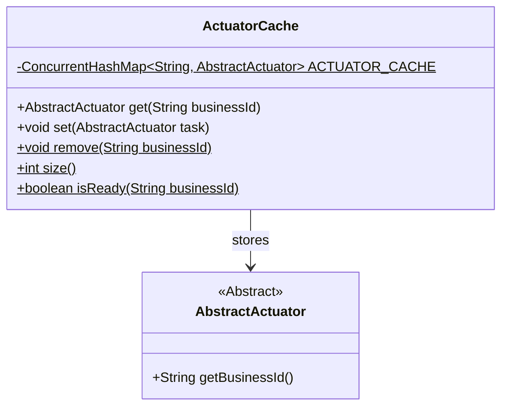
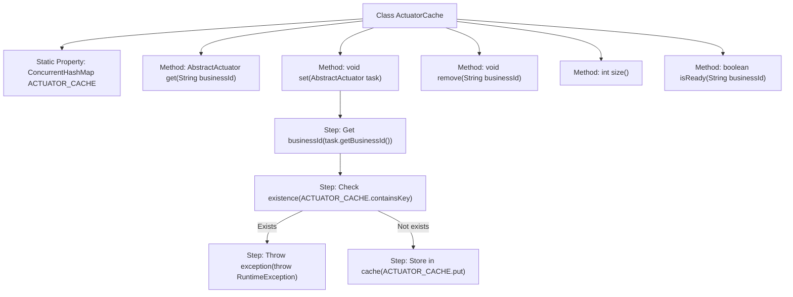

# Basic Information

|      |      |
|------|------|
| Name | ActuatorCache |
| Language | .java |
| Code Path | WeFe/fusion/fusion-core/src/main/java/com/welab/wefe/fusion/core/actuator/ActuatorCache.java |
| Package Name | com.welab.wefe.fusion.core.actuator |
| Dependencies | ['java.util.concurrent.ConcurrentHashMap'] |
| Brief Description | The ActuatorCache class utilizes a ConcurrentHashMap to cache AbstractActuator instances, providing functionalities for retrieval, addition, removal, and querying, while ensuring thread safety and the uniqueness of business IDs. |

# Description

The `ActuatorCache` class is a thread-safe actuator cache management class that uses `ConcurrentHashMap` to store the mapping between business IDs and actuators. It provides the `get` method to retrieve an actuator by querying the business ID. The `set` method for adding an actuator checks for duplicate IDs and throws an exception. The `remove` method can delete the actuator with the specified ID. The `size` method returns the number of cached items. The `isReady` method checks whether an actuator with the specified ID exists. This class ensures thread safety and uniqueness in actuator operations.

# Class Summary

| Name   | Type  | Description |
|-------|------|-------------|
| ActuatorCache | class | The ActuatorCache class utilizes a ConcurrentHashMap to cache AbstractActuator instances, providing functionalities for retrieval, addition, removal, and querying while ensuring thread safety. |

## Class ActuatorCache

|      |      |
|------|------|
| Access Modifier | public |
| Type | class |
| Name | ActuatorCache |
| Description | The ActuatorCache class utilizes a ConcurrentHashMap to cache AbstractActuator instances, providing functionalities for retrieval, addition, removal, and querying while ensuring thread safety. |

### UML Class Diagram

This code demonstrates an actuator caching system ActuatorCache, which utilizes a thread-safe ConcurrentHashMap to store and manage AbstractActuator instances. The class diagram consists of two main components: ActuatorCache serves as a utility class providing cache management functionalities for actuators, including operations like retrieval (get), addition (set), and removal (remove). AbstractActuator acts as an abstract base class requiring subclasses to implement the getBusinessId method. ActuatorCache employs AbstractActuator through a dependency relationship, with all methods being static, indicating this is a singleton-style utility class where ACTUATOR_CACHE as a static final member ensures thread safety.

### Internal Method Call Graph

This code implements a thread-safe actuator caching system using ConcurrentHashMap to store AbstractActuator instances. Core functionalities include retrieving actuators by businessId (get), adding actuators (set, with duplicate checking), removing actuators (remove), getting cache size (size), and checking actuator readiness (isReady). The flowchart illustrates the class structure and key process of the set method: first obtaining businessId, checking for existence, throwing an exception if exists, otherwise storing in cache. All operations ensure thread-safe access through static methods.

### Field List

| Name  | Type  | Description |
|-------|-------|------|
| ACTUATOR_CACHE = new ConcurrentHashMap<>() | ConcurrentHashMap<String, AbstractActuator> | Define a thread-safe static constant hash table with string keys and abstract executor object values, used for caching executor instances. |

### Method List

| Name  | Type  | Description |
|-------|-------|------|
| size | int | This method returns the size of the ACTUATOR_CACHE cache. |
| get | AbstractActuator | Get the executor instance for the specified business ID. |
| set | void | The static method `set` is used to cache executor tasks, checking whether the business ID already exists. If it exists, an exception is thrown; otherwise, the task is stored in the cache. |
| remove | void | Synchronize static method to remove cache items with specified business IDs. |
| isReady | boolean | Check if the specified business ID is ready, return true if it exists, otherwise return false. |

