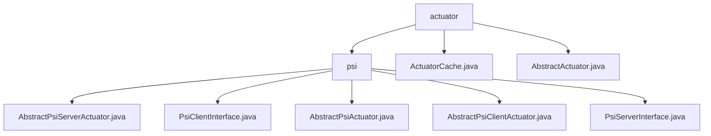

# Basic Information

|      |      |
|------|------|
| Name | actuator |
| Language | .java |
| Code Path | WeFe/fusion/fusion-core/src/main/java/com/welab/wefe/fusion/core/actuator |
| Package Name | docs.fusion.fusion-core.src.main.java.com.welab.wefe.fusion.core.actuator |
| Brief Description | This module implements the dual-end logic of the PSI protocol, including the Server and Client base classes and interfaces, supporting encrypted data alignment. The core workflow consists of Client initialization, bucket encryption, Server transformation and matching, and result transmission. It relies on the RSA-PSI algorithm and JObject serialization to ensure thread safety and data consistency. |

# Description

## Overview  
This module implements the dual-end logic of the Privacy-Preserving Set Intersection (PSI) protocol, with its core responsibility being the secure execution of encrypted data alignment, akin to the blind signature process in secure two-party computation. It provides abstract base classes and interface specifications for Server and Client, including operations such as data transformation (e.g., `dataTransform`) and metadata downloading (e.g., `generateBlindingFactor`). Key data structures involve `BigInteger` encryption parameters, `BloomFilters`, and `PsiActuatorMeta`, relying on the `JObject` serialization framework and the RSA-PSI algorithm. For instance, `ActuatorCache` manages thread-safe executor mappings via `ConcurrentHashMap`, while `AbstractActuator` implements task lifecycle management.  

## Key Business Scenarios  
The typical workflow follows an interaction pattern of Client initialization → metadata retrieval → bucket encryption → Server matching → result retrieval, employing multi-threaded pagination processing similar to MapReduce. Complete functionalities encompass data preprocessing (`parseAndMatch`), encryption transformation (RSA-PSI), state coordination (`volatile` fields), and result persistence. For example, the `execute` method on the Client side processes data buckets, the `receiveResult` method on the Server side receives alignment results, and `AbstractActuator` manages task execution through heartbeat detection and thread pools. Representative integration cases include the `fusion` method coordinating the entire PSI workflow, with `ActuatorCache` ensuring thread safety and uniqueness in executor operations.

### Package Internal Structure View

This flowchart illustrates the package structure of the actuator module in the fusion-core component of the WeFe project. The top level is the actuator directory, which contains a psi subdirectory and two abstract class files. The psi directory includes five interface and abstract class files related to the PSI (Private Set Intersection) protocol, forming a clear hierarchical relationship. The entire structure reflects the code organization approach of the PSI functional module.

# File List

| Name   | Type  | Description |
|-------|------|-------------|
| [ActuatorCache.java](ActuatorCache.md) | file | The ActuatorCache class utilizes a ConcurrentHashMap to cache AbstractActuator instances, providing functionalities for retrieval, addition, deletion, and querying, ensuring thread safety and unique business IDs. |
| [AbstractActuator.java](AbstractActuator.md) | file | The abstract class AbstractActuator implements AutoCloseable and incorporates task execution, progress tracking, and heartbeat detection functionalities. It supports business IDs, data processing counts, error logging, and time consumption calculation. |
| [psi](psi/_module.md) | package | AbstractPsiServerActuator is the abstract class for the PSI protocol server, handling encryption parameters and data conversion. PsiClientInterface defines client functionalities such as data alignment and encryption. AbstractPsiActuator serves as the base abstract class for state management. AbstractPsiClientActuator implements client-side logic, managing data matching and encryption. PsiServerInterface defines server methods including data conversion and result reception. |

