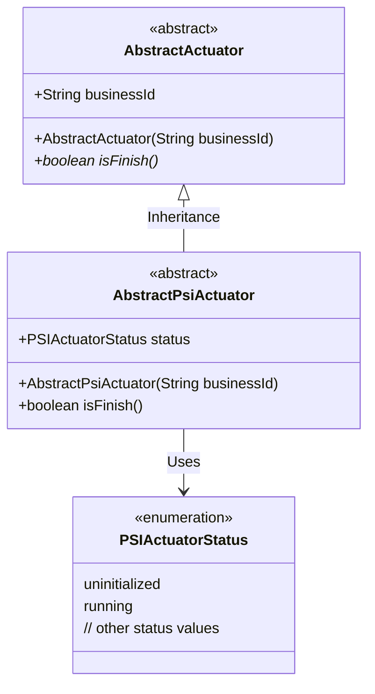
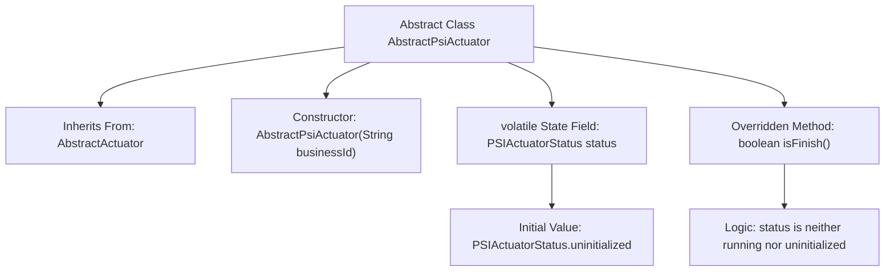

# Basic Information

|      |      |
|------|------|
| Name | AbstractPsiActuator |
| Language | .java |
| Code Path | WeFe/fusion/fusion-core/src/main/java/com/welab/wefe/fusion/core/actuator/psi/AbstractPsiActuator.java |
| Package Name | com.welab.wefe.fusion.core.actuator.psi |
| Dependencies | ['com.welab.wefe.fusion.core.actuator.AbstractActuator', 'com.welab.wefe.fusion.core.enums.PSIActuatorStatus'] |
| Brief Description | The abstract class `AbstractPsiActuator` extends `AbstractActuator`, containing the state variable `status` and the method `isFinish` to check completion. |

# Description

AbstractPsiActuator is an abstract class that inherits from AbstractActuator. It receives the businessId parameter through its constructor and passes it to the parent class. This class contains a volatile-modified status field with a default value of PSIActuatorStatus.uninitialized. It overrides the isFinish method to determine whether the current state is neither running nor uninitialized.

# Class Summary

| Name   | Type  | Description |
|-------|------|-------------|
| AbstractPsiActuator | class | The abstract class AbstractPsiActuator extends AbstractActuator, containing the state variable status and the isFinish method to check for completion. |

## Class AbstractPsiActuator

|      |      |
|------|------|
| Access Modifier | public abstract |
| Type | class |
| Name | AbstractPsiActuator |
| Description | The abstract class AbstractPsiActuator extends AbstractActuator, containing the state variable status and the isFinish method to check for completion. |

### UML Class Diagram

This class diagram illustrates that AbstractPsiActuator inherits from the abstract class AbstractActuator and contains a status field of the PSIActuatorStatus enumeration type. AbstractPsiActuator overrides the isFinish() method, determining completion by checking the status value. The PSIActuatorStatus enumeration includes at least two states—uninitialized and running—to represent different states of the actuator. The entire design embodies the state pattern concept, controlling the actuator's behavior through the status enumeration.

### Internal Method Call Graph

This code illustrates the structure of an abstract class AbstractPsiActuator, which inherits from AbstractActuator and contains a volatile state field. The flowchart clearly presents the class inheritance relationship, constructor, state field initialization, and the logic of the overridden isFinish() method. This method determines whether the actuator has completed by checking the value of the status field. The state management uses volatile to ensure multi-thread visibility, and the judgment logic excludes both running and uninitialized states.

### Field List

| Name  | Type  | Description |
|-------|-------|------|
| status = PSIActuatorStatus.uninitialized | PSIActuatorStatus | The public mutable variable `status`, of type `PSIActuatorStatus`, has an initial value of `uninitialized`. |

### Method List

| Name  | Type  | Description |
|-------|-------|------|
| isFinish | boolean | Check if the status is completed: returns true when not running and not uninitialized. |

