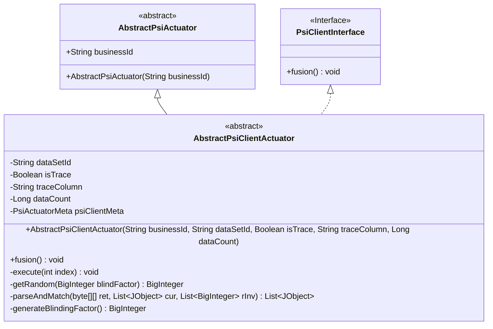
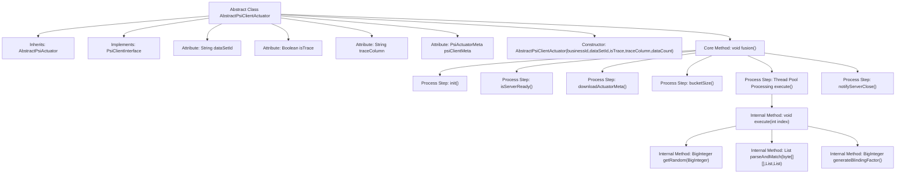
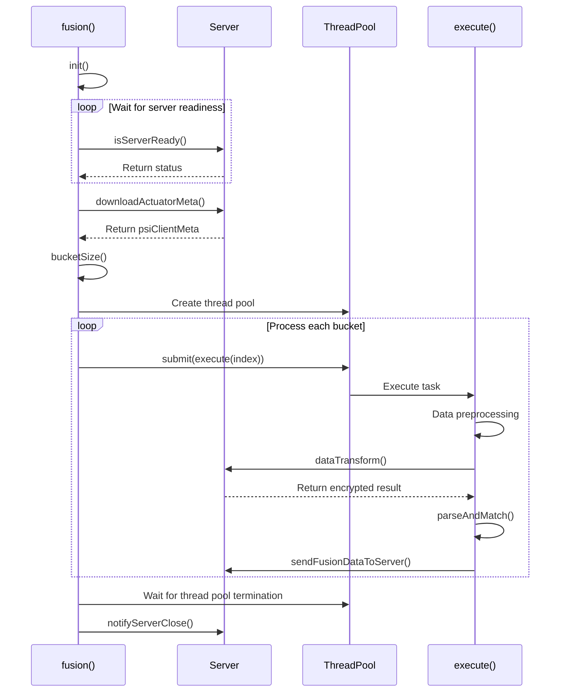

# Basic Information

|      |      |
|------|------|
| Name | AbstractPsiClientActuator |
| Language | .java |
| Code Path | WeFe/fusion/fusion-core/src/main/java/com/welab/wefe/fusion/core/actuator/psi/AbstractPsiClientActuator.java |
| Package Name | com.welab.wefe.fusion.core.actuator.psi |
| Dependencies | ['java.math.BigInteger', 'java.security.SecureRandom', 'java.util.ArrayList', 'java.util.List', 'java.util.concurrent.ExecutorService', 'java.util.concurrent.Executors', 'java.util.concurrent.TimeUnit', 'com.welab.wefe.common.exception.StatusCodeWithException', 'com.welab.wefe.common.util.JObject', 'com.welab.wefe.common.util.ThreadUtil', 'com.welab.wefe.fusion.core.dto.PsiActuatorMeta', 'com.welab.wefe.fusion.core.enums.PSIActuatorStatus', 'com.welab.wefe.fusion.core.utils.PSIUtils'] |
| Brief Description | The abstract class AbstractPsiClientActuator implements PSI client logic, encompassing data fusion, encryption processing, and matching functionality. It employs multithreading to handle data buckets, supports blind factor generation and data transformation, and ultimately sends the matching results to the server. |

# Description

The AbstractPsiClientActuator is an abstract class that inherits from AbstractPsiActuator and implements the PsiClientInterface. It includes attributes such as dataset ID, trace flag, and trace columns, along with PSI client metadata. The constructor initializes the business ID, dataset ID, trace flag, trace columns, and data count. The primary method, `fusion`, is responsible for initialization, waiting for server readiness, downloading metadata, and parallel execution of data processing tasks. The `execute` method handles data buckets, including data preprocessing, transformation, matching, and result transmission. The `parseAndMatch` method parses encrypted data and performs matching while recording memory usage. The `generateBlindingFactor` method generates blinding factors for data encryption. The entire process involves multithreading, data transformation, and matching, ultimately sending the fused data to the server.

# Class Summary

| Name   | Type  | Description |
|-------|------|-------------|
| AbstractPsiClientActuator | class | The abstract class AbstractPsiClientActuator implements PSI client logic, encompassing data preprocessing, encrypted transmission, matching processing, and multithreaded execution capabilities, designed for private set intersection in secure multi-party computation. |

## Class AbstractPsiClientActuator

|      |      |
|------|------|
| Access Modifier | public abstract |
| Type | class |
| Name | AbstractPsiClientActuator |
| Description | The abstract class AbstractPsiClientActuator implements PSI client logic, encompassing data preprocessing, encrypted transmission, matching processing, and multithreaded execution capabilities, designed for private set intersection in secure multi-party computation. |

### UML Class Diagram

Class Diagram Description: This diagram illustrates the structure where the abstract class AbstractPsiClientActuator inherits from AbstractPsiActuator and implements the PsiClientInterface. AbstractPsiClientActuator contains private fields such as dataSetId, isTrace, etc., along with core methods like fusion() for data fusion processing. Internally, it executes the execute() method in parallel via a thread pool to complete data transformation and matching. The class also defines multiple private helper methods, including parseAndMatch() for data parsing and matching, generateBlindingFactor() for generating random factors, collectively implementing the PSI (Private Set Intersection) protocol client functionality.

### Internal Method Call Graph

This flowchart illustrates the core processing logic of a PSI (Private Set Intersection) client. The abstract class AbstractPsiClientActuator executes privacy-preserving computation tasks through multithreading, with key steps including: parameter initialization, waiting for server readiness, downloading metadata, creating thread pools for parallel bucket processing, performing privacy operations (blinding/encryption/matching), and finally notifying server shutdown. The sequence diagram details the interaction between the fusion() method and other components, particularly highlighting critical steps in thread pool management and server communication, demonstrating a typical processing pattern for high-performance privacy-preserving computation tasks.

### Field List

| Name  | Type  | Description |
|-------|-------|------|
| psiClientMeta | PsiActuatorMeta | The private variable psiClientMeta, of type PsiActuatorMeta. |
| traceColumn | String | Declare a protected string variable named traceColumn. |
| dataSetId | String | Dataset ID String Protection Field |
| isTrace | Boolean | The boolean variable isTrace is used to control whether the trace function is enabled. |

### Method List

| Name  | Type  | Description |
|-------|-------|------|
| fusion | void | After initialization, the method fusion waits for the service to be ready, downloads metadata, and retrieves bucket sizes. It uses a thread pool to execute tasks in parallel, updates the status upon completion, and notifies the service to shut down. |
| generateBlindingFactor | BigInteger | Generate a random blinding factor, ensuring it is coprime with N and neither 0 nor 1. |
| execute | void | The method execute processes data: retrieves data, generates blind factors and random numbers, preprocesses and converts the data format, matches results, and sends them to the server. |
| parseAndMatch | List<JObject> | Parse the byte array and match it with the current list to generate a new list. Record memory and processor information. Return the matching results. |
| getRandom | BigInteger | Method for generating random numbers: Compute the e-th power of the blind factor `blindFactor` modulo n, where e and n are obtained from `psiClientMeta`. |

