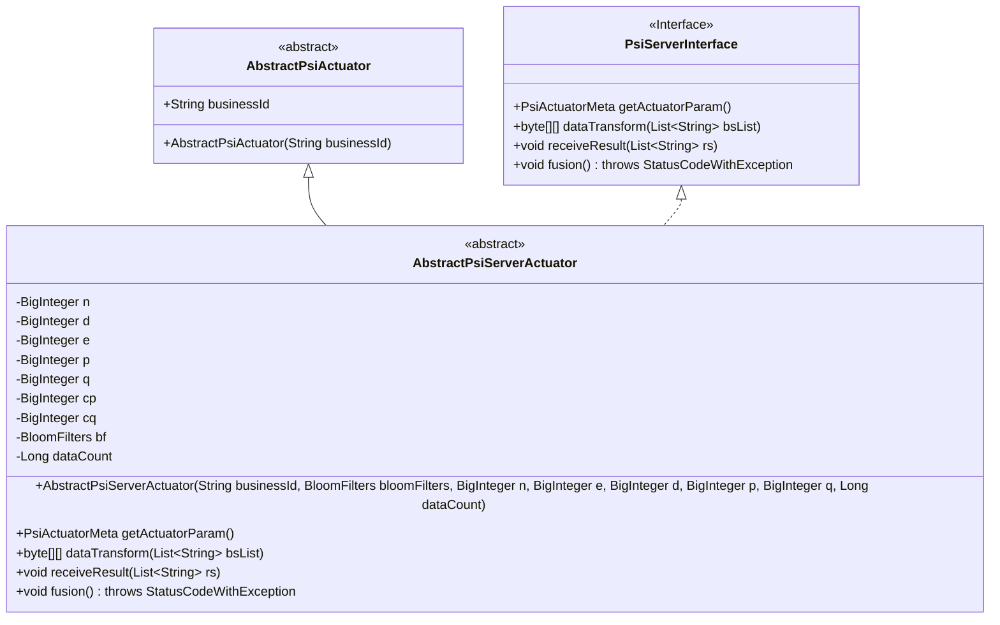
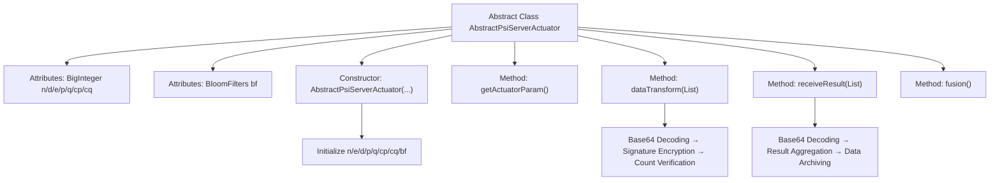

# Basic Information

|      |      |
|------|------|
| Name | AbstractPsiServerActuator |
| Language | .java |
| Code Path | WeFe/fusion/fusion-core/src/main/java/com/welab/wefe/fusion/core/actuator/psi/AbstractPsiServerActuator.java |
| Package Name | com.welab.wefe.fusion.core.actuator.psi |
| Dependencies | ['java.math.BigInteger', 'java.util.ArrayList', 'java.util.List', 'com.welab.wefe.common.exception.StatusCodeWithException', 'com.welab.wefe.common.util.Base64Util', 'com.welab.wefe.common.util.JObject', 'com.welab.wefe.fusion.core.dto.PsiActuatorMeta', 'com.welab.wefe.fusion.core.utils.CryptoUtils', 'com.welab.wefe.fusion.core.utils.bf.BloomFilters'] |
| Brief Description | The abstract class AbstractPsiServerActuator implements the PSI server-side logic, incorporating RSA parameters and a Bloom filter. It provides data encryption/transformation and result reception functionalities, while handling gateway retry mechanisms. |

# Description

AbstractPsiServerActuator is an abstract class that inherits from AbstractPsiActuator and implements the PsiServerInterface interface. This class is primarily used for server-side operations in the PSI (Private Set Intersection) protocol, containing multiple cryptographic parameters of BigInteger type (n, d, e, p, q, cp, cq) and a BloomFilters object. The constructor initializes these parameters and calculates the values of cp and cq. It provides the getActuatorParam method to retrieve actuator metadata, the dataTransform method to encrypt and transform input data while handling count issues caused by retry mechanisms, and the receiveResult method to receive and process result data, also addressing count issues. The fusion method is left unimplemented. The entire class involves cryptographic operations, data transformation, and result processing, serving to implement the server-side functionality of the PSI protocol.

# Class Summary

| Name   | Type  | Description |
|-------|------|-------------|
| AbstractPsiServerActuator | class | The abstract class AbstractPsiServerActuator implements PSI server-side logic, incorporating RSA encryption parameters and a Bloom filter, providing data conversion and result reception functionality, while handling gateway retry mechanisms. |

## Class AbstractPsiServerActuator

|      |      |
|------|------|
| Access Modifier | public abstract |
| Type | class |
| Name | AbstractPsiServerActuator |
| Description | The abstract class AbstractPsiServerActuator implements PSI server-side logic, incorporating RSA encryption parameters and a Bloom filter, providing data conversion and result reception functionality, while handling gateway retry mechanisms. |

### UML Class Diagram

This code illustrates the class diagram structure of an abstract class `AbstractPsiServerActuator`, which inherits from `AbstractPsiActuator` and implements the `PsiServerInterface`. Its core functionality involves server-side implementation of the PSI (Private Set Intersection) protocol, encompassing cryptographic parameter management (large integers such as n/d/e/p/q), data transformation (`dataTransform`), and result processing (`receiveResult`). The class utilizes Bloom filters for data validation, processes data via Base64 and cryptographic utility classes, and incorporates data count protection as an anti-retry mechanism. This design reflects the integration of cryptographic operations with business logic, catering to secure multi-party computation requirements in privacy-preserving computing scenarios.

### Internal Method Call Graph

This flowchart illustrates the core structure of the PSI server actuator, encompassing three key processes: encryption parameter initialization, data transformation, and result reception. The constructor initializes RSA parameters and Bloom Filters, the dataTransform method implements Base64 decoding and signature encryption, while receiveResult processes result data and tallies matching quantities. All processes incorporate data count verification with anti-retry mechanisms to ensure data accuracy in gateway retry scenarios.

### Field List

| Name  | Type  | Description |
|-------|-------|------|
| d | BigInteger | Declared a protected BigInteger variable named d. |
| cq | BigInteger | The protected big integer variable cq. |
| e | BigInteger | The protected BigInteger variable e. |
| p | BigInteger | Declare a protected BigInteger type variable p. |
| bf | BloomFilters | Declare a protected Bloom filter variable bf. |
| n | BigInteger | Declare a protected BigInteger type variable n. |
| q | BigInteger | The protected big integer variable q. |
| cp | BigInteger | The large integer variable cp with a protective declaration. |

### Method List

| Name  | Type  | Description |
|-------|-------|------|
| getActuatorParam | PsiActuatorMeta | The method getActuatorParam returns a PsiActuatorMeta object, constructed using parameters e, n, and bf. |
| dataTransform | byte[][] | The method converts a list of strings into a byte array and performs encryption processing, records the number of processed items, checks whether the limit is exceeded, and finally encrypts and returns the result again. |
| receiveResult | void | The method receives the result list, records its size, and updates the count. If the count exceeds the data volume, it resets. After decoding the results into a JObject, it stores them. |
| fusion | void | Override the method `fusion`, which may throw a `StatusCodeWithException` exception. The current implementation is empty. |

