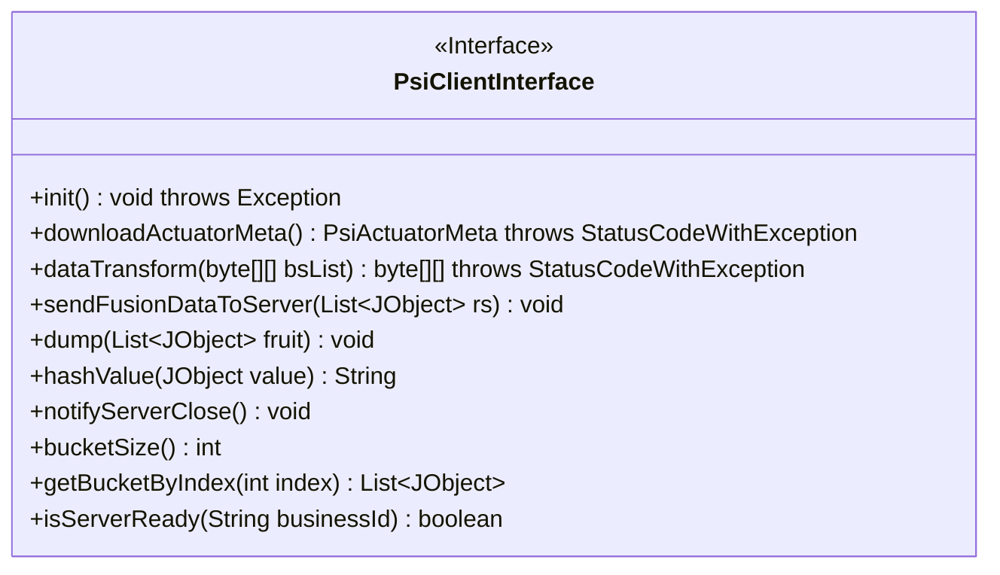
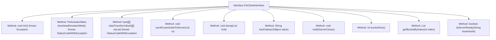

# Basic Information

|      |      |
|------|------|
| Name | PsiClientInterface |
| Language | .java |
| Code Path | WeFe/fusion/fusion-core/src/main/java/com/welab/wefe/fusion/core/actuator/psi/PsiClientInterface.java |
| Package Name | com.welab.wefe.fusion.core.actuator.psi |
| Dependencies | ['com.welab.wefe.common.exception.StatusCodeWithException', 'com.welab.wefe.common.util.JObject', 'com.welab.wefe.fusion.core.dto.PsiActuatorMeta', 'java.util.List'] |
| Brief Description | The PsiClientInterface defines PSI client functionalities, including initialization, metadata downloading, data conversion, sending aligned data, primary key hashing, shutdown notification, paginated data retrieval, and service status checking. |

# Description

The interface defines PSI (Private Set Intersection) client functionalities, including initialization, metadata download, data transformation, aligned data transmission, data storage, primary key hashing, task closure notification, bucketing operations, and service status checks. Core features involve RSA-PSI encryption transformation, Bloom filter parameter retrieval, paginated data fetching, and service coordination, designed for secure data alignment in privacy-preserving computation scenarios.

# Class Summary

| Name   | Type  | Description |
|-------|------|-------------|
| PsiClientInterface | interface | The PsiClientInterface defines the core functionalities of a PSI (Private Set Intersection) client, including initialization, parameter downloading, data transformation, data alignment, primary key hashing, shutdown notification, paginated data retrieval, and service status checking. |

## Class PsiClientInterface

|      |      |
|------|------|
| Access Modifier | public |
| Type | interface |
| Name | PsiClientInterface |
| Description | The PsiClientInterface defines the core functionalities of a PSI (Private Set Intersection) client, including initialization, parameter downloading, data transformation, data alignment, primary key hashing, shutdown notification, paginated data retrieval, and service status checking. |

### UML Class Diagram

This diagram illustrates an interface named `PsiClientInterface`, which defines the core functionalities required for a Privacy-Preserving Set Intersection (PSI) client. The interface comprises 10 methods, primarily including: connection initialization, metadata downloading, data transformation, data transmission, data storage, hash computation, and service status checking. The methods involve exception handling (`throws`), generic collections (`List~JObject~`), and specific return types, reflecting the client-service contract needed for PSI protocol implementation. The interface is marked as `<<Interface>>`, with all methods being public abstract methods, conforming to interface design specifications.

### Internal Method Call Graph

This flowchart illustrates all method definitions and their relationships within the PsiClientInterface. The interface defines 11 core functionalities required for a PSI (Private Set Intersection) client, including initialization, metadata downloading, data transformation, data transmission, hash computation, and status checking. Each method is connected to the interface body via arrows, clearly presenting the method structure. Collectively, these methods form a complete PSI client protocol for implementing secure computation workflows in private set intersection.

### Field List

| Name  | Type  | Description |
|-------|-------|------|

### Method List

| Name  | Type  | Description |
|-------|-------|------|
| dataTransform | byte[][] | Convert the two-dimensional byte array bsList with data transformation, which may throw a StatusCodeWithException. |
| sendFusionDataToServer | void | Function to send a list of JSON objects to the server. |
| getBucketByIndex | List<JObject> | Get the bucket data at the specified index and return a list of JObject. |
| hashValue | String | The method `hashValue` takes a `JObject` parameter and returns its hash value in string form. |
| dump | void | The function `dump` takes a list parameter `fruit` of type `JObject`, which is used to process or output the contents of the list. |
| bucketSize | int | Get the size of the bucket. |
| notifyServerClose | void | Notification Server Shutdown |
| init | void | Initialization method, may throw exceptions. |
| downloadActuatorMeta | PsiActuatorMeta | Method to obtain executor metadata, may throw status code exceptions. |
| isServerReady | boolean | Check if the server for the specified business ID is ready. |

