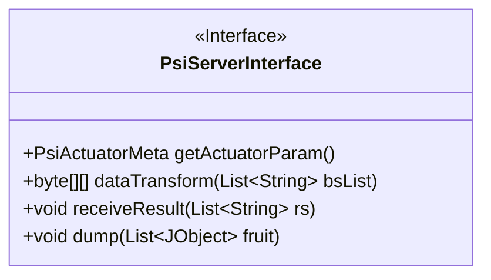
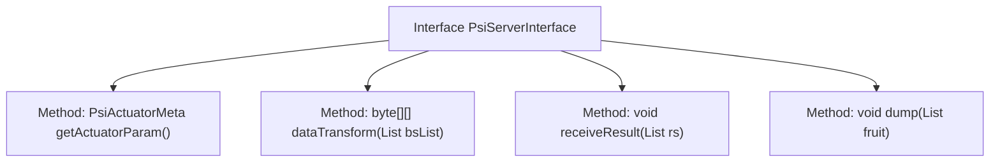

# Basic Information

|      |      |
|------|------|
| Name | PsiServerInterface |
| Language | .java |
| Code Path | WeFe/fusion/fusion-core/src/main/java/com/welab/wefe/fusion/core/actuator/psi/PsiServerInterface.java |
| Package Name | com.welab.wefe.fusion.core.actuator.psi |
| Dependencies | ['com.welab.wefe.common.util.JObject', 'com.welab.wefe.fusion.core.dto.PsiActuatorMeta', 'java.util.List'] |
| Brief Description | PsiServerInterface interface definition: get execution parameters getActuatorParam, data transformation dataTransform, receive results receiveResult, data storage dump. |

# Description

The content defines a Java interface named `PsiServerInterface`, which includes four core methods. The `getActuatorParam` method returns a `PsiActuatorMeta` type object for retrieving actuator parameters. The `dataTransform` method accepts a list of strings and returns a two-dimensional byte array to perform data transformation. The `receiveResult` method is used to receive fusion results, with its parameter being a list of strings. The `dump` method implements data alignment functionality, accepting a list of `JObject` objects as parameters. Comments explain the purposes of each method, including operations for receiving results and aligning data.

# Class Summary

| Name   | Type  | Description |
|-------|------|-------------|
| PsiServerInterface | interface | Interface definition of PsiServerInterface: get actuator parameters getActuatorParam, data transformation dataTransform, receive results receiveResult, data storage dump. |

## Class PsiServerInterface

|      |      |
|------|------|
| Access Modifier | public |
| Type | interface |
| Name | PsiServerInterface |
| Description | Interface definition of PsiServerInterface: get actuator parameters getActuatorParam, data transformation dataTransform, receive results receiveResult, data storage dump. |

### UML Class Diagram

This class diagram describes an interface named PsiServerInterface, which defines four public methods: getActuatorParam() for retrieving actuator metadata, dataTransform() for data transformation, receiveResult() for receiving fusion results, and dump() for storing aligned data into a repository. The interface utilizes generic parameters List to handle different types of data, reflecting its core functionality in data processing and communication.

### Internal Method Call Graph

This flowchart illustrates the structure of the PsiServerInterface, which comprises four core methods: getActuatorParam for retrieving actuator metadata, dataTransform for processing data conversion of string lists, receiveResult for receiving fusion results, and dump for implementing data alignment and storage functionality. All methods are connected to the interface body via unidirectional arrows, clearly presenting the contract-based design pattern of the interface and emphasizing the method specifications that implementing classes must adhere to.

### Field List

| Name  | Type  | Description |
|-------|-------|------|

### Method List

| Name  | Type  | Description |
|-------|-------|------|
| getActuatorParam | PsiActuatorMeta | Methods for Obtaining Executor Parameters. |
| dataTransform | byte[][] | Function to convert a list of strings into a two-dimensional byte array. |
| receiveResult | void | Methods for receiving string list results. |
| dump | void | The function `dump` takes a list parameter `fruit` of type `JObject` for processing or outputting data. |

