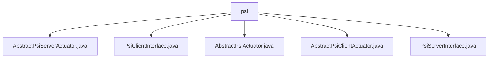

# Basic Information

|      |      |
|------|------|
| Name | psi |
| Language | .java |
| Code Path | WeFe/fusion/fusion-core/src/main/java/com/welab/wefe/fusion/core/actuator/psi |
| Package Name | docs.fusion.fusion-core.src.main.java.com.welab.wefe.fusion.core.actuator.psi |
| Brief Description | AbstractPsiServerActuator is the abstract class for the PSI protocol server, handling encryption parameters and data conversion. PsiClientInterface defines client functionalities such as data alignment and encryption. AbstractPsiActuator serves as the base abstract class for state management. AbstractPsiClientActuator implements client-side logic, managing data matching and encryption. PsiServerInterface defines server methods including data conversion and result reception. |

# Description

## Overview  
This module implements the dual-end logic of the PSI (Private Set Intersection) protocol, including the Server and Client abstract base classes and interfaces. Its core responsibility is to securely perform encrypted data alignment, similar to the blind signature process in secure two-party computation. The interface specifications include the data transformation/result reception methods of PsiServerInterface and the metadata download/bucketing operations of PsiClientInterface. Key data structures involve BigInteger encryption parameters (n, d, e, etc.), BloomFilters, and PsiActuatorMeta. External dependencies include the JObject serialization framework and the RSA-PSI encryption algorithm. For example, the Server side processes encryption transformations via the dataTransform method, while the Client side generates blinding factors using generateBlindingFactor.

## Key Business Scenarios  
The typical workflow involves Client initialization → metadata download → bucketing encryption → Server transformation matching → result return. It adopts a multi-threaded pagination processing model, resembling distributed computing like MapReduce. Complete functionalities cover data preprocessing (e.g., parseAndMatch), encryption transformation (e.g., RSA-PSI), status coordination (via volatile status fields), and result persistence. API integration examples include the Client-side execute method handling data buckets and the Server-side receiveResult receiving alignment results. For instance, the Client coordinates the entire PSI process through the fusion method, involving metadata retrieval and parallel task dispatching.

### Package Internal Structure View

This flowchart illustrates the class structure relationships within the PSI actuator module, where all class files reside under the psi directory. It includes five key class files: two abstract base classes (AbstractPsiServerActuator and AbstractPsiClientActuator), one common abstract class (AbstractPsiActuator), and two interface files (PsiClientInterface and PsiServerInterface). Together, these classes form the core implementation framework of the PSI functionality.

# File List

| Name   | Type  | Description |
|-------|------|-------------|
| [AbstractPsiServerActuator.java](AbstractPsiServerActuator.md) | file | The abstract class AbstractPsiServerActuator implements PSI server-side logic, incorporating RSA parameters and a Bloom filter to provide data encryption conversion and result reception functionality, while handling gateway retry mechanisms. |
| [PsiClientInterface.java](PsiClientInterface.md) | file | The PsiClientInterface defines PSI client functionalities, including initialization, metadata downloading, data conversion, sending alignment data, primary key hashing, shutdown notification, paginated data retrieval, and service status checking. |
| [AbstractPsiActuator.java](AbstractPsiActuator.md) | file | The abstract class `AbstractPsiActuator` extends `AbstractActuator`, containing the state variable `status` and the method `isFinish` to check for completion. |
| [AbstractPsiClientActuator.java](AbstractPsiClientActuator.md) | file | The abstract class `AbstractPsiClientActuator` implements PSI client logic, encompassing data fusion, encryption processing, and matching functionality. It utilizes multithreading to handle data buckets, supports blind factor generation and data transformation, and ultimately sends the matching results to the server. |
| [PsiServerInterface.java](PsiServerInterface.md) | file | PsiServerInterface interface definition: get execution parameters getActuatorParam, data transformation dataTransform, receive results receiveResult, data storage dump. |

