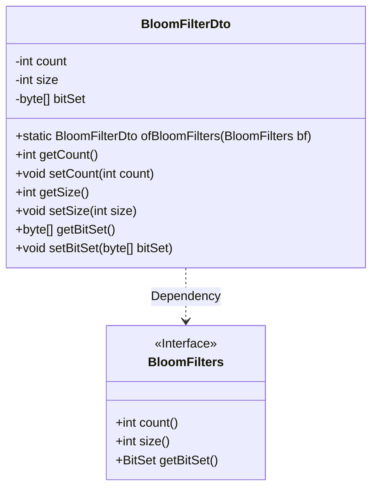
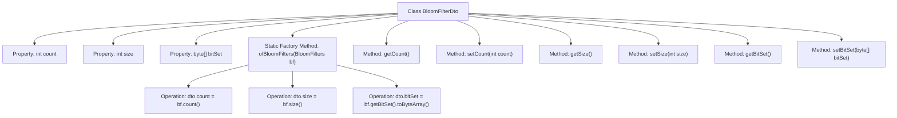

# Basic Information

|      |      |
|------|------|
| Name | BloomFilterDto |
| Language | .java |
| Code Path | WeFe/fusion/fusion-core/src/main/java/com/welab/wefe/fusion/core/dto/BloomFilterDto.java |
| Package Name | com.welab.wefe.fusion.core.dto |
| Dependencies | ['com.welab.wefe.fusion.core.utils.bf.BloomFilters'] |
| Brief Description | The BloomFilterDto class encapsulates Bloom filter data, including count, size, and a byte array of the bit set, providing conversion and access methods. |

# Description

BloomFilterDto is a data transfer object class designed to encapsulate data related to a Bloom filter. This class contains three main attributes: `count` represents the number of elements, `size` indicates the filter size, and `bitSet` is a byte array storing the bit set. It provides a static method `ofBloomFilters` for creating a DTO instance from a BloomFilters object. Additionally, getter and setter methods are included for each attribute to facilitate accessing and modifying these property values.

# Class Summary

| Name   | Type  | Description |
|-------|------|-------------|
| BloomFilterDto | class | The BloomFilterDto class encapsulates Bloom filter data, including the number of elements, the size of the bit set, and the byte array of the bit set, providing conversion and access methods. |

## Class BloomFilterDto

|      |      |
|------|------|
| Access Modifier | public |
| Type | class |
| Name | BloomFilterDto |
| Description | The BloomFilterDto class encapsulates Bloom filter data, including the number of elements, the size of the bit set, and the byte array of the bit set, providing conversion and access methods. |

### UML Class Diagram

This code demonstrates a Data Transfer Object (BloomFilterDto) designed to encapsulate the state data of a Bloom filter (element count, bit array size, and byte array of bitset). It converts data from an instance of the BloomFilters interface via the static factory method ofBloomFilters, providing standard getter/setter methods. The class diagram clearly illustrates the dependency relationship between the DTO and the BloomFilters interface, along with their respective data structures and operations.

### Internal Method Call Graph

This flowchart illustrates the structure and key methods of the BloomFilterDto class. The class contains three private properties (count/size/bitSet) with corresponding getter/setter methods. The core functionality is achieved through the static factory method ofBloomFilters, which converts a BloomFilters object into a DTO object. The conversion process involves three critical operations: retrieving the count value, size value from the source object, and converting the bitSet into a byte array, fully presenting the data flow of the transformation and the relationships between class members.

### Field List

| Name  | Type  | Description |
|-------|-------|------|
| count | int | private int variable count. |
| size | int | private int variable size |
| bitSet | byte[] | The private byte array bitSet is used to store bit set data. |

### Method List

| Name  | Type  | Description |
|-------|-------|------|
| getCount | int | Methods to obtain the count value, returns an integer variable count. |
| setCount | void | The method to set the count attribute assigns the parameter count to the class's count member variable. |
| ofBloomFilters | BloomFilterDto | Convert the BloomFilters object into a BloomFilterDto object, including the count, size, and bitSet attributes. |
| getSize | int | Methods to obtain the size of an object, returning the value of the integer variable size. |
| setSize | void | This is a Java method used to set the size property of an object. It accepts an integer parameter size and assigns it to the object's member variable size. |
| setBitSet | void | Methods for setting a bit set array, assigning the input byte array to the `bitSet` member variable of the class. |
| getBitSet | byte[] | This method returns a byte array bitSet, takes no parameters, and directly returns the value of the member variable bitSet. |

