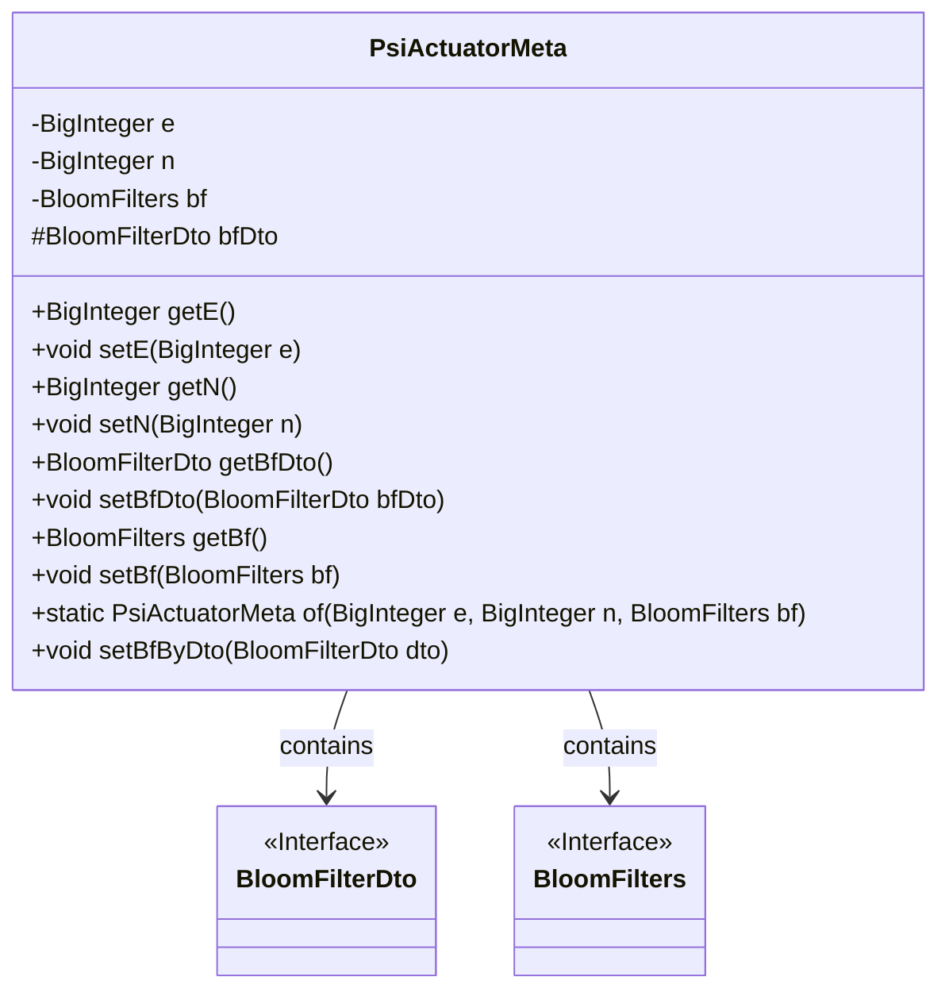
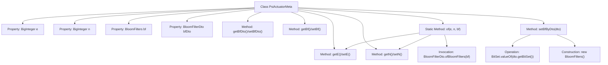

# Basic Information

|      |      |
|------|------|
| Name | PsiActuatorMeta |
| Language | .java |
| Code Path | WeFe/fusion/fusion-core/src/main/java/com/welab/wefe/fusion/core/dto/PsiActuatorMeta.java |
| Package Name | com.welab.wefe.fusion.core.dto |
| Dependencies | ['com.welab.wefe.fusion.core.utils.bf.BloomFilters', 'java.math.BigInteger', 'java.util.BitSet'] |
| Brief Description | The PsiActuatorMeta class includes variables e and n of type BigInteger, a variable bf of type BloomFilters, and a variable bfDto of type BloomFilterDto. It provides getter/setter methods, supports instance creation via the of method, and allows setting bf through the setBfByDto method. |

# Description

The PsiActuatorMeta class encapsulates the metadata of a PSI actuator, containing two BigInteger-type attributes e and n, as well as a BloomFilters object bf and a BloomFilterDto object bfDto. It provides getter and setter methods to manipulate these attributes. The static method of is used to create an instance and initialize bfDto, e, and n. The setBfByDto method sets the bf attribute via the BloomFilterDto object, constructing a new BloomFilters instance based on the dto's bitSet, size, and count parameters.

# Class Summary

| Name   | Type  | Description |
|-------|------|-------------|
| PsiActuatorMeta | class | The PsiActuatorMeta class includes BigInteger-type e and n, BloomFilters-type bf, and BloomFilterDto-type bfDto, providing getter/setter methods. It supports instance creation via the of method and allows setting bf through the setBfByDto method. |

## Class PsiActuatorMeta

|      |      |
|------|------|
| Access Modifier | public |
| Type | class |
| Name | PsiActuatorMeta |
| Description | The PsiActuatorMeta class includes BigInteger-type e and n, BloomFilters-type bf, and BloomFilterDto-type bfDto, providing getter/setter methods. It supports instance creation via the of method and allows setting bf through the setBfByDto method. |

### UML Class Diagram

This class diagram illustrates the structure of the PsiActuatorMeta class, which includes two private BigInteger attributes (e and n), a private BloomFilters attribute (bf), and a protected BloomFilterDto attribute (bfDto). The class provides getter and setter methods for these attributes, along with two key methods: a static factory method `of` for instance creation and `setBfByDto` for configuring the bf attribute via BloomFilterDto. The dependency relationships between PsiActuatorMeta and BloomFilterDto/BloomFilters indicate its utilization of these interfaces' functionalities.

### Internal Method Call Graph

This code describes a class named PsiActuatorMeta, primarily used for managing metadata of PSI (Private Set Intersection) actuators. The class contains four private properties: two large integers e and n, a Bloom filter object bf, and its data transfer object bfDto. Standard getter/setter methods are provided, with core functionality including instance creation and data initialization via the static factory method of(), as well as Bloom filter reconstruction from DTO through the setBfByDto() method. The flowchart clearly illustrates the class structure, method invocation relationships, and key data conversion processes, particularly the bidirectional conversion logic between Bloom filters and DTOs.

### Field List

| Name  | Type  | Description |
|-------|-------|------|
| e | BigInteger | The private large integer variable e. |
| n | BigInteger | Declare a private big integer variable n. |
| bfDto | BloomFilterDto | Bloom filter data transfer object instance for protection types. |
| bf | BloomFilters | Declared a private BloomFilters type variable bf. |

### Method List

| Name  | Type  | Description |
|-------|-------|------|
| setE | void | Set the value of the public exponent e. |
| setN | void | Set the value of the BigInteger type variable n. |
| setBf | void | The method `setBf` is used to set the `BloomFilters` object to the `bf` property of the current instance. |
| setBfByDto | void | The method `setBfByDto` accepts a `BloomFilterDto` object, extracts the parameters `bitSet`, `size`, and `count` from it, creates a new instance of `BloomFilters`, and assigns it to `bf`. |
| getBf | BloomFilters | Methods to obtain the BloomFilters object, returning the member variable bf. |
| getN | BigInteger | The method getN returns a variable n of type BigInteger. |
| of | PsiActuatorMeta | The static method `of` takes the large integers `e`, `n`, and the Bloom filter `bf`, creates a `PsiActuatorMeta` object, sets its attributes, and then returns it. |
| getE | BigInteger | The method getE returns the value of the private variable e of type BigInteger. |
| setBfDto | void | Set Bloom Filter Data Transfer Object. |
| getBfDto | BloomFilterDto | Method to obtain the BloomFilterDto object, returning the member variable bfDto. |

