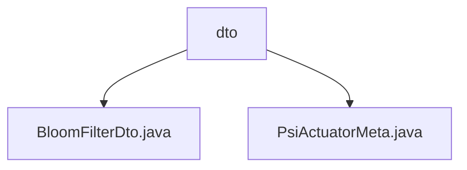

# Basic Information

|      |      |
|------|------|
| Name | dto |
| Language | .java |
| Code Path | WeFe/fusion/fusion-core/src/main/java/com/welab/wefe/fusion/core/dto |
| Package Name | docs.fusion.fusion-core.src.main.java.com.welab.wefe.fusion.core.dto |
| Brief Description | The BloomFilterDto class encapsulates Bloom filter data, including count, size, bitSet attributes, and operational methods. The PsiActuatorMeta class contains e, n, bf, and bfDto attributes, providing initialization and configuration methods. |

# Description

## Overview  
The core responsibility of this module is to encapsulate the Bloom filter data structure and its executor metadata, enabling the serialized transmission of key components in the PSI (Private Set Intersection) protocol. The interface specifications uniformly adopt the DTO pattern, providing static factory methods (such as `ofBloomFilters` and `of`) and standard getter/setter methods. Key data structures include BloomFilterDto (containing a bitSet byte array, size, and count) and PsiActuatorMeta (containing e/n parameters and a BloomFilters instance). External dependencies are limited to the Java standard library and BigInteger mathematical operations. For example, the BloomFilters instance can be reconstructed from the bitSet in BloomFilterDto.

## Primary Business Scenarios  
The module supports the cross-node transmission and metadata assembly of Bloom filters in the PSI protocol, similar to a configuration center model. A typical workflow includes: 1) Transmitting bit set data via DTOs; 2) Using PsiActuatorMeta to assemble encryption parameters (such as RSA's e/n) and filter instances. For instance, the `setBfByDto` method implements the reverse construction from DTO to BloomFilters. The interaction pattern uniformly adopts a Builder style, with API types being pure data containers. Integration examples include filter state snapshots and encrypted executor initialization.

### Package Internal Structure View

This flowchart illustrates the structure of two Java files under the dto directory in the fusion-core project. The top-level node represents the dto directory, which contains two data transfer object class files: BloomFilterDto.java and PsiActuatorMeta.java, demonstrating the simple hierarchical relationship of core data transfer objects within the project.

# File List

| Name   | Type  | Description |
|-------|------|-------------|
| [BloomFilterDto.java](BloomFilterDto.md) | file | The BloomFilterDto class encapsulates Bloom filter data, including count, size, and a byte array of the bit set, providing conversion and access methods. |
| [PsiActuatorMeta.java](PsiActuatorMeta.md) | file | The PsiActuatorMeta class includes variables e and n of type BigInteger, a variable bf of type BloomFilters, and a variable bfDto of type BloomFilterDto. It provides getter/setter methods, supports instance creation via the of method, and allows setting bf through the setBfByDto method. |

