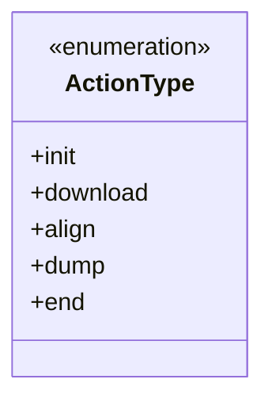
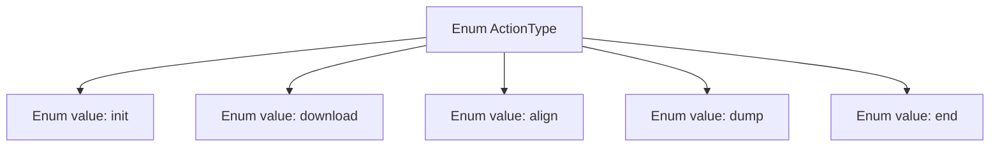

# Basic Information

|      |      |
|------|------|
| Name | ActionType |
| Language | .java |
| Code Path | WeFe/fusion/fusion-core/src/main/java/com/welab/wefe/fusion/core/enums/ActionType.java |
| Package Name | com.welab.wefe.fusion.core.enums |
| Dependencies | [] |
| Brief Description | This is an enumeration type ActionType, which defines five actions: initialization, download, alignment, dump, and termination. |

# Description

The content defines a public enumeration type named ActionType, which includes five enumeration values: `init` represents an initialization operation, `download` represents a download operation, `align` represents an alignment operation, `dump` represents a dump operation, and `end` represents an end operation. Each enumeration value represents a specific action type and can be used for state identification or flow control in a program.

# Class Summary

| Name   | Type  | Description |
|-------|------|-------------|
| ActionType | enum | The ActionType enumeration defines five operation types: initialization, download, alignment, dump, and termination. |

## Class ActionType

|      |      |
|------|------|
| Access Modifier | public |
| Type | enum |
| Name | ActionType |
| Description | The ActionType enumeration defines five operation types: initialization, download, alignment, dump, and termination. |

### UML Class Diagram

This code defines an enumeration type named ActionType, containing five fixed constants: init, download, align, dump, and end. Enumerations are used to represent a limited set of predefined values, commonly employed in state machines or flow control scenarios. This enumeration may be used to identify different stages in a data processing pipeline, such as initialization (init), data downloading (download), data alignment (align), result exporting (dump), and process termination (end). All enumeration members are public static constants, accessible directly via ActionType.XXX notation.

### Internal Method Call Graph

This flowchart illustrates the structure of the ActionType enum, which contains five enum values: init, download, align, dump, and end. Each enum value is a direct instance of ActionType, representing different operation types. Such enum design is commonly used in state machines or workflow systems to ensure type safety and avoid magic strings through predefined constants.

### Field List

| Name  | Type  | Description |
|-------|-------|------|

### Method List

| Name  | Type  | Description |
|-------|-------|------|

