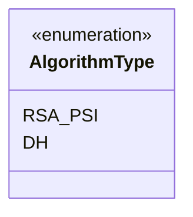
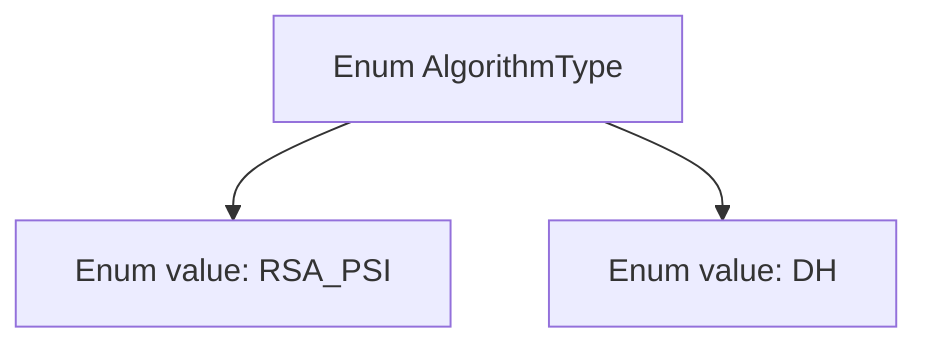

# Basic Information

|      |      |
|------|------|
| Name | AlgorithmType |
| Language | .java |
| Code Path | WeFe/fusion/fusion-core/src/main/java/com/welab/wefe/fusion/core/enums/AlgorithmType.java |
| Package Name | com.welab.wefe.fusion.core.enums |
| Dependencies | [] |
| Brief Description | The algorithm type enumeration includes two types: RSA_PSI and DH. |

# Description

The content defines a public enumeration type named AlgorithmType, containing two enumeration values: RSA_PSI and DH. This indicates two specific implementation options for the algorithm type, where RSA_PSI likely refers to a privacy-preserving intersection algorithm based on RSA encryption, and DH may refer to the Diffie-Hellman key exchange algorithm. Enumeration types are commonly used to limit the optional range of variables, and here it explicitly specifies the two available choices for the algorithm type.

# Class Summary

| Name   | Type  | Description |
|-------|------|-------------|
| AlgorithmType | enum | Defined an enumeration type AlgorithmType, which includes two algorithms: RSA_PSI and DH. |

## Class AlgorithmType

|      |      |
|------|------|
| Access Modifier | public |
| Type | enum |
| Name | AlgorithmType |
| Description | Defined an enumeration type AlgorithmType, which includes two algorithms: RSA_PSI and DH. |

### UML Class Diagram

This code defines an enumeration type named AlgorithmType, containing two enumeration constants: RSA_PSI and DH. Enumeration types are used to represent a fixed set of constant values, here likely identifying different algorithm types such as RSA-based Private Set Intersection (RSA_PSI) and Diffie-Hellman (DH). In the class diagram, the enumeration type is marked with <<enumeration>>, clearly illustrating its limited, predefined set of instances.

### Internal Method Call Graph

This code defines an enumeration type named AlgorithmType containing two enum values: RSA_PSI and DH. The flowchart illustrates the hierarchical relationship between the enumeration type and its constant values, where AlgorithmType serves as the parent node with RSA_PSI and DH as its direct child nodes. Such structure is commonly used to represent a fixed set of algorithm types or mode selections, with each enum value representing a specific algorithm implementation approach.

### Field List

| Name  | Type  | Description |
|-------|-------|------|

### Method List

| Name  | Type  | Description |
|-------|-------|------|

