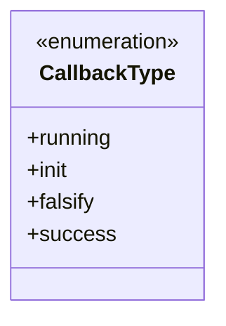
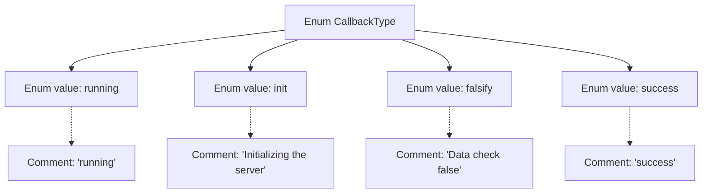

# Basic Information

|      |      |
|------|------|
| Name | CallbackType |
| Language | .java |
| Code Path | WeFe/fusion/fusion-core/src/main/java/com/welab/wefe/fusion/core/enums/CallbackType.java |
| Package Name | com.welab.wefe.fusion.core.enums |
| Dependencies | [] |
| Brief Description | The enumeration CallbackType defines four callback types: Running, Initializing Server, Data Check Failed, Success. |

# Description

The enumeration defines four callback types: "running" indicates in progress, "init" represents the server initialization phase, "falsify" denotes failed data validation, and "success" signifies successful operation completion. Each type is accompanied by comments explaining its specific meaning.

# Class Summary

| Name   | Type  | Description |
|-------|------|-------------|
| CallbackType | enum | The CallbackType enum defines four states: Running, Initializing Server, Data Validation Failed, Success. |

## Class CallbackType

|      |      |
|------|------|
| Access Modifier | public |
| Type | enum |
| Name | CallbackType |
| Description | The CallbackType enum defines four states: Running, Initializing Server, Data Validation Failed, Success. |

### UML Class Diagram

This code defines an enumeration type named CallbackType, which includes four enum constants: running (in progress), init (server initialization), falsify (data validation failed), and success (successful). The enumeration is used to represent different callback states during program execution, with each state having clear semantic annotations explaining its purpose. This design is commonly employed in scenarios such as state machines or tracking asynchronous operation statuses.

### Internal Method Call Graph

This flowchart illustrates the structure of the CallbackType enum, which includes four enum values: running (in progress), init (server initialization), falsify (data validation failure), and success. Each enum value is associated with corresponding comments that clearly describe the specific meaning of each state. This design is commonly used to represent different callback states in asynchronous operations, facilitating explicit distinction and handling of business logic at various stages through enum values in code.

### Field List

| Name  | Type  | Description |
|-------|-------|------|

### Method List

| Name  | Type  | Description |
|-------|-------|------|

