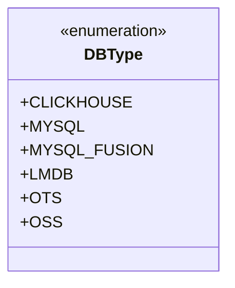
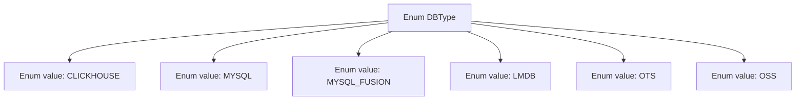

# Basic Information

|      |      |
|------|------|
| Name | DBType |
| Language | .java |
| Code Path | WeFe/fusion/fusion-core/src/main/java/com/welab/wefe/fusion/core/enums/DBType.java |
| Package Name | com.welab.wefe.fusion.core.enums |
| Dependencies | [] |
| Brief Description | The DBType enumeration defines six database types: CLICKHOUSE, MYSQL, MYSQL_FUSION, LMDB, OTS, and OSS. |

# Description

The code defines a public enumeration type named DBType, which includes six enumeration constants: CLICKHOUSE, MYSQL, MYSQL_FUSION, LMDB, OTS, and OSS, representing different types of database systems.

# Class Summary

| Name   | Type  | Description |
|-------|------|-------------|
| DBType | enum | The DBType enumeration defines six database types: CLICKHOUSE, MYSQL, MYSQL_FUSION, LMDB, OTS, and OSS. |

## Class DBType

|      |      |
|------|------|
| Access Modifier | public |
| Type | enum |
| Name | DBType |
| Description | The DBType enumeration defines six database types: CLICKHOUSE, MYSQL, MYSQL_FUSION, LMDB, OTS, and OSS. |

### UML Class Diagram

This code defines an enumeration type named DBType, which represents different types of database systems. The enumeration includes six constant values: CLICKHOUSE, MYSQL, MYSQL_FUSION, LMDB, OTS, and OSS, corresponding to various database technologies. This design is commonly used in scenarios where the selection of database types needs to be explicitly constrained, such as in database connection configurations or multi-database-compatible system architectures. The use of enumeration types ensures type safety and prevents invalid database types from being passed into the system.

### Internal Method Call Graph

This flowchart illustrates the structure of the DBType enum class, which contains six predefined database type constants: CLICKHOUSE, MYSQL, MYSQL_FUSION, LMDB, OTS, and OSS. Each enum value is represented by an independent node and establishes an association relationship with the parent node DBType, clearly presenting the complete member set of this enum class. This design is typically used to uniformly manage different types of database identifiers, facilitating type-safe comparison and usage in code.

### Field List

| Name  | Type  | Description |
|-------|-------|------|

### Method List

| Name  | Type  | Description |
|-------|-------|------|

