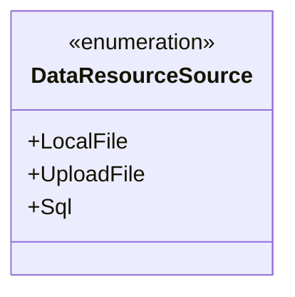
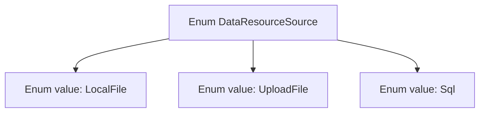

# Basic Information

|      |      |
|------|------|
| Name | DataResourceSource |
| Language | .java |
| Code Path | WeFe/fusion/fusion-core/src/main/java/com/welab/wefe/fusion/core/enums/DataResourceSource.java |
| Package Name | com.welab.wefe.fusion.core.enums |
| Dependencies | [] |
| Brief Description | Source of data resources enumeration: local file, uploaded file, SQL database. |

# Description

This is an enumeration type named DataResourceSource, which defines three data resource sources: LocalFile represents local files, UploadFile represents uploaded files, and Sql represents a database. Enumeration types are used to represent a fixed set of constant values, here clearly distinguishing three different methods of data sourcing.

# Class Summary

| Name   | Type  | Description |
|-------|------|-------------|
| DataResourceSource | enum | The DataResourceSource enumeration defines three data sources: local files, uploaded files, and SQL databases. |

## Class DataResourceSource

|      |      |
|------|------|
| Access Modifier | public |
| Type | enum |
| Name | DataResourceSource |
| Description | The DataResourceSource enumeration defines three data sources: local files, uploaded files, and SQL databases. |

### UML Class Diagram

This code defines an enumeration type named DataResourceSource, which includes three enumeration constants: LocalFile, UploadFile, and Sql. Enumeration types are used to represent a fixed set of constant values, often employed to define a limited and explicit collection of options. In this example, DataResourceSource might be used to identify different types of data sources, such as local files, uploaded files, or SQL databases. In class diagrams, enumeration types are marked with <<enumeration>>, and their constant values are listed as public members.

### Internal Method Call Graph

This flowchart illustrates the structure of the DataResourceSource enum, which contains three enum values: LocalFile, UploadFile, and Sql. As a special data type, enums are used to define a fixed set of constants, here representing three possible sources of data resources. Each enum value is an instance of this type and can be directly accessed via the enum class name. Enums are commonly used to replace magic numbers or string constants, enhancing code readability and type safety.

### Field List

| Name  | Type  | Description |
|-------|-------|------|

### Method List

| Name  | Type  | Description |
|-------|-------|------|

