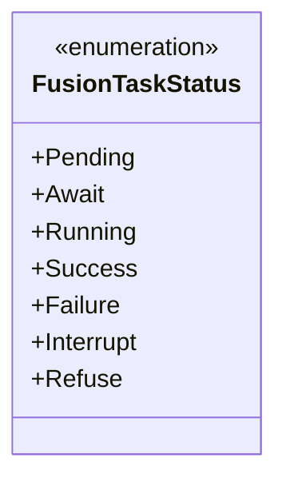
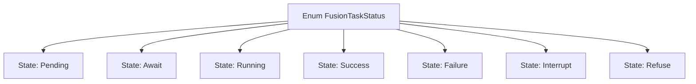

# Basic Information

|      |      |
|------|------|
| Name | FusionTaskStatus |
| Language | .java |
| Code Path | WeFe/fusion/fusion-core/src/main/java/com/welab/wefe/fusion/core/enums/FusionTaskStatus.java |
| Package Name | com.welab.wefe.fusion.core.enums |
| Dependencies | [] |
| Brief Description | The FusionTaskStatus enum defines task states: Pending, Await, Running, Success, Failure, Interrupt, Refuse. |

# Description

The enumeration type defines the possible values of task status, including Pending, Waiting, Running, Success, Failed, Interrupted, and Rejected. The annotations explain the meaning of each status: Pending indicates before alignment, Waiting indicates suspended or awaiting alignment, Running indicates preparation or in progress, while Success, Failed, and Interrupted represent different outcomes of completed alignment. The Rejected status is not explained in the annotations.

# Class Summary

| Name   | Type  | Description |
|-------|------|-------------|
| FusionTaskStatus | enum | The FusionTaskStatus enum defines task statuses: Pending, Await, Running, Success, Failure, Interrupt, Refuse. |

## Class FusionTaskStatus

|      |      |
|------|------|
| Access Modifier | public |
| Type | enum |
| Name | FusionTaskStatus |
| Description | The FusionTaskStatus enum defines task statuses: Pending, Await, Running, Success, Failure, Interrupt, Refuse. |

### UML Class Diagram

This code defines an enumeration type named `FusionTaskStatus` to represent different states of a task. The enumeration includes seven constant values: `Pending` (pending), `Await` (awaiting), `Running` (running), `Success` (success), `Failure` (failure), `Interrupt` (interrupted), and `Refuse` (rejected). Each constant corresponds to a specific phase in the task lifecycle, from the initial waiting state to the final completion or exceptional state. The enumeration type provides a type-safe mechanism for managing task states through a predefined set of constants.

### Internal Method Call Graph

This flowchart illustrates all possible states of the FusionTaskStatus enumeration. The enum defines 7 stages of a task's lifecycle: Pending, Await, Running, Success, Failure, Interrupt, and Refuse. Each state is connected to the enum body via arrows, clearly presenting the complete structure of the state machine. This design is commonly used in systems requiring explicit tracking of task progress states, such as distributed computing or workflow engines.

### Field List

| Name  | Type  | Description |
|-------|-------|------|

### Method List

| Name  | Type  | Description |
|-------|-------|------|

