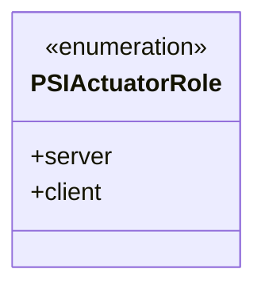
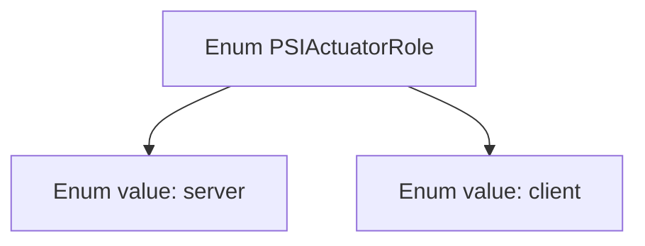

# Basic Information

|      |      |
|------|------|
| Name | PSIActuatorRole |
| Language | .java |
| Code Path | WeFe/fusion/fusion-core/src/main/java/com/welab/wefe/fusion/core/enums/PSIActuatorRole.java |
| Package Name | com.welab.wefe.fusion.core.enums |
| Dependencies | [] |
| Brief Description | The PSIActuatorRole enumeration defines two roles: server and client. |

# Description

The content defines a public enumeration type named PSIActuatorRole, which includes two enumeration values: server and client. The enumeration is used to represent the role of an actuator, where server denotes a server-side role and client denotes a client-side role. This design is commonly used to differentiate the functional positioning or communication modes of different components within a system.

# Class Summary

| Name   | Type  | Description |
|-------|------|-------------|
| PSIActuatorRole | enum | The PSIActuatorRole enumeration defines two roles: server and client. |

## Class PSIActuatorRole

|      |      |
|------|------|
| Access Modifier | public |
| Type | enum |
| Name | PSIActuatorRole |
| Description | The PSIActuatorRole enumeration defines two roles: server and client. |

### UML Class Diagram

This class diagram describes an enumeration type named PSIActuatorRole, which contains two enumeration constants: server and client. The enumeration type is marked with <<enumeration>> in the class diagram, indicating it is a finite set of predefined values. This enumeration is likely used to represent the role types of actuators in the PSI (Private Set Intersection) protocol, where server denotes the server-side role and client denotes the client-side role. Such design is commonly employed to clearly distinguish the responsibilities and behavioral patterns of different components within a system.

### Internal Method Call Graph

This code defines an enumeration type named PSIActuatorRole, which contains two enum values: server and client. The flowchart clearly illustrates the hierarchical relationship between the enumeration type and its values, with server and client existing as direct members of PSIActuatorRole. Such structure is commonly used to represent fixed sets of roles or states, such as distinguishing between server and client roles in network communication.

### Field List

| Name  | Type  | Description |
|-------|-------|------|

### Method List

| Name  | Type  | Description |
|-------|-------|------|

