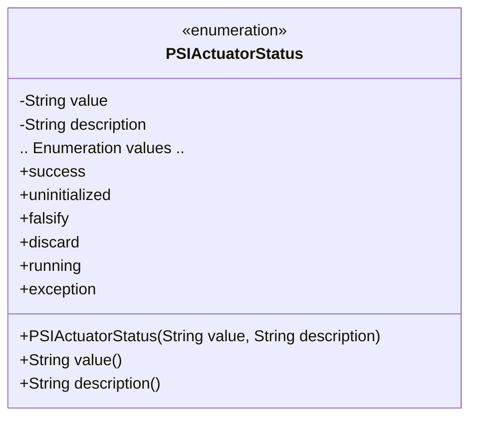

# Basic Information

|      |      |
|------|------|
| Name | PSIActuatorStatus |
| Language | .java |
| Code Path | WeFe/fusion/fusion-core/src/main/java/com/welab/wefe/fusion/core/enums/PSIActuatorStatus.java |
| Package Name | com.welab.wefe.fusion.core.enums |
| Dependencies | [] |
| Brief Description | The enumeration PSIActuatorStatus defines actuator states, including six statuses: Success, Uninitialized, Validation Failed, Discarded, Running, and Exception, each with a value and description. |

# Description

This is an enumeration type PSIActuatorStatus, which defines six actuator states and their descriptions. It includes six states: Success, Uninitialized, Validation Failed, Task Discarded, Running, and Exception. Each state has a corresponding English value and Chinese description. The enumeration class provides methods to retrieve the values and descriptions. This enumeration is used to represent the different operational states and results of an actuator.

# Class Summary

| Name   | Type  | Description |
|-------|------|-------------|
| PSIActuatorStatus | enum | The PSIActuatorStatus enumeration defines six states: Success, Uninitialized, Validation Failed, Task Discarded, Running, and Exception, each containing a value and description. |

## Class PSIActuatorStatus

|      |      |
|------|------|
| Access Modifier | public |
| Type | enum |
| Name | PSIActuatorStatus |
| Description | The PSIActuatorStatus enumeration defines six states: Success, Uninitialized, Validation Failed, Task Discarded, Running, and Exception, each containing a value and description. |

### UML Class Diagram

The enumeration class PSIActuatorStatus defines six state constants, each containing two attributes: value and description, representing the state value and descriptive information respectively. The enumeration values are initialized via the constructor, with value() and description() methods provided to retrieve attribute values. Enumeration types are commonly used to represent a fixed set of constants, here employed to describe actuator states and their meanings.

### Internal Method Call Graph

```mermaid
graph TD
    A["Enum PSIActuatorStatus"]
    B["Enum value: success('success', 'Success')"]
    C["Enum value: uninitialized('uninitialized', 'Data uninitialized or initialization failed')"]
    D["Enum value: falsify('falsify', 'Data validation failed')"]
    E["Enum value: discard('discard', 'Task discarded')"]
    F["Enum value: running('running', 'Running')"]
    G["Enum value: exception('exception', 'Unexpected situation')"]
    H["Property: String value"]
    I["Property: String description"]
    J["Constructor: PSIActuatorStatus(String value, String description)"]
    K["Method: String value()"]
    L["Method: String description()"]

    A --> B
    A --> C
    A --> D
    A --> E
    A --> F
    A --> G
    A --> H
    A --> I
    A --> J
    A --> K
    A --> L
```

This flowchart illustrates the structure of the PSIActuatorStatus enum, which includes 6 predefined enum values (success, uninitialized, etc.), each bound to value and description properties via the constructor. The enum class provides value() and description() methods to retrieve these property values. The flowchart clearly presents the hierarchical relationships between enum definition, property declaration, constructor, and exposed methods, reflecting the characteristics of an enum as a special class.

### Field List

| Name  | Type  | Description |
|-------|-------|------|

### Method List

| Name  | Type  | Description |
|-------|-------|------|

