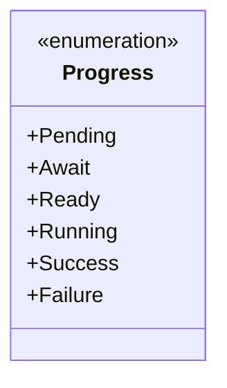
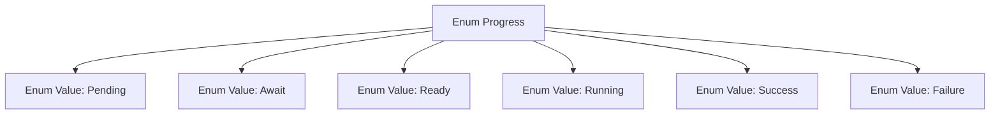

# Basic Information

|      |      |
|------|------|
| Name | Progress |
| Language | .java |
| Code Path | WeFe/fusion/fusion-core/src/main/java/com/welab/wefe/fusion/core/enums/Progress.java |
| Package Name | com.welab.wefe.fusion.core.enums |
| Dependencies | [] |
| Brief Description | Progress Status Enum: Pending, Waiting, Ready, Running, Success, Failed. |

# Description

This is an enumeration type named Progress, which defines six distinct status values: Pending indicates awaiting processing, Await signifies in a waiting state, Ready denotes prepared and ready, Running represents currently in progress, Success means completed successfully, and Failure indicates execution failure. These statuses can be used to describe different stages of a task or process.

# Class Summary

| Name   | Type  | Description |
|-------|------|-------------|
| Progress | enum | This is an enumeration class representing progress, which includes six states: pending, waiting, ready, running, success, and failure. |

## Class Progress

|      |      |
|------|------|
| Access Modifier | public |
| Type | enum |
| Name | Progress |
| Description | This is an enumeration class representing progress, which includes six states: pending, waiting, ready, running, success, and failure. |

### UML Class Diagram

This code defines an enumeration type named Progress, which includes six enumeration constants: Pending, Await, Ready, Running, Success, and Failure. Enumerations are typically used to represent a fixed set of states or options. Here, Progress likely represents the various stages of a task or process. Pending indicates the initial waiting state, Await signifies waiting for certain conditions to be met, Ready denotes being prepared, Running means the task is in progress, Success indicates successful completion, and Failure represents execution failure. The use of enumeration types enhances code readability and type safety.

### Internal Method Call Graph

This flowchart illustrates the structure of the Progress enum, which includes 6 ordered state values: Pending, Await, Ready, Running, Success, and Failure. Each enum value is connected as an independent node to the main enum class, clearly presenting all possible states of the state machine. It is suitable for scenarios requiring task progress tracking.

### Field List

| Name  | Type  | Description |
|-------|-------|------|

### Method List

| Name  | Type  | Description |
|-------|-------|------|

