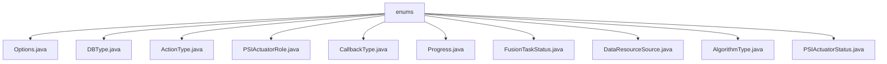

# Basic Information

|      |      |
|------|------|
| Name | enums |
| Language | .java |
| Code Path | WeFe/fusion/fusion-core/src/main/java/com/welab/wefe/fusion/core/enums |
| Package Name | docs.fusion.fusion-core.src.main.java.com.welab.wefe.fusion.core.enums |
| Brief Description | The code defines multiple enumeration types: DBType includes six database types; ActionType has five operation types; PSIActuatorRole distinguishes between server and client; CallbackType describes four callback states; Progress and FusionTaskStatus define task progress and status respectively; DataResourceSource lists three data sources; AlgorithmType provides two algorithm choices; PSIActuatorStatus contains six actuator states. |

# Description

## Overview  
The core responsibility of this module is to provide enumeration definitions for the federated learning fusion process, covering key dimensions such as database types, task statuses, and algorithm selection. The interface specifications are implemented through enumeration classes. For example, `DBType` defines six database types (e.g., `CLICKHOUSE`, `OSS`), and `AlgorithmType` restricts the options to `RSA_PSI` and `DH`.  

Key data structures include task statuses (e.g., `FusionTaskStatus` with values like `Pending`/`Success`), executor roles (`PSIActuatorRole` distinguishing `server`/`client`), and data sources (`DataResourceSource` including `LocalFile`/`Sql`). External dependencies are limited to the basic Java environment. For instance, the `Progress` enumeration describes the task lifecycle through six states such as `Running` and `Success`.  

## Key Business Scenarios  
The module supports end-to-end control of federated learning, similar to a state machine pattern. Typical scenarios include: using `ActionType.init` during the initialization phase, triggering `CallbackType.falsify` checks in the data alignment phase, and finally marking completion with `PSIActuatorStatus.Success`.  

The interaction model is based on role differentiation (`server`/`client`) and state-driven actions (e.g., `Progress.Ready` triggers task execution). API types are centralized as enumeration constants, such as `AlgorithmType.DH` for key exchange and `DataResourceSource.Sql` for database sources. A complete workflow can combine multiple enumerations, for example, starting from the `Pending` state, progressing through `Running`, and ultimately reaching `Success` or `Failure`.

### Package Internal Structure View

This flowchart illustrates the enumeration class structure within the fusion-core module of the WeFe project. The root node is the enums directory, which contains 11 specific enumeration class files covering various types such as database types, action types, task statuses, and more. All enumeration classes are directly subordinate to the enums directory with no deeper nested relationships.

# File List

| Name   | Type  | Description |
|-------|------|-------------|
| [Options.java](Options.md) | file | The input content is empty, unable to generate a summary description. |
| [DBType.java](DBType.md) | file | The DBType enumeration defines six types of databases: CLICKHOUSE, MYSQL, MYSQL_FUSION, LMDB, OTS, and OSS. |
| [ActionType.java](ActionType.md) | file | This is an enumeration type ActionType, which defines five actions: initialization, download, alignment, dump, and end. |
| [PSIActuatorRole.java](PSIActuatorRole.md) | file | The PSIActuatorRole enumeration defines two roles: server and client. |
| [CallbackType.java](CallbackType.md) | file | The enumeration CallbackType defines four callback types: Running, Initializing Server, Data Check Failed, and Success. |
| [Progress.java](Progress.md) | file | Progress Status Enum: Pending, Waiting, Ready, Running, Success, Failed. |
| [FusionTaskStatus.java](FusionTaskStatus.md) | file | The FusionTaskStatus enum defines task states: Pending, Await, Running, Success, Failure, Interrupt, Refuse. |
| [DataResourceSource.java](DataResourceSource.md) | file | Data resource source enumeration: local file, uploaded file, SQL database. |
| [AlgorithmType.java](AlgorithmType.md) | file | The algorithm type enumeration includes two types: RSA_PSI and DH. |
| [PSIActuatorStatus.java](PSIActuatorStatus.md) | file | The enumeration `PSIActuatorStatus` defines the actuator status, which includes six states: Success, Uninitialized, Validation Failed, Discarded, Running, and Exception. Each state has a value and a description. |

