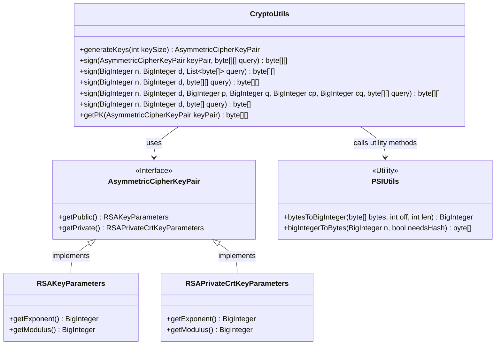

# Basic Information

|      |      |
|------|------|
| Name | CryptoUtils |
| Language | .java |
| Code Path | WeFe/fusion/fusion-core/src/main/java/com/welab/wefe/fusion/core/utils/CryptoUtils.java |
| Package Name | com.welab.wefe.fusion.core.utils |
| Dependencies | ['org.bouncycastle.crypto.AsymmetricCipherKeyPair', 'org.bouncycastle.crypto.generators.RSAKeyPairGenerator', 'org.bouncycastle.crypto.params.RSAKeyGenerationParameters', 'org.bouncycastle.crypto.params.RSAKeyParameters', 'org.bouncycastle.crypto.params.RSAPrivateCrtKeyParameters', 'java.math.BigInteger', 'java.security.SecureRandom', 'java.util.List'] |
| Brief Description | The CryptoUtils class provides RSA key generation, signing, and public key extraction functionalities, supporting multiple parameter inputs and CRT-optimized signing. |

# Description

The `CryptoUtils` class provides RSA key generation and signing functionality. The `generateKeys` method generates an RSA key pair of a specified length. The `sign` method offers multiple overloaded forms, supporting signing with either a key pair or individual parameters, including both standard modular exponentiation and CRT-optimized implementations. The `getPK` method extracts the exponent and modulus of a public key. All methods handle exceptions and return default values. The signing process involves conversion between byte arrays and `BigInteger`, which is accomplished using the `PSIUtils` utility class.

# Class Summary

| Name   | Type  | Description |
|-------|------|-------------|
| CryptoUtils | class | The CryptoUtils class provides RSA key generation and signing functionalities, including generating key pairs, multiple signing methods, and obtaining public keys. It supports standard signing and CRT-optimized signing, handling both single and batch data. |

## Class CryptoUtils

|      |      |
|------|------|
| Access Modifier | public |
| Type | class |
| Name | CryptoUtils |
| Description | The CryptoUtils class provides RSA key generation and signing functionalities, including generating key pairs, multiple signing methods, and obtaining public keys. It supports standard signing and CRT-optimized signing, handling both single and batch data. |

### UML Class Diagram

Class diagram description: CryptoUtils is a utility class providing cryptographic functions, mainly including key generation (generateKeys), data signing (sign), and public key extraction (getPK). It relies on the AsymmetricCipherKeyPair interface and its implementation classes RSAKeyParameters/RSAPrivateCrtKeyParameters to manage RSA key pairs, and uses the PSIUtils utility class for byte array-BigInteger conversion. The diagram shows 5 overloaded sign methods supporting different parameter forms for signing operations, including an implementation optimized with the Chinese Remainder Theorem (CRT).

### Internal Method Call Graph

```mermaid
graph TD
    A["Class CryptoUtils"]
    B["Method: generateKeys(int keySize)"]
    C["Method: sign(AsymmetricCipherKeyPair, byte[][])"]
    D["Method: sign(BigInteger, BigInteger, List<byte[]>)"]
    E["Method: sign(BigInteger, BigInteger, byte[][])"]
    F["Method: sign(BigInteger, BigInteger, BigInteger, BigInteger, BigInteger, BigInteger, byte[][])"]
    G["Method: sign(BigInteger, BigInteger, byte[])"]
    H["Method: getPK(AsymmetricCipherKeyPair)"]

    A --> B
    A --> C
    A --> D
    A --> E
    A --> F
    A --> G
    A --> H

    C --> C1["Get private key parameters"]
    C --> C2["Iterate through query array"]
    C --> C3["Perform modular exponentiation"]
    C --> C4["Convert result format"]

    D --> D1["Convert List to array"]
    D --> D2["Call sign(BigInteger, BigInteger, byte[][])"]

    E --> E1["Iterate through query array"]
    E --> E2["Perform modular exponentiation"]
    E --> E3["Convert result format"]

    F --> F1["Iterate through query array"]
    F --> F2["CRT-optimized calculation"]
    F --> F3["Merge calculation results"]
    F --> F4["Convert result format"]

    G --> G1["Perform modular exponentiation"]
    G --> G2["Convert result format"]

    H --> H1["Get public key parameters"]
    H --> H2["Convert parameters to byte array"]
```

Flowchart description: This flowchart illustrates the structure of the CryptoUtils class, including key generation (generateKeys), multiple signing methods (sign), and public key retrieval (getPK) functionalities. The signing methods are implemented through parameter overloading, with core processes involving parameter conversion, modular exponentiation, and result formatting. It specifically demonstrates the step-by-step calculation process of the CRT-optimized signing method and the invocation relationships between methods. All methods incorporate exception handling mechanisms.

### Field List

| Name  | Type  | Description |
|-------|-------|------|

### Method List

| Name  | Type  | Description |
|-------|-------|------|
| sign | byte[][] | Using the CRT-optimized RSA signature method, the input parameters include modulus n, private key d, primes p and q, coefficients cp and cq, and the data to be signed, query. The signature result is calculated through modular exponentiation and CRT, returning the signed byte array. An empty array is returned in case of exceptions. |
| sign | byte[] | This method uses an RSA private key to sign the input data, converts the byte array into a large integer, computes the modular exponentiation, and then converts the result back into a byte array for return. In case of an exception, it returns a single-byte array. |
| getPK | byte[][] | Extract the exponent and modulus of an RSA public key, convert them into byte arrays, and return the result. |
| sign | byte[][] | The method uses an RSA private key to sign the input byte array, generating a signature result array through modular exponentiation. An empty array is returned when handling exceptions. |
| generateKeys | AsymmetricCipherKeyPair | This method generates an RSA key pair, specifying the key length and public exponent, using a secure random number generator, and returns an asymmetric key pair. |
| sign | byte[][] | The static method `sign` takes the large integers `n`, `d`, and a byte array list `query`, converts the list into a two-dimensional array, and then calls the method signature of the same name, returning an empty array in case of an exception. |
| sign | byte[][] | The static method `sign` uses the private key `d` and modulus `n` to sign the input byte array `query`, returning the signed byte array. If an exception occurs during processing, it prints the error and returns an empty array. |

