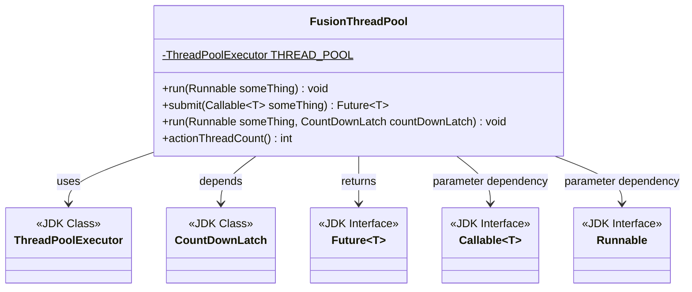
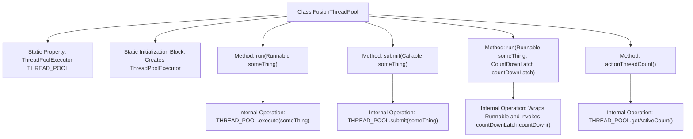

# Basic Information

|      |      |
|------|------|
| Name | FusionThreadPool |
| Language | .java |
| Code Path | WeFe/fusion/fusion-core/src/main/java/com/welab/wefe/fusion/core/utils/FusionThreadPool.java |
| Package Name | com.welab.wefe.fusion.core.utils |
| Dependencies | ['java.util.concurrent'] |
| Brief Description | The FusionThreadPool class implements a static thread pool that supports executing Runnable tasks, submitting Callable tasks, and handling asynchronous tasks with counters, while also providing the ability to retrieve the number of active threads. The thread pool size is dynamically configured based on the number of processor cores. |

# Description

FusionThreadPool is a static thread pool utility class initialized in singleton mode. The core thread count of the pool is set to the number of CPU cores, with the maximum thread count being twice the core count, using a 100ms keep-alive time and an unbounded blocking queue. It provides three task execution methods: directly executing Runnable tasks, submitting Callable tasks to return a Future, and supporting asynchronous task execution with CountDownLatch (automatically decrementing the counter upon completion). Additionally, the current number of active threads can be obtained via the actionThreadCount method.

# Class Summary

| Name   | Type  | Description |
|-------|------|-------------|
| FusionThreadPool | class | The FusionThreadPool class implements a static thread pool with a core thread count equal to the number of CPU cores and a maximum thread count twice the core count. It provides methods for executing Runnable tasks, submitting Callable tasks, and handling asynchronous tasks with CountDownLatch, while supporting retrieval of the active thread count. |

## Class FusionThreadPool

|      |      |
|------|------|
| Access Modifier | public |
| Type | class |
| Name | FusionThreadPool |
| Description | The FusionThreadPool class implements a static thread pool with a core thread count equal to the number of CPU cores and a maximum thread count twice the core count. It provides methods for executing Runnable tasks, submitting Callable tasks, and handling asynchronous tasks with CountDownLatch, while supporting retrieval of the active thread count. |

### UML Class Diagram

This class diagram illustrates the structure of the FusionThreadPool utility class, which encapsulates JDK's ThreadPoolExecutor. It provides static methods to execute Runnable tasks, submit Callable tasks (returning Future), execute asynchronous tasks with CountDownLatch, and retrieve active thread counts. With generic support for multiple return types, it relies on JDK's threading-related interfaces and classes to implement core functionality, representing a typical thread pool utility class encapsulation design.

### Internal Method Call Graph

This code defines a thread pool utility class named FusionThreadPool, which includes a static initialization block to create a ThreadPoolExecutor instance and provides four operational methods: executing Runnable tasks, submitting Callable tasks, executing asynchronous tasks with CountDownLatch, and retrieving the active thread count. The flowchart clearly illustrates the class structure, initialization process, and method invocation relationships, particularly highlighting the feature where tasks with CountDownLatch automatically trigger counter decrement upon execution.

### Field List

| Name  | Type  | Description |
|-------|-------|------|
| THREAD_POOL | ThreadPoolExecutor | Private static thread pool executor THREAD_POOL. |

### Method List

| Name  | Type  | Description |
|-------|-------|------|
| run | void | This method uses a thread pool to execute Runnable tasks and calls the countDown method of CountDownLatch upon task completion. It ensures the counter is decremented by one after task execution. |
| actionThreadCount | int | This method returns the current number of active threads in the thread pool. |
| run | void | The static method `run` accepts a `Runnable` parameter and executes the task using the thread pool `THREAD_POOL`. |
| submit | Future<T> | Java Method: Submitting a Callable task to a thread pool and returning a Future object. |

