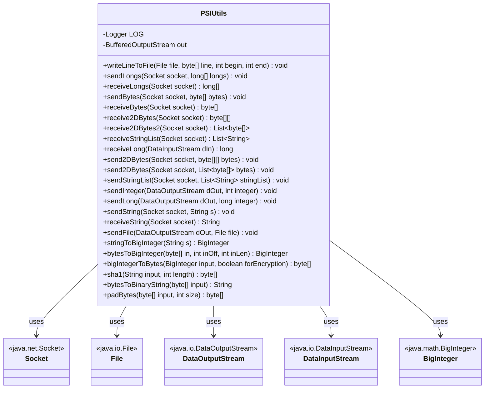

# Basic Information

|      |      |
|------|------|
| Name | PSIUtils |
| Language | .java |
| Code Path | WeFe/fusion/fusion-core/src/main/java/com/welab/wefe/fusion/core/utils/PSIUtils.java |
| Package Name | com.welab.wefe.fusion.core.utils |
| Dependencies | ['com.welab.wefe.common.StatusCode', 'com.welab.wefe.common.exception.StatusCodeWithException', 'org.slf4j.Logger', 'org.slf4j.LoggerFactory', 'java.io', 'java.math.BigInteger', 'java.net.Socket', 'java.security.MessageDigest', 'java.security.NoSuchAlgorithmException', 'java.util.Arrays', 'java.util.List'] |
| Brief Description | The PSIUtils utility class provides functionalities such as file writing, Socket data transmission (long arrays, byte arrays, string lists, etc.), large integer conversion, and SHA1 hashing. |

# Description

PSIUtils is a utility class that provides various data manipulation functions. It primarily includes file writing methods such as writeLineToFile, as well as methods for transmitting and receiving long arrays, byte arrays, two-dimensional byte arrays, and string lists via sockets, such as sendLongs, receiveLongs, sendBytes, receiveBytes, and others. It also supports sending and receiving strings, integers, long integers, and file transfer functionality like sendFile. The class offers conversion methods between BigInteger and strings or byte arrays, such as stringToBigInteger and bytesToBigInteger. Additionally, it includes auxiliary functions like SHA1 hash computation, byte array padding, and binary string conversion. All methods incorporate exception handling and log error messages.

# Class Summary

| Name   | Type  | Description |
|-------|------|-------------|
| PSIUtils | class | The PSIUtils class provides functionalities such as file writing, Socket data transmission (long arrays, byte arrays, string lists, etc.), BigInteger conversion, and SHA1 hashing, encapsulating commonly used utility methods. |

## Class PSIUtils

|      |      |
|------|------|
| Access Modifier | public |
| Type | class |
| Name | PSIUtils |
| Description | The PSIUtils class provides functionalities such as file writing, Socket data transmission (long arrays, byte arrays, string lists, etc.), BigInteger conversion, and SHA1 hashing, encapsulating commonly used utility methods. |

### UML Class Diagram

This code represents a utility class PSIUtils, primarily providing functionalities such as file writing, Socket data transmission, and BigInteger conversion. The class contains static methods for sending and receiving various data types including byte arrays, long integer arrays, and string lists, while also supporting file operations and encryption-related features. It enables efficient data transmission via Socket and handles various exceptional cases. The class diagram illustrates PSIUtils' dependencies on Java standard library classes like Socket and File.

### Internal Method Call Graph

```mermaid
graph TD
    A["Class PSIUtils"]
    B["Attribute: Logger LOG"]
    C["Attribute: BufferedOutputStream out"]
    D["Method: writeLineToFile(File, byte[], int, int)"]
    E["Method: sendLongs(Socket, long[])"]
    F["Method: receiveLongs(Socket)"]
    G["Method: sendBytes(Socket, byte[])"]
    H["Method: receiveBytes(Socket)"]
    I["Method: receive2DBytes(Socket)"]
    J["Method: receive2DBytes2(Socket)"]
    K["Method: receiveStringList(Socket)"]
    L["Method: receiveLong(DataInputStream)"]
    M["Method: send2DBytes(Socket, byte[][])"]
    N["Method: send2DBytes(Socket, List<byte[]>)"]
    O["Method: sendStringList(Socket, List<String>)"]
    P["Method: sendInteger(DataOutputStream, int)"]
    Q["Method: sendLong(DataOutputStream, long)"]
    R["Method: sendString(Socket, String)"]
    S["Method: receiveString(Socket)"]
    T["Method: sendFile(DataOutputStream, File)"]
    U["Method: stringToBigInteger(String)"]
    V["Method: bytesToBigInteger(byte[], int, int)"]
    W["Method: bigIntegerToBytes(BigInteger, boolean)"]
    X["Method: sha1(String, int)"]
    Y["Method: bytesToBinaryString(byte[])"]
    Z["Method: padBytes(byte[], int)"]

    A --> B
    A --> C
    A --> D
    A --> E
    A --> F
    A --> G
    A --> H
    A --> I
    A --> J
    A --> K
    A --> L
    A --> M
    A --> N
    A --> O
    A --> P
    A --> Q
    A --> R
    A --> S
    A --> T
    A --> U
    A --> V
    A --> W
    A --> X
    A --> Y
    A --> Z
```

This flowchart illustrates the structure of the PSIUtils class, containing 2 static attributes and 24 static methods. The core functionalities are categorized into four types: file operations (e.g., writeLineToFile), Socket data transmission (e.g., sendLongs/receiveLongs), type conversion (e.g., stringToBigInteger), and byte processing (e.g., padBytes). All methods include exception handling logic and record error information through LOG, demonstrating a robust design for network and IO operation utilities.

### Field List

| Name  | Type  | Description |
|-------|-------|------|
| out = null | BufferedOutputStream | Declare a static private BufferedOutputStream variable out with an initial value of null. |
| LOG = LoggerFactory.getLogger(PSIUtils.class) | Logger | The PSIUtils class defines a protected static final log object LOG for recording log information. |

### Method List

| Name  | Type  | Description |
|-------|-------|------|
| sendBytes | void | The Java method `sendBytes` transmits a byte array via Socket, writing data using `ObjectOutputStream`, and logs error messages when exceptions occur. |
| receiveString | String | The Java method `receiveString` reads a string from a Socket, logs an error in case of an exception, and returns an empty string. |
| stringToBigInteger | BigInteger | Convert the string into a byte array using UTF-8 encoding, then transform it into a big integer, and log an error message if an exception occurs. |
| receiveLong | long | The static method `receiveLong` reads a long value from `DataInputStream`, logs an error in case of an exception, and returns 0. |
| receive2DBytes | byte[][] | Receiving a two-dimensional byte array from a Socket, reading the object using ObjectInputStream, and logging an error in case of exceptions. |
| sendStringList | void | The static method `sendStringList` sends a list of strings through a Socket, serializing the data using `ObjectOutputStream`, and logs an error message if an exception occurs. |
| receiveStringList | List<String> | Static method receives a string list via Socket, reads data using an object input stream, logs error messages upon exceptions, and returns the list. |
| sendString | void | The method sends strings via Socket, using PrintWriter to wrap the output stream with automatic buffer flushing, and logs error messages when exceptions occur. |
| receive2DBytes2 | List<byte[]> | Receive a two-dimensional byte array list from the Socket, log the error in case of an exception, and return null. |
| sendLong | void | The static method `sendLong` sends a long integer value via `DataOutputStream`, catching and logging any IO exceptions. |
| send2DBytes | void | The static method `send2DBytes` sends a list of byte arrays via Socket using `ObjectOutputStream` to write data, and logs an error message if an exception occurs. |
| sendLongs | void | The method sends a long integer array via Socket by first transmitting the array length, then sending each element sequentially, flushing the buffer every 500 elements to enhance performance, and finally ensuring all data is transmitted completely. |
| sendFile | void | The method sends file content via DataOutputStream, using a 4096-byte buffer to cyclically read the file and write to the output stream, finally closing the input stream and flushing the output stream, while logging error messages in case of exceptions. |
| receiveLongs | long[] | Receives a long integer array from the Socket, reads the length first, then reads each data item sequentially. Returns an empty array and closes the Socket if an exception occurs. |
| sendInteger | void | The static method `sendInteger` sends an integer via `DataOutputStream`, catches and prints IO exceptions. |
| writeLineToFile | void | The static method `writeLineToFile` writes a byte array to a file, creating the output stream on the first call and closing it on the final call, while logging exceptions if they occur. |
| send2DBytes | void | The static method `send2DBytes` sends a two-dimensional byte array via Socket, using `ObjectOutputStream` to write the data, and logs an error message if an exception occurs. |
| receiveBytes | byte[] | Receive a byte array from the Socket, read the object using ObjectInputStream and convert it to byte[], log an error if an exception occurs, and finally return the byte array. |
| bytesToBigInteger | BigInteger | Convert a byte array to a big integer, supporting offset and length parameters to handle subarrays or full arrays, returning a positive result. |
| bigIntegerToBytes | byte[] | Convert a BigInteger to a byte array. If the first byte is zero, remove it and return the remaining part; otherwise, return the original array as-is. |
| sha1 | byte[] | Java Method: Generate a hash byte array of specified length using the SHA1 algorithm, with input as a string and a length parameter. |
| bytesToBinaryString | String | Convert a byte array to a binary string, padding each byte with zeros to 8 bits. |
| padBytes | byte[] | This method pads the input byte array to the specified length by prepending zeros to fill the gap. It uses System.arraycopy to copy the original array to the end of the new array and returns the padded result. |

