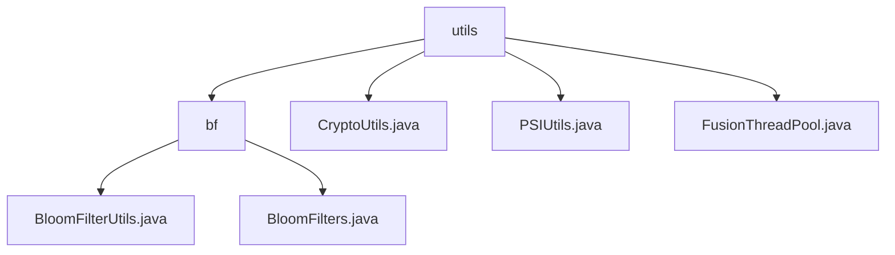

# Basic Information

|      |      |
|------|------|
| Name | utils |
| Language | .java |
| Code Path | WeFe/fusion/fusion-core/src/main/java/com/welab/wefe/fusion/core/utils |
| Package Name | docs.fusion.fusion-core.src.main.java.com.welab.wefe.fusion.core.utils |
| Brief Description | The Bloom Filter module supports efficient operations and persistence, designed for big data deduplication and rapid retrieval. It relies on Java standard IO, incorporating BitSet storage and MD5 hashing. Static methods are provided to simplify IO operations, with support for false positive rate initialization. |

# Description

## Overview  
The core responsibility of this module is to enable efficient operations and persistence of Bloom filters, while integrating cryptographic tools and thread pool management. The Bloom filter component supports element existence detection and file storage/loading, with BloomFilterUtils providing static methods to simplify I/O operations. Cryptographic functionalities include RSA key generation and signing (e.g., the CryptoUtils class), as well as data conversion and transmission (e.g., the PSIUtils class). Thread pool management is implemented via FusionThreadPool for task scheduling. Key data structures include BitSet storage, MD5/SHA1 hash digests, and RSA key pairs. External dependencies involve Java standard I/O libraries and cryptographic components.

## Key Business Scenarios  
Typical applications include big data deduplication (Bloom filters), secure communication (RSA signatures), and parallel computing (thread pools). The complete workflow encompasses filter initialization, element operations, file persistence (e.g., writeTo/readFrom), as well as key generation, data signing, and transmission (e.g., sendBytes/receiveBytes). Interaction patterns are encapsulated via static methods, resembling a utility class collection. API types focus on basic operations (add/contains), cryptographic functions (generateKeys/sign), and thread task submission (e.g., asynchronous execution supporting CountDownLatch). For instance, MD5 hashing ensures data consistency, while the thread pool dynamically scales based on CPU core count.

### Package Internal Structure View

This flowchart illustrates the hierarchical structure of the utils utility package within the fusion-core module of the WeFe project. The root node "utils" contains four child nodes: the "bf" directory and three utility class files. The "bf" directory further includes two Bloom filter-related utility class files. The entire structure clearly demonstrates the organization of core utility classes, with Bloom filter functionalities categorized separately under the "bf" subdirectory.

# File List

| Name   | Type  | Description |
|-------|------|-------------|
| [CryptoUtils.java](CryptoUtils.md) | file | The CryptoUtils class provides RSA key generation, signing, and public key extraction functionalities, supporting multiple parameter inputs and CRT-optimized signing. |
| [PSIUtils.java](PSIUtils.md) | file | The PSIUtils utility class provides functionalities such as file writing, Socket data transmission (long arrays, byte arrays, string lists, etc.), large integer conversion, and SHA1 hashing. |
| [FusionThreadPool.java](FusionThreadPool.md) | file | The FusionThreadPool class implements a static thread pool that supports executing Runnable tasks, submitting Callable tasks, handling asynchronous tasks with counters, and retrieving the number of active threads. The thread pool size is dynamically configured based on the number of processor cores. |
| [bf](bf/_module.md) | package | The BloomFilterUtils class provides file read/write methods to simplify Bloom filter persistence. The BloomFilters class implements the core functionality of Bloom filters, supporting various initialization parameters and operations such as adding elements and checking existence, utilizing BitSet and MD5 hashing. |

