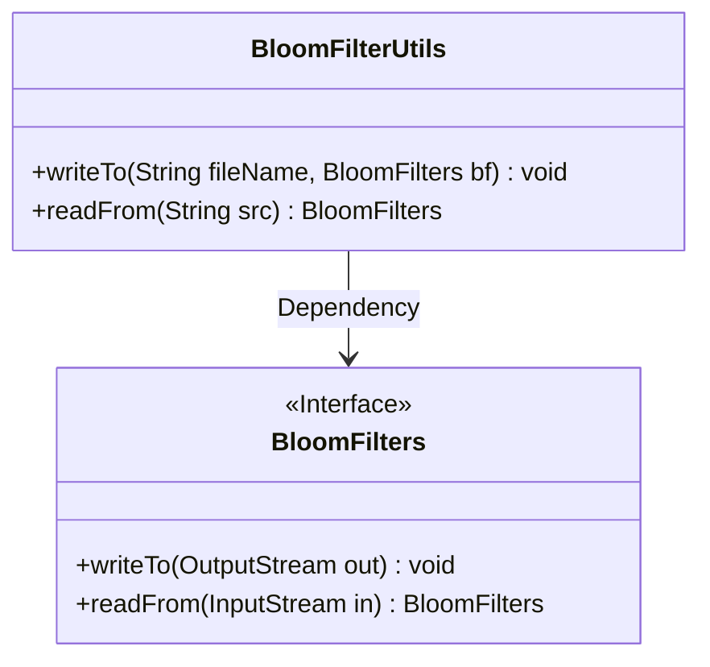
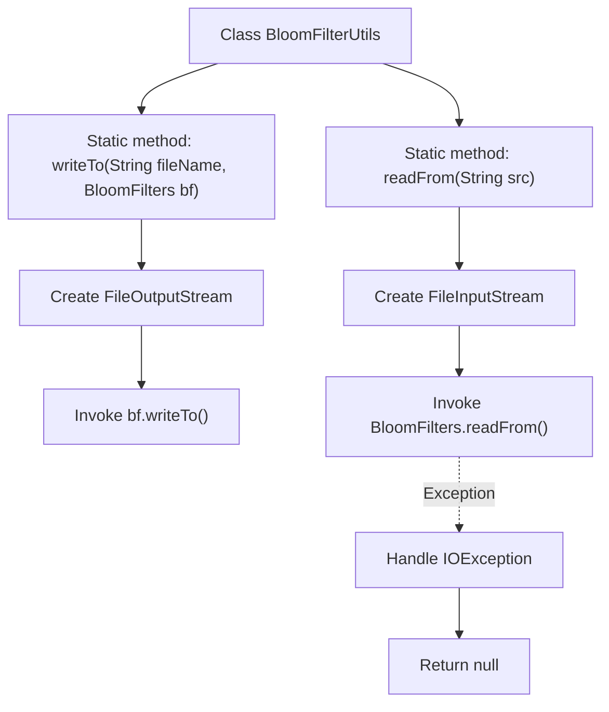

# Basic Information

|      |      |
|------|------|
| Name | BloomFilterUtils |
| Language | .java |
| Code Path | WeFe/fusion/fusion-core/src/main/java/com/welab/wefe/fusion/core/utils/bf/BloomFilterUtils.java |
| Package Name | com.welab.wefe.fusion.core.utils.bf |
| Dependencies | ['java.io.FileInputStream', 'java.io.FileOutputStream', 'java.io.IOException'] |
| Brief Description | The BloomFilterUtils class provides two methods: writeTo writes the Bloom filter to a file, and readFrom reads the Bloom filter from a file. |

# Description

The BloomFilterUtils class provides two static methods for handling file operations related to Bloom filters. The writeTo method writes a Bloom filter object to a specified file using FileOutputStream in overwrite mode. The readFrom method reads a Bloom filter object from a file using FileInputStream, printing the stack trace and returning null if an IO exception occurs. These two methods simplify the persistence and loading process of Bloom filters.

# Class Summary

| Name   | Type  | Description |
|-------|------|-------------|
| BloomFilterUtils | class | The BloomFilterUtils class provides two static methods: writeTo writes the Bloom filter to a file, and readFrom reads the Bloom filter from a file. |

## Class BloomFilterUtils

|      |      |
|------|------|
| Access Modifier | public |
| Type | class |
| Name | BloomFilterUtils |
| Description | The BloomFilterUtils class provides two static methods: writeTo writes the Bloom filter to a file, and readFrom reads the Bloom filter from a file. |

### UML Class Diagram

This code demonstrates a utility class `BloomFilterUtils` that provides two static methods for Bloom filter serialization and deserialization operations. The `writeTo` method writes the Bloom filter to a specified file, while the `readFrom` method reads the Bloom filter from a file. The class depends on the `BloomFilters` interface, which defines the core read/write methods. The code structure is clear, but the deserialization process does not handle IO exceptions and directly returns null, potentially leading to null pointer issues. A Bloom filter is a space-efficient probabilistic data structure used to test whether an element is a member of a set.

### Internal Method Call Graph

This flowchart illustrates the two core methods of the BloomFilterUtils utility class. The writeTo method serializes a Bloom filter to a specified file, involving creating an output stream and invoking bf's write method. The readFrom method deserializes a Bloom filter from a file, which includes creating an input stream and calling the static read method, printing the stack trace and returning null upon exceptions. Both methods revolve around file I/O operations, demonstrating standard serialization/deserialization processing flows.

### Field List

| Name  | Type  | Description |
|-------|-------|------|

### Method List

| Name  | Type  | Description |
|-------|-------|------|
| readFrom | BloomFilters | Static method reads the Bloom filter from the specified path and returns null on exception. |
| writeTo | void | Java static method that writes a BloomFilter object to a specified file in overwrite mode, may throw IO exceptions. |

