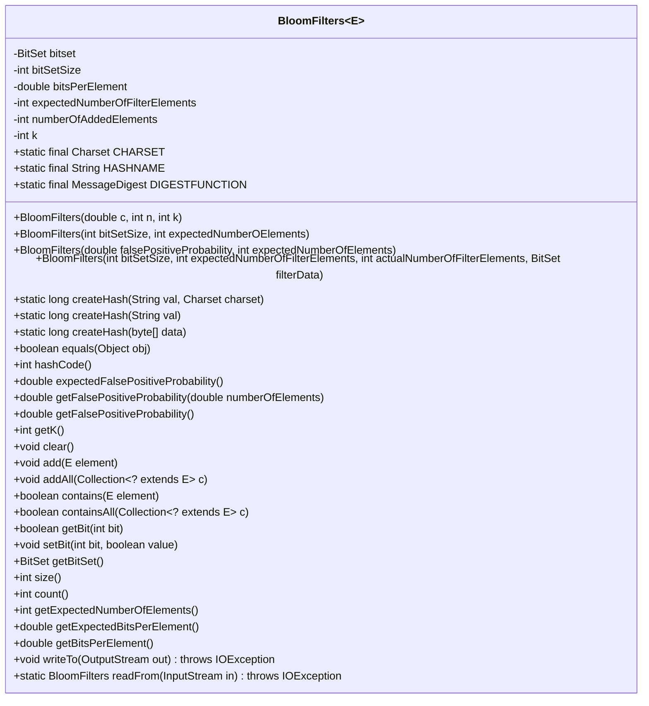

# Basic Information

|      |      |
|------|------|
| Name | BloomFilters |
| Language | .java |
| Code Path | WeFe/fusion/fusion-core/src/main/java/com/welab/wefe/fusion/core/utils/bf/BloomFilters.java |
| Package Name | com.welab.wefe.fusion.core.utils.bf |
| Dependencies | ['com.google.common.base.Preconditions', 'java.io', 'java.nio.charset.Charset', 'java.security.MessageDigest', 'java.security.NoSuchAlgorithmException', 'java.util.BitSet', 'java.util.Collection'] |
| Brief Description | The BloomFilters class is a serializable Bloom filter implementation that uses a BitSet for data storage. It supports functionalities such as adding elements, checking for element existence, calculating false positive rates, and provides multiple constructors to accommodate different scenario requirements. |

# Description

This is a Java class that implements a Bloom Filter. A Bloom Filter is a space-efficient probabilistic data structure used to determine whether an element is in a set. The class provides multiple constructors, supporting filter initialization through various parameters (such as false positive rate, expected number of elements, etc.). Core functionalities include adding elements, checking element existence, calculating the false positive rate, and clearing the filter. The class uses BitSet for data storage, employs the MD5 hash algorithm to generate digests, and supports object persistence through the serialization interface. Additionally, it implements the equals and hashCode methods and provides utility methods for read and write operations.

# Class Summary

| Name   | Type  | Description |
|-------|------|-------------|
| BloomFilters | class | The `BloomFilters` class is a serializable Bloom filter implementation that utilizes `BitSet` for data storage. It supports functionalities such as adding elements, checking element existence, calculating false positive rates, and provides multiple constructors to accommodate various scenario requirements. |

## Class BloomFilters

|      |      |
|------|------|
| Access Modifier | public |
| Type | class |
| Name | BloomFilters |
| Description | The `BloomFilters` class is a serializable Bloom filter implementation that utilizes `BitSet` for data storage. It supports functionalities such as adding elements, checking element existence, calculating false positive rates, and provides multiple constructors to accommodate various scenario requirements. |

### UML Class Diagram

Class diagram description: BloomFilters<E> is a generic class that implements the Serializable interface, designed to realize the Bloom filter data structure. It contains a BitSet for storing element hash results and provides core functionalities such as adding elements, checking element existence, and calculating false positive probabilities. The class includes multiple constructors supporting filter initialization through different parameters (e.g., false positive probability, expected number of elements). Static method createHash generates hash values, while serialization/deserialization support is also provided. This class encapsulates all core operations and state management required for a Bloom filter.

### Internal Method Call Graph

```mermaid
graph TD
    A["Class BloomFilters<E>"]
    B["Static Properties: serialVersionUID, CHARSET, HASHNAME, DIGESTFUNCTION"]
    C["Instance Properties: bitset, bitSetSize, bitsPerElement, expectedNumberOfFilterElements, numberOfAddedElements, k"]
    D["Constructor: BloomFilters(double c, int n, int k)"]
    E["Constructor: BloomFilters(int bitSetSize, int expectedNumberOElements)"]
    F["Constructor: BloomFilters(double falsePositiveProbability, int expectedNumberOfElements)"]
    G["Constructor: BloomFilters(int bitSetSize, int expectedNumberOfFilterElements, int actualNumberOfFilterElements, BitSet filterData)"]
    H["Static Methods: createHash series"]
    I["Core Methods: add/addAll/contains/containsAll"]
    J["Utility Methods: clear/getBit/setBit/getBitSet"]
    K["Calculation Methods: expectedFalsePositiveProbability/getFalsePositiveProbability"]
    L["Serialization Methods: writeTo/readFrom"]
    M["Overridden Methods: equals/hashCode"]

    A --> B
    A --> C
    A --> D
    A --> E
    A --> F
    A --> G
    A --> H
    A --> I
    A --> J
    A --> K
    A --> L
    A --> M
```

This flowchart illustrates the main structure and functional modules of the BloomFilters class. The class contains 4 constructors that initialize the Bloom filter with different parameters; core operations include element addition (add/addAll) and existence checking (contains/containsAll); it supports probability calculation, bit manipulation, and serialization functionality. The static method createHash provides hash generation capability, while overriding the equals and hashCode methods. The class design comprehensively covers all core functionalities required for a Bloom filter.

### Field List

| Name  | Type  | Description |
|-------|-------|------|
| k | int | Private integer variable k. |
| HASHNAME = "MD5" | String | Define a static constant HASHNAME with the string value "MD5". |
| DIGESTFUNCTION | MessageDigest | Declare a static immutable MessageDigest object DIGESTFUNCTION. |
| serialVersionUID = -2326638072608273135L | long | Define the serial version UID as -2326638072608273135L to ensure class version compatibility. |
| bitsPerElement | double | Private double-precision floating-point variable, representing the number of bits per element. |
| bitSetSize | int | The private integer variable bitSetSize is used to represent the size of the bit set. |
| expectedNumberOfFilterElements | int | Private integer variable used to store the expected number of filter elements. |
| numberOfAddedElements | int | Private integer variable, recording the number of newly added elements. |
| bitset | BitSet | The private bitset variable bitset. |
| CHARSET = Charset.forName("UTF-8") | Charset | Define the static constant CHARSET for the UTF-8 character set. |

### Method List

| Name  | Type  | Description |
|-------|-------|------|
| add | void | The method `add` converts the element into a string, generates a hash value by looping k times, takes the modulo, sets the corresponding bit in the bitset to true, and finally increments the element count. |
| equals | boolean | Override the equals method to check whether the object is non-null, the class is the same, the expected number of elements, the k value, the bitset size, and the bitset content are consistent. |
| addAll | void | The method iterates through all elements in collection c and invokes the add method to add them one by one to the current collection. |
| hashCode | int | Rewrite the hashCode method to compute the hash code based on the bitset, expected number of elements, bitset size, and k value. |
| getFalsePositiveProbability | double | The method returns the false positive probability, calculated based on the number of elements already added. |
| createHash | long | The method generates a hash value from a string and character set by first converting them into a byte array and then invoking an internal hash function. |
| getK | int | Methods to obtain the value of the integer variable k. |
| createHash | long | The static method `createHash` takes a string parameter `val`, invokes the overloaded method `createHash` with the default charset `CHARSET`, and returns a long integer hash value. |
| getBitSet | BitSet | Methods to obtain a BitSet object, directly returning the member variable bitset. |
| expectedFalsePositiveProbability | double | This method calculates the expected false positive probability by calling getFalsePositiveProbability and passing the expected number of elements as a parameter. |
| size | int | This method returns the value of bitSetSize, indicating the current size of the bit set. |
| count | int | The method count returns the number of elements currently added. |
| getExpectedNumberOfElements | int | Method returns the expected number of filter elements. |
| getExpectedBitsPerElement | double | The method returns the expected number of bits for each current element. |
| getBitsPerElement | double | This method calculates the average number of bits per element, with the formula being the size of the bitset divided by the number of elements. |
| writeTo | void | Write the bitmap size, expected number of elements, and bitset data to the output stream. |
| readFrom | BloomFilters | Read data from the input stream to construct a BloomFilter, including the size of the bit set, the expected number of elements, and the byte array of data, throwing an IOException in case of exceptions. |
| getBit | boolean | The method `getBit` checks the value of a specified bit in the bitset and returns a boolean result. |
| containsAll | boolean | Check if the set contains all elements of the given set, return true if all are included, otherwise return false. |
| createHash | long | The static method `createHash` generates a data hash value: it synchronously invokes the digest function to process the input byte array, then converts the first 4 bytes into a long integer and returns it. |
| clear | void | Clear the bit set and reset the element count. |
| getFalsePositiveProbability | double | Calculate the false positive probability of a Bloom filter, given by the formula (1 - e^(-k * n / m)) ^ k, where n is the number of elements, m is the size of the bit array, and k is the number of hash functions. |
| contains | boolean | Check if an element exists in the Bloom filter by verifying the bit set status through multiple hash computations. Return true if it exists, otherwise return false. |
| setBit | void | This method is used to set the value of a specified bit, where the parameter `bit` specifies the position and `value` is a boolean indicating the state to be set. |

