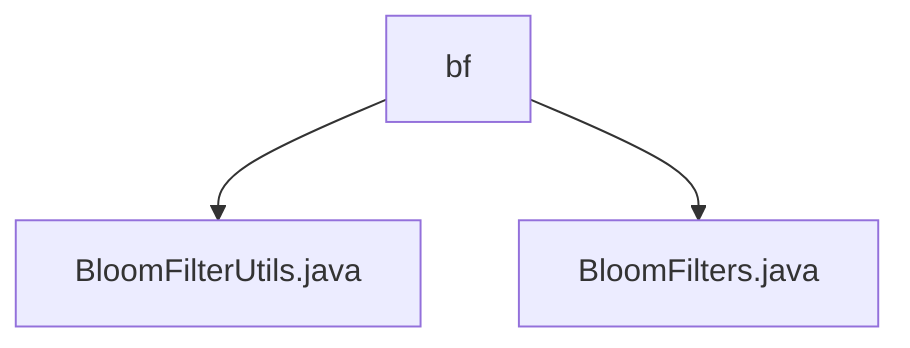

# Basic Information

|      |      |
|------|------|
| Name | bf |
| Language | .java |
| Code Path | WeFe/fusion/fusion-core/src/main/java/com/welab/wefe/fusion/core/utils/bf |
| Package Name | docs.fusion.fusion-core.src.main.java.com.welab.wefe.fusion.core.utils.bf |
| Brief Description | The BloomFilterUtils class provides file read/write methods to simplify Bloom filter persistence. The BloomFilters class implements the core functionality of Bloom filters, supporting various initialization parameters and operations such as adding elements and checking existence, utilizing BitSet and MD5 hashing. |

# Description

## Overview  
The core responsibility of this module is to implement efficient operations and persistence for Bloom filters, supporting element existence detection and file storage/loading. The interface specifications include writing to files (overwrite mode) and reading from files (returns null on exception), such as BloomFilterUtils providing static methods to simplify IO operations. The key data structures are BitSet storage and MD5 hash digests. External dependencies are limited to the Java standard IO library. For example, the filter is initialized based on the false positive rate and expected element count.

## Key Business Scenarios  
Typical applications include big data deduplication and fast retrieval, similar to a pre-check caching mechanism. The complete workflow covers initialization, element addition/query, and file persistence (e.g., writeTo/readFrom). The interaction mode is encapsulated via static methods, such as the BloomFilters class supporting multiple construction parameters. The API types focus on basic operations (add/contains) and serialization, with MD5 hashing ensuring data consistency.

### Package Internal Structure View

This flowchart illustrates the file structure of Bloom Filter-related utility classes in the WeFe project. The parent node 'bf' contains two child nodes: BloomFilterUtils.java and BloomFilters.java. Both Java files are located under the Bloom Filter utility package path in the fusion-core module, providing distinct functional implementations for Bloom Filters.

# File List

| Name   | Type  | Description |
|-------|------|-------------|
| [BloomFilterUtils.java](BloomFilterUtils.md) | file | The BloomFilterUtils class provides two methods: writeTo writes the Bloom filter to a file, and readFrom reads the Bloom filter from a file. |
| [BloomFilters.java](BloomFilters.md) | file | The `BloomFilters` class is a serializable Bloom filter implementation that utilizes `BitSet` for data storage. It supports functionalities such as adding elements, checking element existence, calculating false positive rates, and offers multiple constructors to accommodate various scenario requirements. |

