# Basic Information

|      |      |
|------|------|
| Name | welab |
| Language | .java |
| Code Path | WeFe/fusion/fusion-service/src/main/java/com/welab |
| Package Name | docs.fusion.fusion-service.src.main.java.com.welab |
| Brief Description | The core system of the federated learning platform includes control, data, and task modules, supporting the entire workflow of initialization, data management, and task scheduling. It features a layered architecture design, unified interface standards, and integrates key data structures with multiple service components. |

# Description

## Overview  
This module serves as the core management system of the federated learning platform, adopting a layered architecture design that integrates system control, data management, task scheduling, and privacy computing functionalities. Its core responsibilities include: 1) achieving data persistence through a hierarchical storage system (MySQL/MergeTree); 2) ensuring secure cross-institution data alignment based on the PSI (Private Set Intersection) algorithm; 3) providing a full lifecycle management toolkit (Bloom filters/primary key generation, etc.). The interface specifications uniformly employ JPA annotations and RESTful style, such as deriving various APIs from the AbstractApi base class and implementing extended queries via @Query. Key data structures encompass paginated result sets, encrypted business entities (e.g., GlobalConfigMysqlModel), and PSI execution parameters (e/N/d). External dependencies include Spring Data JPA, RSA encryption components, connection pool management (e.g., HikariCP), and multiple database drivers (MySQL/Hive/Impala).  

## Core Business Scenarios  
The module supports end-to-end federated learning process management, with a typical workflow as follows: 1) system initialization (generating RSA keys/validating memberName); 2) data preparation (DatasetApi managing CSV/Excel parsing); 3) secure computation (PsiClientActuator executing encrypted sharding); 4) result callback (TaskResultManager dynamically creating tables for storage). The interaction model combines the producer-consumer pattern (batch processing 10,000 rows of data) with state machine-driven operations (TaskStatus managing 7 states). Functional completeness is reflected in: encrypted validation (≤5 field combinations), thread-safe operations (ConcurrentHashMap managing tasks), and exception handling chains (StatusCodeWithException). Integration cases span from basic configurations (DataSourceConfig multi-data sources) to complex business scenarios (RSA-PSI algorithm switching), resembling a distributed ETL console.

### Package Internal Structure View

```mermaid
graph TD
    wefe --> data
    data --> fusion
    fusion --> service
    service --> api
    service --> repo
    service --> database
    service --> utils
    service --> enums
    service --> actuator
    service --> manager
    service --> service
    service --> scheduled
    service --> dto
    service --> operation
    service --> task
    service --> listener
    service --> config
    api --> system
    api --> account
    api --> partner
    api --> bloomfilter
    api --> thirdparty
    api --> file
    api --> dataset
    api --> operation
    api --> task
    api --> datasource
    system --> IsInitializedApi.java
    system --> ResetRsaKeyApi.java
    system --> OptionsApi.java
    system --> GlobalConfigUpdateApi.java
    system --> GetGlobalConfigApi.java
    system --> TaskOverviewApi.java
    system --> InitializeApi.java
    system --> ConfigApi.java
    account --> SsoLoginApi.java
    partner --> PagingApi.java
    partner --> UpdateApi.java
    partner --> DeleteApi.java
    partner --> AddApi.java
    partner --> CheckApi.java
    bloomfilter --> QueryApi.java
    bloomfilter --> DetailAndPreviewApi.java
    bloomfilter --> DeleteApi.java
    bloomfilter --> AddApi.java
    bloomfilter --> DetailApi.java
    bloomfilter --> GetBloomFilterStateApi.java
    bloomfilter --> PreviewApi.java
    thirdparty --> CallbackApi.java
    thirdparty --> RemoteCheckApi.java
    file --> MergeApi.java
    file --> UploadApi.java
    dataset --> GetDataSetStateApi.java
    dataset --> QueryApi.java
    dataset --> DetailAndPreviewApi.java
    dataset --> UpdateApi.java
    dataset --> DeleteApi.java
    dataset --> AddApi.java
    dataset --> DetailApi.java
    dataset --> GetHeadersApi.java
    dataset --> PreviewApi.java
    operation --> LogQueryApi.java
    task --> ReceiveApi.java
    task --> InfoApi.java
    task --> PagingApi.java
    task --> UpdateApi.java
    task --> DeleteApi.java
    task --> AddApi.java
    task --> DetailApi.java
    task --> TaskStatusApi.java
    task --> StopTaskApi.java
    task --> HandleApi.java
    datasource --> OverviewApi.java
    datasource --> QueryApi.java
    datasource --> UpdateApi.java
    datasource --> DeleteApi.java
    datasource --> AddApi.java
    datasource --> TestDBConnectApi.java
    repo --> impl
    repo --> Storage.java
    repo --> AbstractStorage.java
    impl --> MysqlStorage.java
    database --> repository
    database --> entity
    database --> DataSourceConfig.java
    repository --> DataSetRepository.java
    repository --> base
    repository --> DataSourceRepository.java
    repository --> BloomFilterRepository.java
    repository --> OperationLogRepository.java
    repository --> GlobalConfigRepository.java
    repository --> GlobalSettingRepository.java
    repository --> PartnerRepository.java
    repository --> TaskRepository.java
    repository --> FieldInfoRepository.java
    repository --> AccountRepository.java
    repository --> TaskResultRepository.java
    repository --> VerificationCodeRepository.java
    base --> BaseRepositoryFactoryBean.java
    base --> BaseRepositoryImpl.java
    base --> BaseRepository.java
    entity --> AbstractBaseMySqlModel.java
    entity --> TaskMySqlModel.java
    entity --> DataSetMySqlModel.java
    entity --> TaskResultMySqlModel.java
    entity --> GlobalSettingMySqlModel.java
    entity --> DataSetColumnOutputModel.java
    entity --> GlobalConfigMysqlModel.java
    entity --> BloomFilterMySqlModel.java
    entity --> PartnerMySqlModel.java
    entity --> OperationLogMysqlModel.java
    entity --> VerificationCodeMysqlModel.java
    entity --> FieldInfoMySqlModel.java
    entity --> AccountMysqlModel.java
    entity --> DataSourceMySqlModel.java
    entity --> AbstractMySqlModel.java
    utils --> bf
    utils --> primarykey
    utils --> dataresouce
    utils --> unique
    utils --> ByteUtils.java
    utils --> AbstractDataSetReader.java
    utils --> CsvDataSetReader.java
    utils --> ExcelDataSetReader.java
    utils --> FileSecurityChecker.java
    utils --> SocketUtils.java
    utils --> FusionUtils.java
    bf --> BloomFilterUtils.java
    bf --> BloomFilters.java
    bf --> BitArray.java
    primarykey --> PrimaryKeyUtils.java
    primarykey --> FieldInfo.java
    dataresouce --> DataResouceHelper.java
    unique --> DataSetBloomUniqueFilter.java
    unique --> AbstractDataSetUniqueFilter.java
    unique --> ContainResult.java
    unique --> DataSetMemoryUniqueFilter.java
    enums --> RoleType.java
    enums --> DBType.java
    enums --> Options.java
    enums --> TaskStatus.java
    enums --> DataResourceType.java
    enums --> DataResourceSource.java
    enums --> AlgorithmType.java
    enums --> CallbackType.java
    enums --> Progress.java
    enums --> ActionType.java
    enums --> PSIActuatorRole.java
    enums --> PSIActuatorStatus.java
    actuator --> rsapsi
    actuator --> AbstractActuator.java
    rsapsi --> PsiClientActuator.java
    rsapsi --> AbstractPsiActuator.java
    rsapsi --> PsiServerActuator.java
    manager --> TaskResultManager.java
    manager --> ActuatorManager.java
    manager --> JdbcManager.java
    service --> bloomfilter
    service --> globalconfig
    service --> dataset
    service --> TaskService.java
    service --> SystemInitializeService.java
    service --> PartnerService.java
    service --> FusionStorageService.java
    service --> AccountService.java
    service --> AbstractService.java
    service --> DataStorageService.java
    service --> FieldInfoService.java
    service --> TaskResultService.java
    service --> CallbackService.java
    service --> CacheObjects.java
    service --> PrivacyDatabaseEncryptService.java
    service --> DataSourceService.java
    service --> GetHeadersService.java
    service --> ThirdPartyService.java
    service --> OperationLogService.java
    bloomfilter --> BloomFilterAddServiceDataRowConsumer.java
    bloomfilter --> BloomFilterService.java
    bloomfilter --> BloomFilterAddService.java
    bloomfilter --> GetBloomFilterStateService.java
    globalconfig --> GlobalConfigService.java
    globalconfig --> MailServerModel.java
    globalconfig --> BaseGlobalConfigService.java
    dataset --> DataSetAddService.java
    dataset --> GetDataSetStateService.java
    dataset --> DataSetAddServiceDataRowConsumer.java
    dataset --> DataSetService.java
    dataset --> DataSetStorageHelper.java
    scheduled --> AccountScheduledService.java
    dto --> vo
    dto --> entity
    dto --> base
    vo --> AccountInputModel.java
    vo --> AccountOutputModel.java
    entity --> bloomfilter
    entity --> globalconfig
    entity --> dataset
    entity --> DataSourceOverviewOutput.java
    entity --> TaskOverviewOutput.java
    entity --> OperationLogOutputModel.java
    entity --> PartnerOutputModel.java
    entity --> AbstractOutputModel.java
    entity --> TaskOutput.java
    bloomfilter --> BloomfilterOutputModel.java
    bloomfilter --> BloomfilterDetailOutputModel.java
    globalconfig --> GlobalConfigInput.java
    globalconfig --> MemberInfoModel.java
    globalconfig --> FusionConfigModel.java
    dataset --> DataSetOutputModel.java
    dataset --> DataSetPreviewOutputModel.java
    dataset --> DataSetDetailOutputModel.java
    dataset --> DataSetStateOutputModel.java
    base --> PagingOutput.java
    base --> PagingInput.java
    operation --> FusionApiLogger.java
    task --> PsiClientTask.java
    task --> AbstractTask.java
    task --> PsiServerTask.java
    task --> AbstractPsiTask.java
    listener --> AutoPrivacyDatabaseEncryptListener.java
    config --> Config.java
    service --> FusionService.java
```

This flowchart illustrates the complete directory structure of the WeFe/fusion project, starting from the top-level wefe node and expanding hierarchically down to the most granular files. It primarily includes core modules such as api, service, database, and utils. The api module is further subdivided into submodules like system, account, and partner, each containing corresponding interface files, while the service module encompasses business logic processing-related service classes. The entire structure is clearly layered, comprehensively presenting the hierarchical relationships between project modules.

# File List

| Name   | Type  | Description |
|-------|------|-------------|
| [wefe](wefe/_module.md) | package | The core system of the federated learning platform includes control, data, and task modules, supporting the entire workflow from initialization to data management and task scheduling. It features a layered architecture design, unified interface standards, and integrates key data structures with multiple service components. |

