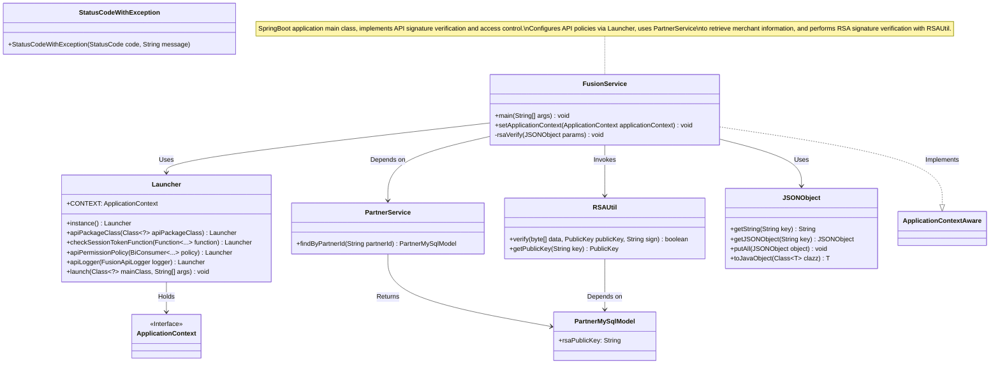
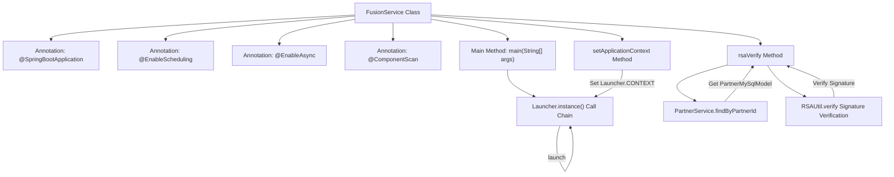
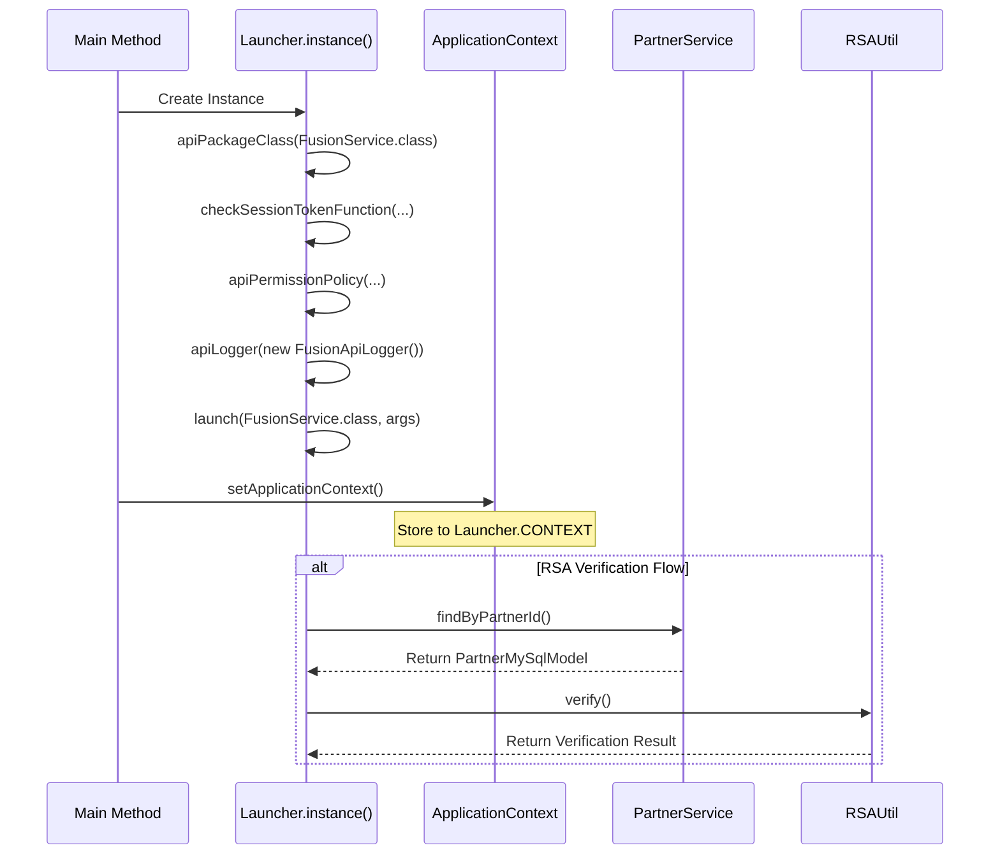

# Basic Information

|      |      |
|------|------|
| Name | FusionService |
| Language | .java |
| Code Path | WeFe/fusion/fusion-service/src/main/java/com/welab/wefe/data/fusion/service/FusionService.java |
| Package Name | com.welab.wefe.data.fusion.service |
| Dependencies | ['com.alibaba.fastjson.JSONObject', 'com.welab.wefe.common.StatusCode', 'com.welab.wefe.common.exception.StatusCodeWithException', 'com.welab.wefe.common.util.RSAUtil', 'com.welab.wefe.common.web.Launcher', 'com.welab.wefe.common.web.config.ApiBeanNameGenerator', 'com.welab.wefe.common.web.dto.SignedApiInput', 'com.welab.wefe.common.web.util.CurrentAccountUtil', 'com.welab.wefe.data.fusion.service.database.entity.PartnerMySqlModel', 'com.welab.wefe.data.fusion.service.operation.FusionApiLogger', 'com.welab.wefe.data.fusion.service.service.PartnerService', 'org.springframework.beans.BeansException', 'org.springframework.boot.autoconfigure.SpringBootApplication', 'org.springframework.context.ApplicationContext', 'org.springframework.context.ApplicationContextAware', 'org.springframework.context.annotation.ComponentScan', 'org.springframework.scheduling.annotation.EnableAsync', 'org.springframework.scheduling.annotation.EnableScheduling'] |
| Brief Description | A SpringBoot application integrates scheduling and asynchronous tasks, customizes component scanning paths, implements API permission verification and RSA signature validation, and launches and manages the application context through a Launcher. |

# Description

This is the main class `FusionService` of a Spring Boot application, annotated with `@SpringBootApplication` and enabled with scheduled tasks and asynchronous functionality. It specifies a custom Bean name generator and base scan packages via `@ComponentScan`. The class implements the `ApplicationContextAware` interface to obtain the application context. The `main` method launches the application through `Launcher`, configuring API package paths, session token checks, permission policies, and logging. The class also includes RSA signature verification logic, which looks up partner services and validates the signature effectiveness of request parameters, throwing an exception upon failure.

# Class Summary

| Name   | Type  | Description |
|-------|------|-------------|
| FusionService | class | FusionService is a SpringBoot application that enables scheduled and asynchronous tasks with custom component scanning. The main method launches the API service via Launcher, configuring permission validation and logging. It implements RSA signature verification to check member validity and data signatures. |

## Class FusionService

|      |      |
|------|------|
| Access Modifier | @SpringBootApplication;@EnableScheduling;@EnableAsync;@ComponentScan(;        nameGenerator = ApiBeanNameGenerator.class,;        basePackageClasses = {FusionService.class, Launcher.class};);public |
| Type | class |
| Name | FusionService |
| Description | FusionService is a SpringBoot application that enables scheduled and asynchronous tasks with custom component scanning. The main method launches the API service via Launcher, configuring permission validation and logging. It implements RSA signature verification to check member validity and data signatures. |

### UML Class Diagram

This code represents the entry class of a SpringBoot application, primarily implementing API signature verification and access control functionalities. The class diagram illustrates the interaction relationships between FusionService as the main class and components such as Launcher, PartnerService, and RSAUtil. FusionService configures API policies through Launcher, retrieves merchant information using PartnerService, and invokes RSAUtil for RSA signature verification. The entire process involves collaboration among multiple components, including parameter processing, merchant information queries, and cryptographic verification steps.

### Internal Method Call Graph

The flowchart illustrates the core structure of FusionService, including SpringBoot startup configuration, Launcher initialization process, and RSA signature verification logic. The sequence diagram details the chained invocation process of Launcher during main method execution, followed by context setup and security verification interactions. The code implements a SpringBoot-based API service framework integrating session validation, permission policies, and logging functionality, with RSA signature verification securely validating request data through key pairs obtained from PartnerService.

### Field List

| Name  | Type  | Description |
|-------|-------|------|

### Method List

| Name  | Type  | Description |
|-------|-------|------|
| main | void | Configure the Launcher instance in the Java main method, set the API package class, session check, permission policy, and logging, then start the FusionService service. |
| setApplicationContext | void | This method assigns the incoming Spring application context to the static variable CONTEXT of the Launcher class. |
| rsaVerify | void | The method rsaVerify verifies an RSA signature: it checks the validity of the member ID, uses the public key to verify the data signature, throws an exception if it fails, and merges the data if successful. |

