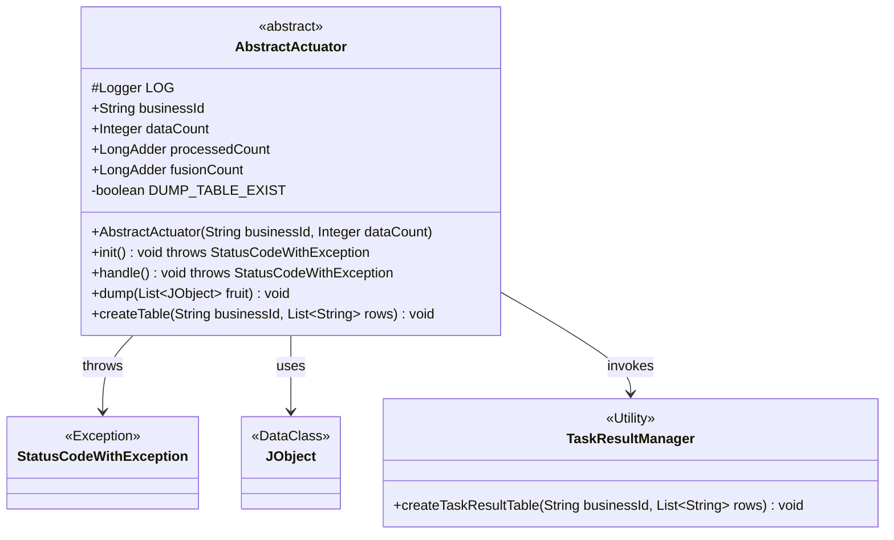
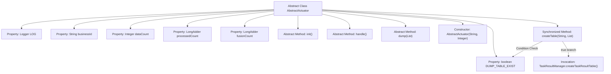

# Basic Information

|      |      |
|------|------|
| Name | AbstractActuator |
| Language | .java |
| Code Path | WeFe/fusion/fusion-service/src/main/java/com/welab/wefe/data/fusion/service/actuator/AbstractActuator.java |
| Package Name | com.welab.wefe.data.fusion.service.actuator |
| Dependencies | ['com.welab.wefe.common.exception.StatusCodeWithException', 'com.welab.wefe.common.util.JObject', 'com.welab.wefe.data.fusion.service.manager.TaskResultManager', 'org.slf4j.Logger', 'org.slf4j.LoggerFactory', 'java.util.List', 'java.util.concurrent.atomic.LongAdder'] |
| Brief Description | The abstract class `AbstractActuator` implements `AutoCloseable` and contains fields such as business ID and data count. It provides abstract methods for initialization, execution, and data persistence, while supporting synchronous table creation functionality. |

# Description

AbstractActuator is an abstract class that implements the AutoCloseable interface. It contains the following key attributes and methods: businessId and dataCount as public properties, processedCount and fusionCount using LongAdder for counting. It provides abstract methods init (initializing the actuator), handle (actuator processing method), and dump (data persistence method). The constructor accepts businessId and dataCount parameters. The private variable DUMP_TABLE_EXIST marks whether the table exists, and the createTable method is used to synchronously create the table (only when the table does not exist), internally calling TaskResultManager.createTaskResultTable. The class also includes a protected Logger instance for logging.

# Class Summary

| Name   | Type  | Description |
|-------|------|-------------|
| AbstractActuator | class | The abstract class AbstractActuator implements AutoCloseable, containing fields such as business ID and data count. It provides abstract methods for initialization, execution, and data persistence, while supporting synchronous table creation. |

## Class AbstractActuator

|      |      |
|------|------|
| Access Modifier | public abstract |
| Type | class |
| Name | AbstractActuator |
| Description | The abstract class AbstractActuator implements AutoCloseable, containing fields such as business ID and data count. It provides abstract methods for initialization, execution, and data persistence, while supporting synchronous table creation. |

### UML Class Diagram

This class diagram describes an abstract actuator class AbstractActuator, which implements the AutoCloseable interface. It contains fields such as business ID and data count, along with abstract methods for initialization, processing, and data dumping. The class utilizes TaskResultManager to create result tables and may throw StatusCodeWithException. The diagram clearly illustrates key interactions between classes, including exception handling, utility class invocation, and data object usage.

### Internal Method Call Graph

This flowchart illustrates the complete structure of the AbstractActuator abstract class, including 5 member variables, 3 abstract methods, and 2 concrete methods. The critical path shows the synchronized control flow of the createTable method: it first checks the DUMP_TABLE_EXIST flag, and when the table doesn't exist, invokes TaskResultManager to create the table and updates the flag. All abstract methods require implementation by subclasses, while the constructor initializes core business parameters. The flowchart clearly presents hierarchical relationships between class members and conditional logic.

### Field List

| Name  | Type  | Description |
|-------|-------|------|
| businessId | String | Defined a public string variable businessId. |
| DUMP_TABLE_EXIST = false | boolean | The private boolean variable DUMP_TABLE_EXIST has an initial value of false, used to determine whether the table exists. |
| LOG = LoggerFactory.getLogger(getClass()) | Logger | Define a protected static log object LOG in the class for recording logs of the current class. |
| dataCount | Integer | Declare a public integer variable named dataCount. |
| fusionCount = new LongAdder() | LongAdder | Defined a LongAdder-type variable named fusionCount for high-concurrency counting. |
| processedCount = new LongAdder() | LongAdder | Define a variable named processedCount of type LongAdder, used for incremental counting in high-concurrency scenarios. |

### Method List

| Name  | Type  | Description |
|-------|-------|------|
| handle | void | Abstract method handle, which may throw a StatusCodeWithException. |
| init | void | Abstract method init, which may throw a StatusCodeWithException. |
| dump | void | Abstract method dump, which takes a list of JObject parameters named fruit and has no return value. |
| createTable | void | The synchronous method `createTable` checks if the table exists, and if not, creates the table and updates the status. |

