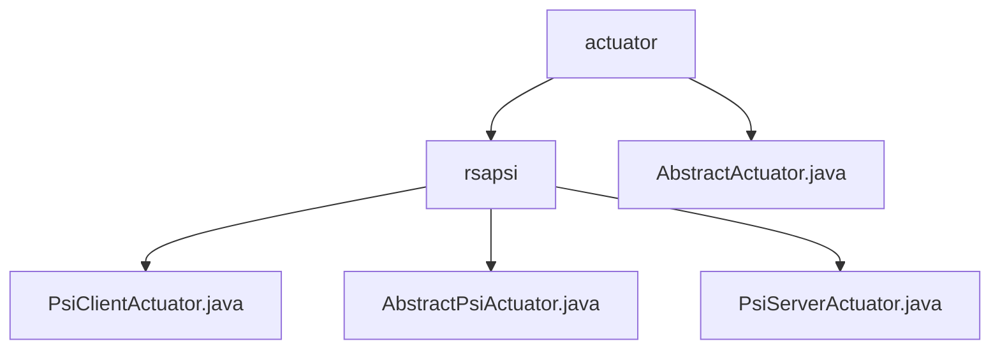

# Basic Information

|      |      |
|------|------|
| Name | actuator |
| Language | .java |
| Code Path | WeFe/fusion/fusion-service/src/main/java/com/welab/wefe/data/fusion/service/actuator |
| Package Name | docs.fusion.fusion-service.src.main.java.com.welab.wefe.data.fusion.service.actuator |
| Brief Description | The PsiClientActuator and PsiServerActuator form the PSI dual-end module, which employs RSA encryption and Bloom filters to achieve secure data alignment. The client performs encrypted comparison while the server processes requests, supporting cross-institution data matching such as financial risk control. AbstractActuator is an abstract class containing initialization, processing, and storage methods, utilizing LongAdder for counting. |

# Description

## Overview  
The core responsibility of the module is to implement Private Set Intersection (PSI) through dual-end actuators (PsiClientActuator/PsiServerActuator), utilizing RSA encryption and Bloom filter technology to ensure secure data alignment, akin to a secure multi-party computation gateway. Key data structures include thread pool configuration, encryption parameters (e/N/d), status identifiers, and cache Maps, relying on foundational Java networking libraries and encryption components. For example, client-side paginated encrypted queries and server-side multi-threaded signature processing.  

AbstractActuator serves as the base class for actuators, managing task metadata via businessId/dataCount, implementing atomic counting with processedCount/fusionCount, and providing a standardized lifecycle of initialization (init), processing (handle), and persistence (dump). For instance, synchronously creating result tables through TaskResultManager.  

## Key Business Scenarios  
The complete workflow involves client-side data sharding → RSA encryption → Bloom filter comparison → server-side signature returning the intersection, with a state machine managing the interaction process. It is typically applied to cross-institution secure matching (e.g., financial blacklist comparison), supporting HTTP filter downloads and Socket long-connection data alignment. For example, large-capacity dataset sharding scenarios.  

AbstractActuator standardizes the universal actuator pattern: initialization → atomic counting processing → result persistence, ensuring table structure existence via createTable. It is suitable for batch processing tasks requiring phased statistics and reliable storage, resembling an ETL pipeline design.

### Package Internal Structure View

This flowchart illustrates the hierarchical structure of the actuator module in WeFe's data fusion service. The top level is the actuator directory, which contains the AbstractActuator abstract class and the rsapsi subdirectory. The rsapsi directory includes three PSI protocol-related actuator classes: PsiClientActuator, AbstractPsiActuator, and PsiServerActuator, reflecting the client-server implementation pattern of the PSI protocol in data fusion.

# File List

| Name   | Type  | Description |
|-------|------|-------------|
| [AbstractActuator.java](AbstractActuator.md) | file | The abstract class AbstractActuator implements AutoCloseable and contains fields such as business ID and data count. It provides abstract methods for initialization, execution, data persistence, etc., and supports synchronous table creation functionality. |
| [rsapsi](rsapsi/_module.md) | package | The PsiClientActuator is a PSI client actuator responsible for data encryption and comparison, incorporating a thread pool and encryption parameters. The AbstractPsiActuator serves as an abstract base class, managing PSI task attributes and result processing. The PsiServerActuator is a server-side actuator that handles requests and encryption operations, supporting multithreading and state management. |

