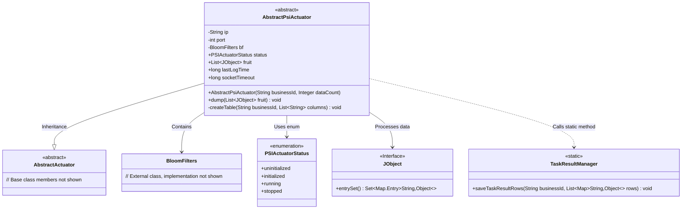
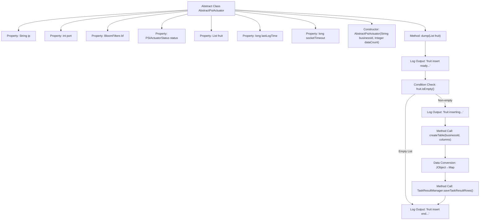

# Basic Information

|      |      |
|------|------|
| Name | AbstractPsiActuator |
| Language | .java |
| Code Path | WeFe/fusion/fusion-service/src/main/java/com/welab/wefe/data/fusion/service/actuator/rsapsi/AbstractPsiActuator.java |
| Package Name | com.welab.wefe.data.fusion.service.actuator.rsapsi |
| Dependencies | ['com.welab.wefe.common.util.JObject', 'com.welab.wefe.data.fusion.service.actuator.AbstractActuator', 'com.welab.wefe.data.fusion.service.enums.PSIActuatorStatus', 'com.welab.wefe.data.fusion.service.manager.TaskResultManager', 'com.welab.wefe.data.fusion.service.utils.bf.BloomFilters', 'java.util.ArrayList', 'java.util.LinkedHashMap', 'java.util.List', 'java.util.Map', 'java.util.function.Function', 'java.util.stream.Collectors'] |
| Brief Description | The abstract class `AbstractPsiActuator` inherits from `AbstractActuator` and includes attributes such as IP, port, and Bloom filter, with its state defaulting to uninitialized. It provides a `dump` method to process a list of `JObject`, formatting and storing the results. |

# Description

AbstractPsiActuator is an abstract class that inherits from AbstractActuator and is used to handle PSI actuator-related operations. The class contains attributes such as IP address, port number, Bloom filter, status flag, result list, and last log time. The constructor receives business ID and data volume parameters. The dump method is responsible for processing result data, including checking if the data is empty, creating a data table, formatting the data into a Map list, and saving the results via TaskResultManager. The entire process is accompanied by logging, with thread visibility of status ensured through volatile variables.

# Class Summary

| Name   | Type  | Description |
|-------|------|-------------|
| AbstractPsiActuator | class | The abstract class `AbstractPsiActuator` inherits from `AbstractActuator` and includes attributes such as IP, port, and Bloom filter, with its state defaulting to uninitialized. It provides a `dump` method to process a list of `JObject`, formatting them into a Map before storage. |

## Class AbstractPsiActuator

|      |      |
|------|------|
| Access Modifier | public abstract |
| Type | class |
| Name | AbstractPsiActuator |
| Description | The abstract class `AbstractPsiActuator` inherits from `AbstractActuator` and includes attributes such as IP, port, and Bloom filter, with its state defaulting to uninitialized. It provides a `dump` method to process a list of `JObject`, formatting them into a Map before storage. |

### UML Class Diagram

This class diagram illustrates the abstract class structure of a PSI actuator, with `AbstractPsiActuator` as the core class inheriting from `AbstractActuator`. It incorporates components like Bloom filters and status enumerations. The class processes `JObject` data through the `dump` method and ultimately invokes `TaskResultManager` to persist results. Thread safety is ensured via `volatile` variables for status management, while data handling involves stream transformation and table creation, demonstrating a complete workflow of data standardization and persistence.

### Internal Method Call Graph

The flowchart describes the data dumping process of the AbstractPsiActuator class: First, it checks whether the input data is empty. If not empty, it creates a table structure, then converts JObject format data into Map format, and finally saves the results through TaskResultManager. The entire process includes 4 log nodes and 1 conditional branch, clearly demonstrating the complete processing chain from data preparation to persistence.

### Field List

| Name  | Type  | Description |
|-------|-------|------|
| port | int | Protected integer port variables. |
| status = PSIActuatorStatus.uninitialized | PSIActuatorStatus | The public volatile variable `status`, with an initial value of uninitialized, is of type `PSIActuatorStatus`. |
| fruit = new ArrayList<>() | List<JObject> | Declare a list variable named fruit to store JObject objects, initialized as an empty ArrayList. |
| bf | BloomFilters | Protect the member variable `bf`, which is of type Bloom filter. |
| ip | String | Declare a protected string variable ip. |
| lastLogTime = System.currentTimeMillis() | long | Declare a volatile long variable named lastLogTime, initialized to the current system time in milliseconds. |
| socketTimeout = 30 * 60 * 1000 | long | Set the socketTimeout to 30 minutes (1,800,000 milliseconds). |

### Method List

| Name  | Type  | Description |
|-------|-------|------|
| dump | void | The method `dump` takes a list of fruits as input and returns if the list is empty. Otherwise, it creates a table, converts the fruit data into Map format for storage, and logs the operation. |

