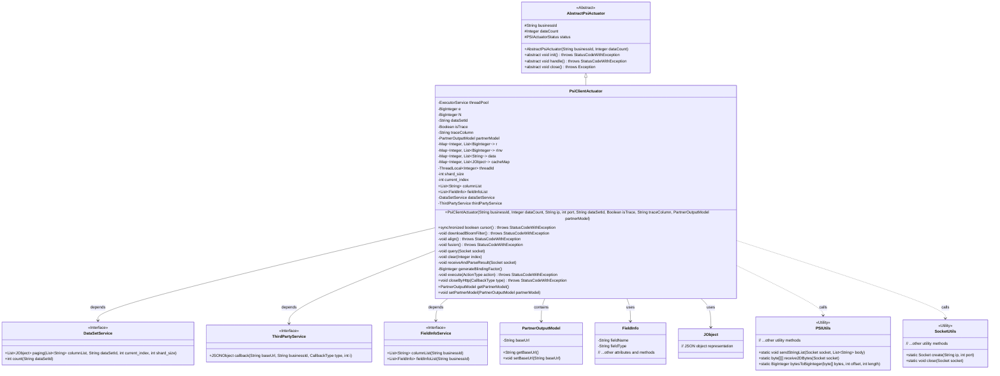
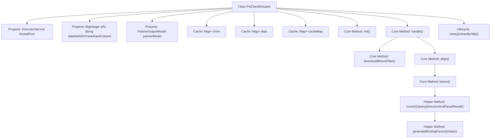
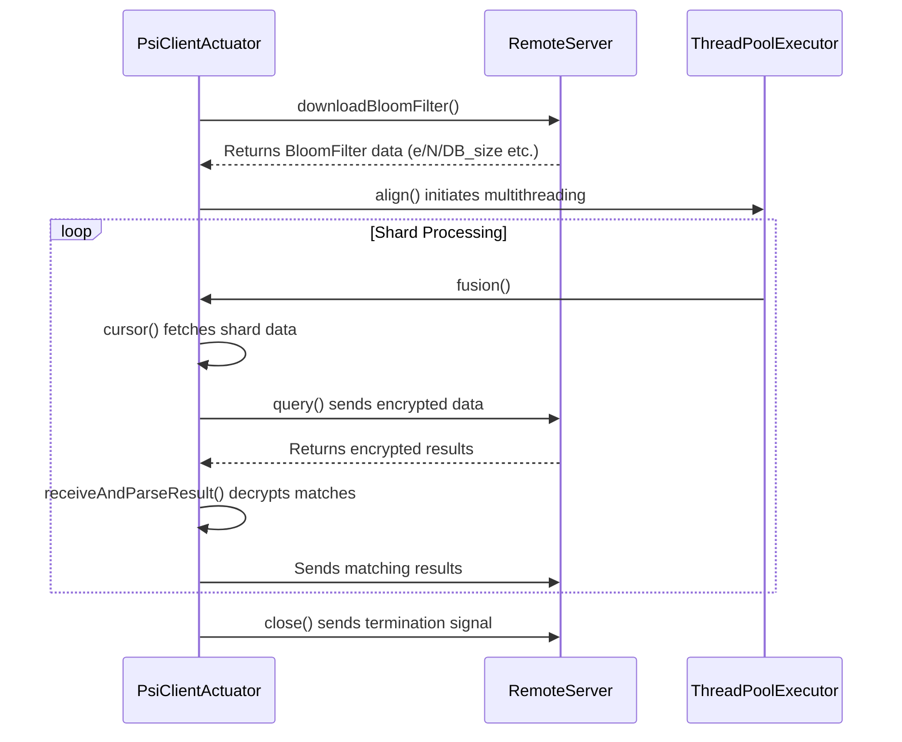

# Basic Information

|      |      |
|------|------|
| Name | PsiClientActuator |
| Language | .java |
| Code Path | WeFe/fusion/fusion-service/src/main/java/com/welab/wefe/data/fusion/service/actuator/rsapsi/PsiClientActuator.java |
| Package Name | com.welab.wefe.data.fusion.service.actuator.rsapsi |
| Dependencies | ['com.alibaba.fastjson.JSONObject', 'com.google.common.collect.Lists', 'com.welab.wefe.common.StatusCode', 'com.welab.wefe.common.exception.StatusCodeWithException', 'com.welab.wefe.common.util.Base64Util', 'com.welab.wefe.common.util.JObject', 'com.welab.wefe.common.web.Launcher', 'com.welab.wefe.data.fusion.service.dto.entity.PartnerOutputModel', 'com.welab.wefe.data.fusion.service.enums.ActionType', 'com.welab.wefe.data.fusion.service.enums.CallbackType', 'com.welab.wefe.data.fusion.service.enums.PSIActuatorStatus', 'com.welab.wefe.data.fusion.service.service.FieldInfoService', 'com.welab.wefe.data.fusion.service.service.ThirdPartyService', 'com.welab.wefe.data.fusion.service.service.dataset.DataSetService', 'com.welab.wefe.data.fusion.service.utils.FusionUtils', 'com.welab.wefe.data.fusion.service.utils.SocketUtils', 'com.welab.wefe.data.fusion.service.utils.bf.BitArray', 'com.welab.wefe.data.fusion.service.utils.bf.BloomFilters', 'com.welab.wefe.data.fusion.service.utils.primarykey.FieldInfo', 'com.welab.wefe.data.fusion.service.utils.primarykey.PrimaryKeyUtils', 'com.welab.wefe.fusion.core.utils.PSIUtils', 'org.apache.commons.collections4.CollectionUtils', 'java.io.DataInputStream', 'java.io.IOException', 'java.math.BigInteger', 'java.net.Socket', 'java.security.SecureRandom', 'java.util.ArrayList', 'java.util.HashMap', 'java.util.List', 'java.util.Map', 'java.util.concurrent'] |
| Brief Description | The PsiClientActuator class implements the client-side logic of the PSI protocol, encompassing functionalities such as paginated data retrieval, encryption, alignment, and result parsing. It utilizes a thread pool to process data shards, supports BloomFilter downloading and data fusion, and accomplishes collaborative computation through Socket communication. Key attributes include the thread pool, encryption parameters, dataset ID, and cache mapping. Core methods consist of cursor() for paginated queries, align() for data alignment, and fusion() for encrypted fusion. |

# Description

The PsiClientActuator is a client-side executor for Private Set Intersection (PSI), inheriting from AbstractPsiActuator. It processes data shard encryption and comparison tasks via a thread pool, with core functionalities including downloading the server's Bloom filter, paginated data retrieval, encrypted queries, and result parsing. Key components consist of thread pool configuration, encryption parameters (e/N), dataset identifiers, tracking fields, and partner models. The execution flow is divided into three phases: initialization, Bloom filter download, and data alignment, achieved through Socket communication for server interaction. Internally, it maintains multiple cache Maps to store intermediate data, supporting shard processing and large dataset operations. It incorporates exception handling and state management mechanisms, ultimately notifying results through callbacks.

# Class Summary

| Name   | Type  | Description |
|-------|------|-------------|
| PsiClientActuator | class | The PsiClientActuator class implements the PSI protocol client logic, including data pagination encryption, Bloom filter downloading, and data alignment functionality. It utilizes a thread pool to handle concurrent tasks and supports field tracing and callback notifications. |

## Class PsiClientActuator

|      |      |
|------|------|
| Access Modifier | public |
| Type | class |
| Name | PsiClientActuator |
| Description | The PsiClientActuator class implements the PSI protocol client logic, including data pagination encryption, Bloom filter downloading, and data alignment functionality. It utilizes a thread pool to handle concurrent tasks and supports field tracing and callback notifications. |

### UML Class Diagram

Class diagram description: PsiClientActuator is an implementation of AbstractPsiActuator, responsible for the client-side execution logic of the PSI (Private Set Intersection) protocol. It processes data shard encryption through a thread pool, communicates with the server using Socket, depends on DataSetService to obtain datasets, and performs callback notifications via ThirdPartyService. The class contains multiple cache Maps for storing intermediate calculation results, with core methods including data downloading (downloadBloomFilter), alignment (align), and fusion operations.

### Internal Method Call Graph

This flowchart illustrates the core structure and execution flow of the PsiClientActuator class. As a client-side implementation of the PSI (Private Set Intersection) protocol, it processes data in shards via thread pools, primarily consisting of three phases: BloomFilter download, encrypted data alignment, and result decryption matching. The sequence diagram details the client-server interaction process, including key steps such as initial connection establishment, encrypted shard data transmission, and result decryption verification, demonstrating the complete lifecycle of multithreaded shard processing and cryptographic protocol execution. The class structure encompasses core components like thread pool management, cryptographic parameter storage, and data shard caching, with execution flow controlled through a state machine.

### Field List

| Name  | Type  | Description |
|-------|-------|------|
| partnerModel | PartnerOutputModel | The private member variable `partnerModel`, of type `PartnerOutputModel`. |
| isTrace | Boolean | Private boolean variable isTrace, used to track state. |
| shard_size = 2000 | int | Set the shard size to 2000. |
| threadId = new ThreadLocal<>() | ThreadLocal<Integer> | Define a thread-local variable `threadId` to store an integer value unique to each thread. |
| dataSetService = Launcher.CONTEXT.getBean(DataSetService.class) | DataSetService | Obtain the DataSetService instance from Launcher.CONTEXT and assign it to the private constant dataSetService. |
| e | BigInteger | Private large integer variable e. |
| fieldInfoList | List<FieldInfo> | Declare a public list named fieldInfoList to store elements of type FieldInfo. |
| current_index = 0 | int | Define an integer variable current_index and initialize it to 0. |
| data = new HashMap<>() | Map<Integer, List<String>> | Declare a HashMap variable named data with Integer as the key and a list of Strings as the value. |
| rInv = new HashMap<>() | Map<Integer, List<BigInteger>> | Declare a private Map variable rInv with Integer keys and values as lists of BigInteger, initialized as a HashMap. |
| N | BigInteger | Declare a private big integer variable N. |
| dataSetId | String | Private string variable for dataset ID. |
| cacheMap = new HashMap<>() | Map<Integer, List<JObject>> | Private hash map with integer keys and a list of JObjects as values. |
| traceColumn | String | Private string type variable traceColumn. |
| threadPool = new ThreadPoolExecutor(            Runtime.getRuntime().availableProcessors(),            Runtime.getRuntime().availableProcessors() * 2,            100L,            TimeUnit.MILLISECONDS,            new LinkedBlockingQueue<>()) | ExecutorService | Create a thread pool with the core thread count equal to the number of CPU cores, the maximum thread count set to twice the core count, non-core threads being recycled after 100 milliseconds of idle time, and an unbounded task queue. |
| r = new HashMap<>() | Map<Integer, List<BigInteger>> | Declare a private Map variable r with Integer keys and a list of BigInteger values, initialized as a HashMap instance. |
| thirdPartyService = Launcher.CONTEXT.getBean(ThirdPartyService.class) | ThirdPartyService | Obtain the ThirdPartyService instance from the Launcher context and assign it to the private constant thirdPartyService. |
| columnList | List<String> | Declare a public string list variable named columnList. |

### Method List

| Name  | Type  | Description |
|-------|-------|------|
| cursor | boolean | Synchronize the method cursor for paginated querying of datasets, record time consumption, cache results, and update the thread ID. Returns whether data was retrieved. |
| fusion | void | The method `fusion` checks the status, establishes a socket connection, executes the query, and receives the result. If the status does not match, it throws an exception. |
| downloadBloomFilter | void | This method is used to download Bloom filter data. It establishes a Socket connection to the server, sends a download request, and then receives the data, including the public key parameters e and N, the number of elements DB_size, the bit size bitSetSize, and the bit array data, ultimately constructing a BloomFilters object. If the connection or download fails, it throws an exception and logs an error message. |
| main | void | Java code example: Create a Socket connection to 127.0.0.1:9090, set 3 retries with 1-second intervals, and send a string list containing "download". |
| align | void | The method `align()` performs data alignment and encryption: it calculates the batch count, processes data fusion in parallel using a thread pool, waits for all threads to complete, records the time consumed, and updates the status to success. Error logs are recorded in case of exceptions. |
| receiveAndParseResult | void | Receive and parse socket data, extract indices and data, process and filter the results before sending them to the server, record processing counts, and clear the cache. |
| generateBlindingFactor | BigInteger | Generate a random blinding factor, ensuring it is non-zero, non-one, and coprime with N. |
| query | void | The method `query` handles Socket queries: retrieves thread index and cached data, generates primary key and blinding factor, computes encrypted values and stores them in a list, records execution time, and finally sends the processed data list. |
| clear | void | Clear the cache, data, mapping relationships, and thread ID for the specified index, and log the operation. |
| execute | void | The method `execute` performs different operations based on the `action` type: it calls `downloadBloomFilter` for `download`, `align` for `align`, otherwise throws an exception. Finally, it updates `lastLogTime` to the current time. |
| close | void | The method close() terminates the callback via HTTP in a non-success state, creates a socket connection, sends the termination action and status information, and then closes the socket. |
| closeByHttp | void | The method `closeByHttp` closes the HTTP connection via a third-party service callback and logs the information. If `partnerModel` is not null, it invokes the callback and outputs the URL and response. |
| init | void | Initialization method: Obtain the field list, supplement tracking fields, locate the primary key field, calculate the shard size, check the dataset row count, and log the results. |
| handle | void | Override the handle method, set the status to running, and sequentially execute the download and align operations. |
| getPartnerModel | PartnerOutputModel | Methods to obtain the partner model, returning an object of type PartnerOutputModel. |
| setPartnerModel | void | Set up the partner model object. |

