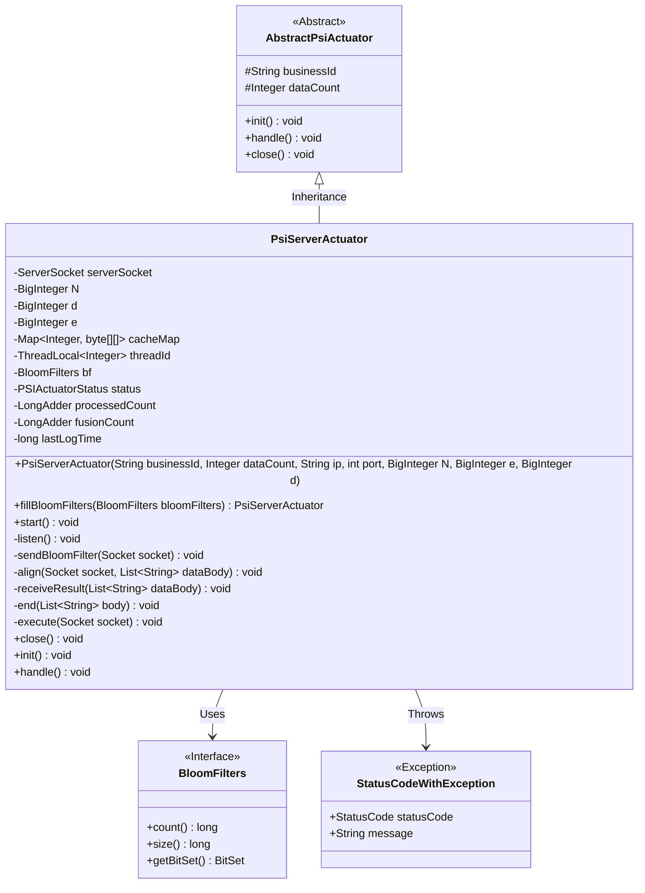
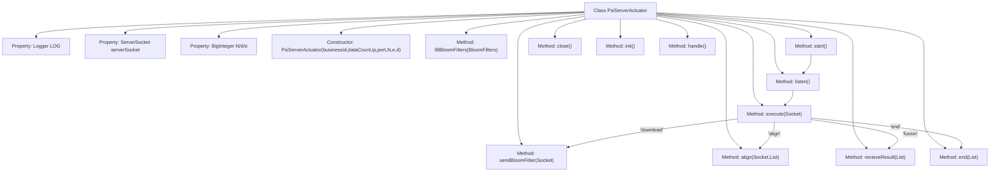

# Basic Information

|      |      |
|------|------|
| Name | PsiServerActuator |
| Language | .java |
| Code Path | WeFe/fusion/fusion-service/src/main/java/com/welab/wefe/data/fusion/service/actuator/rsapsi/PsiServerActuator.java |
| Package Name | com.welab.wefe.data.fusion.service.actuator.rsapsi |
| Dependencies | ['com.alibaba.fastjson.JSONObject', 'com.welab.wefe.common.CommonThreadPool', 'com.welab.wefe.common.StatusCode', 'com.welab.wefe.common.exception.StatusCodeWithException', 'com.welab.wefe.common.util.JObject', 'com.welab.wefe.data.fusion.service.enums.ActionType', 'com.welab.wefe.data.fusion.service.enums.PSIActuatorStatus', 'com.welab.wefe.data.fusion.service.utils.FusionUtils', 'com.welab.wefe.data.fusion.service.utils.bf.BloomFilters', 'com.welab.wefe.fusion.core.utils.CryptoUtils', 'com.welab.wefe.fusion.core.utils.PSIUtils', 'org.apache.commons.collections4.CollectionUtils', 'org.slf4j.Logger', 'org.slf4j.LoggerFactory', 'java.io.DataOutputStream', 'java.io.IOException', 'java.math.BigInteger', 'java.net.InetAddress', 'java.net.ServerSocket', 'java.net.Socket', 'java.util.ArrayList', 'java.util.HashMap', 'java.util.List', 'java.util.Map'] |
| Brief Description | The PsiServerActuator class implements a Socket-based PSI protocol server, containing key parameters N/e/d. It supports initializing Bloom filters, listening on ports, processing alignment requests, and receiving results, with comprehensive state management. |

# Description

The PsiServerActuator is a Java-based server-side executor class designed for handling Private Set Intersection (PSI) tasks. Inheriting from AbstractPsiActuator, it contains core fields such as server sockets, RSA encryption parameters (N, d, e), and cache mappings. Key functionalities include: initializing Bloom filters, starting server port listening, processing client requests (downloading Bloom filters, data alignment, result reception, and task termination), as well as encryption and signing operations. It handles concurrent requests through multithreading, logs detailed execution traces, and implements resource closure interfaces. The class strictly follows a state machine pattern to manage task lifecycles, supporting secure multi-party computation scenarios with large-scale datasets.

# Class Summary

| Name   | Type  | Description |
|-------|------|-------------|
| PsiServerActuator | class | PsiServerActuator is a Java-based server actuator designed for handling encrypted data communication and Bloom filter operations. It listens on ports via ServerSocket, supports four operation types: download, align, merge, and terminate, employs RSA algorithm for data encryption and signing, and records processing status and logs. |

## Class PsiServerActuator

|      |      |
|------|------|
| Access Modifier | public |
| Type | class |
| Name | PsiServerActuator |
| Description | PsiServerActuator is a Java-based server actuator designed for handling encrypted data communication and Bloom filter operations. It listens on ports via ServerSocket, supports four operation types: download, align, merge, and terminate, employs RSA algorithm for data encryption and signing, and records processing status and logs. |

### UML Class Diagram

This code describes the implementation class PsiServerActuator for a PSI (Private Set Intersection) server, which inherits from the abstract class AbstractPsiActuator. The class is primarily responsible for establishing server Socket connections, handling client requests, performing data alignment operations, and managing Bloom filters. Core functionalities include port listening, sending encryption parameters, processing alignment requests, and receiving result data. The class utilizes multiple BigInteger parameters for cryptographic operations and manages thread-local variables through ThreadLocal. Exception handling is implemented via StatusCodeWithException, and state management is controlled through the PSIActuatorStatus enumeration. The overall design reflects the server-side implementation of the PSI protocol, supporting multi-threaded processing and encrypted data transmission.

### Internal Method Call Graph

This code implements a PSI (Private Set Intersection) server actuator, whose core functionalities include initializing server sockets, listening to client requests, and processing different types of operations (downloading Bloom filters, data alignment, result fusion, and termination handling). It employs a multi-threading mechanism to handle concurrent requests, utilizes RSA encryption for data protection, and provides complete lifecycle management (initialization, startup, shutdown). The flowchart clearly illustrates the class structure and core method invocation chain, particularly highlighting the branching process where the execute method routes to different processing logics based on action types.

### Field List

| Name  | Type  | Description |
|-------|-------|------|
| LOG = LoggerFactory.getLogger(PsiServerActuator.class) | Logger | Define a static log object LOG for the PsiServerActuator class, using protected final modifiers to ensure security and immutability. |
| N | BigInteger | Declare a private big integer variable N. |
| serverSocket | ServerSocket | Declare a private variable serverSocket of type ServerSocket. |
| threadId = new ThreadLocal<>() | ThreadLocal<Integer> | Thread-local variable, storing a unique integer ID for each thread. |
| cacheMap = new HashMap<>() | Map<Integer, byte[][]> | Define a private HashMap with Integer as the key and a two-dimensional byte array as the value, used for caching data. |
| d | BigInteger | The private large integer variable d. |
| e | BigInteger | Declare a private big integer variable e. |

### Method List

| Name  | Type  | Description |
|-------|-------|------|
| receiveResult | void | Receive and process data: Record data size, extract and convert data into JObject, then store after counting processed quantities. |
| sendBloomFilter | void | The server sends Bloom filter data via socket, including parameters e and N, the number of elements, the number of bits, and the bitset data, while logging the process. Errors are logged in case of exceptions. |
| start | void | The method start() checks for data initialization and throws an exception if uninitialized. It starts the server Socket to listen on the specified port and logs the event. A thread is then created to execute the listening task. |
| listen | void | Listening on ports and handling connections: Continuously accept socket requests, use a thread pool to execute tasks, catch exceptions, and log error messages. |
| end | void | The method `end` takes a list of strings `body`, converts the first element into the `PSIActuatorStatus` enum type and assigns it to the `status` property, then logs the status. |
| align | void | The method `align` handles data alignment: extracts indices and data, encrypts them, then returns the result while recording processing time and quantity, and logs errors when they occur. |
| fillBloomFilters | PsiServerActuator | The method `fillBloomFilters` assigns the passed Bloom filter to the member variable `bf`, sets the status to `running`, and finally returns the current object. |
| execute | void | The method `execute` processes socket data: it receives the data body, checks for null values, and extracts the action type. Based on the action type, it performs operations such as download, alignment, fusion, or termination, and finally updates the log timestamp. |
| close | void | Rewrite the close method to shut down the serverSocket and log the operation. Capture any exceptions and log the error message. |
| init | void | Here is an example of Java method overriding with an empty implementation that may throw a StatusCodeWithException. |
| handle | void | Method override, calling start(), may throw a StatusCodeWithException. |

