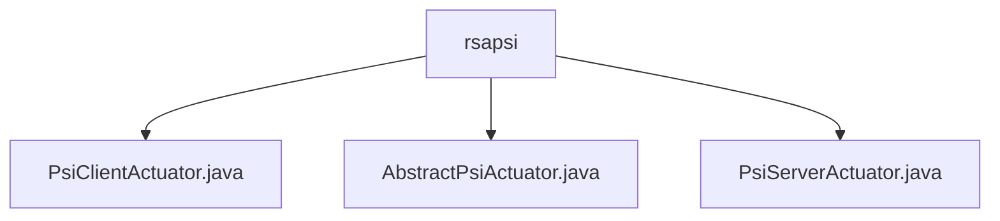

# Basic Information

|      |      |
|------|------|
| Name | rsapsi |
| Language | .java |
| Code Path | WeFe/fusion/fusion-service/src/main/java/com/welab/wefe/data/fusion/service/actuator/rsapsi |
| Package Name | docs.fusion.fusion-service.src.main.java.com.welab.wefe.data.fusion.service.actuator.rsapsi |
| Brief Description | The PsiClientActuator is a PSI client actuator responsible for data encryption and comparison, incorporating a thread pool and encryption parameters. The AbstractPsiActuator serves as an abstract base class, managing PSI task attributes and result processing. The PsiServerActuator is a server-side actuator that handles requests and encryption operations, supporting multithreading and state management. |

# Description

## Overview  
The PsiClientActuator and PsiServerActuator form the dual-end execution modules for Private Set Intersection (PSI), responsible for client-side data encryption/comparison and server-side request processing, respectively. They employ RSA encryption parameters (e/N/d) and Bloom filters to achieve secure data alignment, resembling a secure multi-party computation gateway pattern. Core data structures include thread pool configurations, cache Maps, encryption parameters, and status flags, with phased interactions (initialization/filter download/data alignment) implemented via Socket communication. External dependencies are limited to basic Java networking libraries and cryptographic components. For example, the client performs paginated encrypted queries, while the server handles signature requests with multithreading.  

## Key Business Scenarios  
The complete workflow involves: client-side data sharding → encrypted comparison with the server's Bloom filter → server-side signature returning intersection results. The interaction model follows state machine management, where clients receive results via callbacks, and servers strictly adhere to lifecycle-based request processing. Typical applications include cross-institution secure data matching, such as blacklist comparisons in financial risk control. API types cover filter downloads (HTTP) and data alignment (Socket long connections), with integration cases demonstrating sharding capabilities for large-scale datasets.

### Package Internal Structure View

This flowchart illustrates the hierarchical relationships between three Java files under the rsapsi directory. PsiClientActuator.java, AbstractPsiActuator.java, and PsiServerActuator.java are all directly subordinate to the rsapsi directory with no deeper nesting structure. These three files exist as peers within the rsapsi directory, collectively forming its contents.

# File List

| Name   | Type  | Description |
|-------|------|-------------|
| [PsiClientActuator.java](PsiClientActuator.md) | file | The PsiClientActuator class implements the client-side logic of the PSI protocol, encompassing functionalities such as paginated data retrieval, encryption, alignment, and result parsing. It utilizes a thread pool to process data shards, supports BloomFilter downloading and data fusion, and performs collaborative computation via Socket communication. Key attributes include the thread pool, encryption parameters, dataset ID, and cache mapping. Core methods consist of cursor() for paginated queries, align() for data alignment, and fusion() for encrypted fusion. |
| [AbstractPsiActuator.java](AbstractPsiActuator.md) | file | The abstract class `AbstractPsiActuator` extends `AbstractActuator` and contains attributes such as IP, port, and Bloom filter, with its state defaulting to uninitialized. It provides a `dump` method to process a list of `JObject`, formatting and storing the results. |
| [PsiServerActuator.java](PsiServerActuator.md) | file | The PsiServerActuator class implements a Socket-based PSI protocol server, containing key parameters N/e/d. It supports initializing Bloom filters, listening on ports, processing alignment requests, and receiving results, with comprehensive state management. |

