# Basic Information

|      |      |
|------|------|
| Name | api |
| Language | .java |
| Code Path | WeFe/fusion/fusion-service/src/main/java/com/welab/wefe/data/fusion/service/api |
| Package Name | docs.fusion.fusion-service.src.main.java.com.welab.wefe.data.fusion.service.api |
| Brief Description | The system management module is responsible for initialization, configuration, and key management; the partner module provides CRUD functionality; the Bloom filter module supports CRUD and status queries; the third-party service module handles callbacks and status checks; the file module manages chunked uploads and merging; the dataset module implements lifecycle management; the log module queries operation records; the task module manages the full task lifecycle; the data source module handles data source CRUD and connection testing. |

# Description

## Overview  
This module serves as the core management system of the federated learning platform, adopting a layered architecture design that includes submodules such as system control, data management, and task scheduling. The system control module handles initialization states, global configurations, and security key management, functioning similarly to a control hub pattern. The data management module provides CRUD operations for resources like datasets and Bloom filters. The task scheduling module manages the lifecycle of alignment tasks. The unified interface specification inherits from the AbstractApi base class, with paths defined using @Api annotations, such as "system/is_initialized" to check initialization status. Key data structures include paginated result sets, Input classes with business IDs, and various OutputModel types. External dependencies encompass over ten service components like SystemInitializeService and TaskService, where InitializeApi completes system initialization by validating memberName.

## Key Business Scenarios  
The module supports end-to-end federated learning process management: 1) During system initialization, IsInitializedApi checks the status, and InitializeApi completes the configuration; 2) In the data preparation phase, DatasetApi manages datasets, and BloomfilterApi configures filters; 3) During task execution, TaskApi creates alignment tasks, and ReceiveApi handles collaboration requests. The typical interaction pattern follows RESTful conventions, such as OptionsApi returning an EnumSet<Options>. Functional completeness is reflected in the lifecycle management capabilities of each submodule, such as the partner module supporting full-chain operations from AddApi to DeleteApi. API types include status queries (e.g., GetStateApi), data processing (e.g., MergeApi), and enum retrieval (e.g., TaskStatusApi). Integration cases involve sharded file merging and RSA key rotation.

### Package Internal Structure View

```mermaid
graph TD
    api --> system
    api --> account
    api --> partner
    api --> bloomfilter
    api --> thirdparty
    api --> file
    api --> dataset
    api --> operation
    api --> task
    api --> datasource
    system --> IsInitializedApi.java
    system --> ResetRsaKeyApi.java
    system --> OptionsApi.java
    system --> GlobalConfigUpdateApi.java
    system --> GetGlobalConfigApi.java
    system --> TaskOverviewApi.java
    system --> InitializeApi.java
    system --> ConfigApi.java
    account --> SsoLoginApi.java
    partner --> PagingApi.java
    partner --> UpdateApi.java
    partner --> DeleteApi.java
    partner --> AddApi.java
    partner --> CheckApi.java
    bloomfilter --> QueryApi.java
    bloomfilter --> DetailAndPreviewApi.java
    bloomfilter --> DeleteApi.java
    bloomfilter --> AddApi.java
    bloomfilter --> DetailApi.java
    bloomfilter --> GetBloomFilterStateApi.java
    bloomfilter --> PreviewApi.java
    thirdparty --> CallbackApi.java
    thirdparty --> RemoteCheckApi.java
    file --> MergeApi.java
    file --> UploadApi.java
    dataset --> GetDataSetStateApi.java
    dataset --> QueryApi.java
    dataset --> DetailAndPreviewApi.java
    dataset --> UpdateApi.java
    dataset --> DeleteApi.java
    dataset --> AddApi.java
    dataset --> DetailApi.java
    dataset --> GetHeadersApi.java
    dataset --> PreviewApi.java
    operation --> LogQueryApi.java
    task --> ReceiveApi.java
    task --> InfoApi.java
    task --> PagingApi.java
    task --> UpdateApi.java
    task --> DeleteApi.java
    task --> AddApi.java
    task --> DetailApi.java
    task --> TaskStatusApi.java
    task --> StopTaskApi.java
    task --> HandleApi.java
    datasource --> OverviewApi.java
    datasource --> QueryApi.java
    datasource --> UpdateApi.java
    datasource --> DeleteApi.java
    datasource --> AddApi.java
    datasource --> TestDBConnectApi.java
```

This flowchart presents the complete directory structure of WeFe data fusion service APIs, branching from the root directory "api" into 9 submodules including core functional modules such as system configuration, account management, and partner management. Each submodule contains multiple specific API implementation classes. For example, the system module includes 8 APIs like initialization and RSA key reset, while the dataset module provides 9 operation interfaces including query and update. A total of 47 API nodes are displayed, comprehensively covering the functional architecture of the data fusion service.

# File List

| Name   | Type  | Description |
|-------|------|-------------|
| [thirdparty](thirdparty/_module.md) | package | CallbackApi is a third-party callback interface class, located at thirdparty/callback, inheriting from AbstractNoneOutputApi, handling inputs with mandatory businessId and CallbackType fields along with optional fields. RemoteCheckApi is used to test service status, located at third_party/remote/check, inheriting from AbstractNoneOutputApi, with no additional input fields required. |
| [system](system/_module.md) | package | The IsInitializedApi checks the system initialization status. The ResetRsaKeyApi resets RSA keys. The OptionsApi retrieves operation type options. The GlobalConfigUpdateApi updates global configurations. The GetGlobalConfigApi fetches global configurations. The TaskOverviewApi obtains task overviews. The InitializeApi handles system initialization. The ConfigApi serves as an empty configuration class. |
| [datasource](datasource/_module.md) | package | OverviewApi handles data source overview requests, with the path data_source/overview. QueryApi queries data sources, with the path data_source/query, supporting pagination. UpdateApi updates data sources, with the path data_source/update. DeleteApi deletes data sources, with the path data_source/delete. AddApi adds new data sources. TestDBConnectApi tests database connections, with the path data_source/test_db_connect. All inherit from AbstractApi and implement functionality through DataSourceService. |
| [task](task/_module.md) | package | ReceiveApi receives alignment requests, path task/receive, requires signature. InfoApi retrieves task information, path task/info. PagingApi handles paginated lists, path task/paging. UpdateApi modifies tasks, path task/update. DeleteApi deletes tasks, path task/delete. AddApi adds tasks, path task/add. DetailApi queries details, path task/detail. TaskStatusApi fetches status enums, path task/status. StopTaskApi pauses tasks, path task/stop. HandleApi processes tasks, path task/handle. |
| [account](account/_module.md) | package | SSO Login API class, no login required, call the `ssoLogin` method of `AccountService`, and return an output result containing ID, token, phone number, and nickname. |
| [operation](operation/_module.md) | package | Log query API class, inherits from abstract API, takes inputs including interface name, caller, and time range, outputs paginated operation logs, and invokes OperationLogService to handle the query. |
| [dataset](dataset/_module.md) | package | A collection of API interfaces for obtaining dataset status, querying lists, detail previews, updates, deletions, additions, fetching details, feature fields, and preview files. All require login access and include input/output definitions and service invocation logic. |
| [file](file/_module.md) | package | The MergeApi class handles file chunk merging, verifying file types before combining chunks and deleting temporary files. The UploadApi class manages file uploads, supporting chunked storage and validation while restricting file types to csv/xls/xlsx. |
| [bloomfilter](bloomfilter/_module.md) | package | QueryApi query filter list, inherits AbstractApi, input includes id and name, outputs paginated results. DetailAndPreviewApi retrieves filter details and preview, requires id as input. DeleteApi deletes a filter, requires id and login. AddApi adds a filter, includes multi-field validation. DetailApi retrieves details, requires id and login. GetBloomFilterStateApi retrieves status, includes progress information. PreviewApi previews files, input includes data ID, etc. |
| [partner](partner/_module.md) | package | PagingApi handles partner pagination queries, with inputs including memberId and memberName, and returns paginated results. UpdateApi updates partner information, with inputs containing five mandatory fields. DeleteApi deletes a partner, requiring an id as input. AddApi adds a partner, with inputs containing four mandatory fields. CheckApi tests the service status, requiring memberId as input. |

