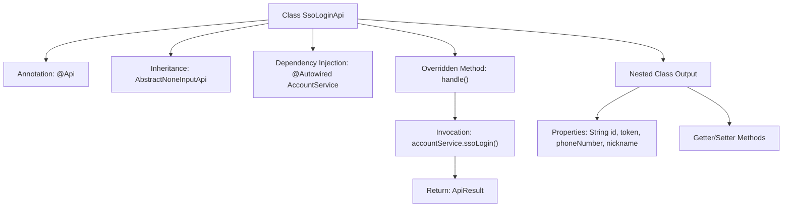

# Basic Information

|      |      |
|------|------|
| Name | SsoLoginApi |
| Language | .java |
| Code Path | WeFe/fusion/fusion-service/src/main/java/com/welab/wefe/data/fusion/service/api/account/SsoLoginApi.java |
| Package Name | com.welab.wefe.data.fusion.service.api.account |
| Dependencies | ['com.welab.wefe.common.exception.StatusCodeWithException', 'com.welab.wefe.common.web.api.base.AbstractNoneInputApi', 'com.welab.wefe.common.web.api.base.Api', 'com.welab.wefe.common.web.dto.AbstractApiOutput', 'com.welab.wefe.common.web.dto.ApiResult', 'com.welab.wefe.data.fusion.service.service.AccountService', 'org.springframework.beans.factory.annotation.Autowired'] |
| Brief Description | SSO login API class, no login required, call the ssoLogin method of AccountService, and return an output result containing ID, token, phone number, and nickname. |

# Description

This is a Java class named SsoLoginApi, designed to handle Single Sign-On (SSO) requests. The class inherits from AbstractNoneInputApi, with the path account/sso_login, and can be accessed without login. It processes requests by invoking the ssoLogin method through the injected AccountService, returning an output result containing the user ID, token, phone number, and nickname. The output class Output extends AbstractApiOutput, providing getter and setter methods for four string fields.

# Class Summary

| Name   | Type  | Description |
|-------|------|-------------|
| SsoLoginApi | class | SSO login API class, calling accountService.ssoLogin returns user ID, token, phone number, and nickname. No login required. |


## Class SsoLoginApi

|      |      |
|------|------|
| Access Modifier | @Api(path = "account/sso_login", name = "sso_login", login = false);public |
| Type | class |
| Name | SsoLoginApi |
| Description | SSO login API class, calling accountService.ssoLogin returns user ID, token, phone number, and nickname. No login required. |


### UML Class Diagram

```mermaid
classDiagram
    class AbstractNoneInputApi~T~ {
        <<Abstract>>
        +handle() ApiResult~T~
    }

    class SsoLoginApi {
        -AccountService accountService
        +handle() ApiResult~Output~
    }

    class AccountService {
        <<Interface>>
        +ssoLogin() SsoLoginApi$Output
    }

    class AbstractApiOutput {
        <<Abstract>>
    }

    class SsoLoginApi$Output {
        -String id
        -String token
        -String phoneNumber
        -String nickname
        +get/set methods...
    }

    SsoLoginApi --|> AbstractNoneInputApi : Inheritance
    SsoLoginApi --> AccountService : Dependency
    SsoLoginApi$Output --|> AbstractApiOutput : Inheritance
```

Class Diagram Description: This diagram illustrates the class structure of the SSO Login API, where the core SsoLoginApi inherits from the generic abstract class AbstractNoneInputApi and relies on the AccountService interface to implement login functionality. The output class Output extends AbstractApiOutput, containing user information fields such as id, token, etc. The overall structure demonstrates the separation of the control layer from services, achieving type-safe API response handling through generics and abstract classes.


### Internal Method Call Graph



This code flowchart illustrates the core structure of the SSO login API. The SsoLoginApi class defines the interface path through the @Api annotation, inherits from an abstract base class, and injects AccountService. The main logic resides in the handle() method, which calls the accountService.ssoLogin() service and returns an ApiResult containing an Output object. The nested Output class defines fields such as user ID, token, phone number, and nickname for login responses, along with standard Getter/Setter methods. The entire process clearly presents the call chain from the API entry point to business logic processing.

### Field List

| Name  | Type  | Description |
|-------|-------|------|
| accountService | AccountService | Using @Autowired to automatically inject an instance of AccountService. |

### Method List

| Name  | Type  | Description |
|-------|-------|------|
| handle | ApiResult<Output> | Java method override, call the ssoLogin method of accountService and return the successful result. |


