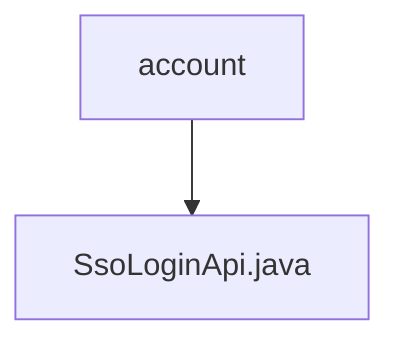

# Basic Information

|      |      |
|------|------|
| Name | account |
| Language | .java |
| Code Path | WeFe/fusion/fusion-service/src/main/java/com/welab/wefe/data/fusion/service/api/account |
| Package Name | docs.fusion.fusion-service.src.main.java.com.welab.wefe.data.fusion.service.api.account |
| Brief Description | SSO Login API class, no login required, call the `ssoLogin` method of `AccountService`, and return an output result containing ID, token, phone number, and nickname. |

# Description

This is a Java class named SsoLoginApi, designed to handle Single Sign-On (SSO) requests. The class inherits from AbstractNoneInputApi, with the path account/sso_login, and can be accessed without login. It processes requests by invoking the ssoLogin method through the injected AccountService, returning an output result containing the user ID, token, phone number, and nickname. The output class Output inherits from AbstractApiOutput, providing getter and setter methods for four string fields.

### Package Internal Structure View

This flowchart illustrates the hierarchical relationship between the account folder and the SsoLoginApi.java file. The account, as the parent directory, contains a child file named SsoLoginApi.java. This is a simple single-layer structure that clearly demonstrates the subordinate relationship between an API interface file and its package directory in a Java project.

# File List

| Name   | Type  | Description |
|-------|------|-------------|
| [SsoLoginApi.java](SsoLoginApi.md) | file | SSO login API class, no login required, call the `ssoLogin` method of `AccountService`, and return an output result containing ID, token, mobile number, and nickname. |

