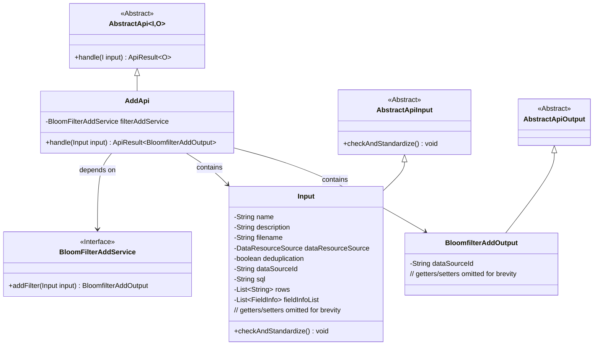
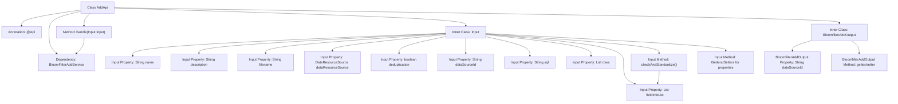

# Basic Information

|      |      |
|------|------|
| Name | AddApi |
| Language | .java |
| Code Path | WeFe/fusion/fusion-service/src/main/java/com/welab/wefe/data/fusion/service/api/bloomfilter/AddApi.java |
| Package Name | com.welab.wefe.data.fusion.service.api.bloomfilter |
| Dependencies | ['com.welab.wefe.common.StatusCode', 'com.welab.wefe.common.exception.StatusCodeWithException', 'com.welab.wefe.common.fieldvalidate.annotation.Check', 'com.welab.wefe.common.web.api.base.AbstractApi', 'com.welab.wefe.common.web.api.base.Api', 'com.welab.wefe.common.web.dto.AbstractApiInput', 'com.welab.wefe.common.web.dto.AbstractApiOutput', 'com.welab.wefe.common.web.dto.ApiResult', 'com.welab.wefe.data.fusion.service.enums.DataResourceSource', 'com.welab.wefe.data.fusion.service.service.bloomfilter.BloomFilterAddService', 'com.welab.wefe.data.fusion.service.utils.primarykey.FieldInfo', 'org.apache.commons.collections4.CollectionUtils', 'org.springframework.beans.factory.annotation.Autowired', 'java.util.List'] |
| Brief Description | API endpoint for adding a filter requires login. Input includes dataset name, description, file, etc. Output is the data source ID. Name length must be 4-30 characters, description cannot exceed 3072 characters, and primary key is mandatory. |

# Description

This code defines an API class named `AddApi` for adding filters. The API path is `filter/add` and requires login access. The input parameter `Input` class includes multiple fields such as dataset name, description, file name, data source type, deduplication flag, data source ID, SQL script, feature columns, and primary key processing information, where the dataset name and deduplication flag are mandatory. The input parameters have strict validation rules, such as length limits for the name and description. The processing logic is handled by `BloomFilterAddService`, and the output is `BloomfilterAddOutput`, which includes the data source ID. The `Input` class also contains custom validation logic to ensure the primary key processing information is not empty.

# Class Summary

| Name   | Type  | Description |
|-------|------|-------------|
| AddApi | class | API interface for adding filters, including input parameters such as dataset name, description, and files. Requires login to use and returns the data source ID. |

## Class AddApi

|      |      |
|------|------|
| Access Modifier | @Api(path = "filter/add", name = "添加过滤器", desc = "添加过滤器", login = true);public |
| Type | class |
| Name | AddApi |
| Description | API interface for adding filters, including input parameters such as dataset name, description, and files. Requires login to use and returns the data source ID. |

### UML Class Diagram

This code demonstrates an API implementation for adding filters, adopting a layered architecture design. The core class AddApi inherits from the generic abstract class AbstractApi, handling input (Input) and output (BloomfilterAddOutput) types. The Input class extends AbstractApiInput and contains multiple fields with validation annotations, while BloomfilterAddOutput inherits from AbstractApiOutput. AddApi implements business logic through the dependency-injected BloomFilterAddService interface, reflecting clear separation of responsibilities and dependency inversion principles.

### Internal Method Call Graph

This code describes an API class AddApi for adding filters, which inherits from AbstractApi and includes an input parameter handling class Input and an output result class BloomfilterAddOutput. The Input class contains multiple properties with validation annotations and parameter standardization methods, while BloomfilterAddOutput encapsulates the returned data source ID. The core process involves calling the BloomFilterAddService through the handle method to complete the filter addition operation, with strict parameter validation and standardization performed during the process.

### Field List

| Name  | Type  | Description |
|-------|-------|------|
| filterAddService | BloomFilterAddService | Automatically inject Bloom filter to add service instances. |

### Method List

| Name  | Type  | Description |
|-------|-------|------|
| handle | ApiResult<BloomfilterAddOutput> | Java method override, calling filterAddService.addFilter to process the input and return an ApiResult. |

