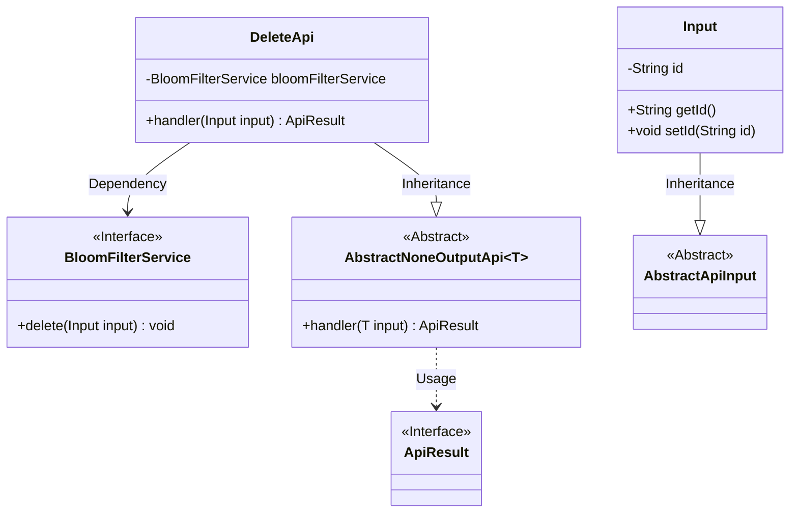
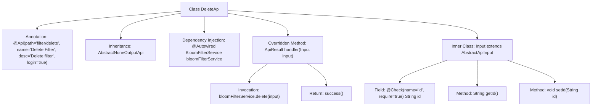

# Basic Information

|      |      |
|------|------|
| Name | DeleteApi |
| Language | .java |
| Code Path | WeFe/fusion/fusion-service/src/main/java/com/welab/wefe/data/fusion/service/api/bloomfilter/DeleteApi.java |
| Package Name | com.welab.wefe.data.fusion.service.api.bloomfilter |
| Dependencies | ['com.welab.wefe.common.fieldvalidate.annotation.Check', 'com.welab.wefe.common.web.api.base.AbstractNoneOutputApi', 'com.welab.wefe.common.web.api.base.Api', 'com.welab.wefe.common.web.dto.AbstractApiInput', 'com.welab.wefe.common.web.dto.ApiResult', 'com.welab.wefe.data.fusion.service.service.bloomfilter.BloomFilterService', 'org.springframework.beans.factory.annotation.Autowired'] |
| Brief Description | API class for deleting filters, requires login, invokes BloomFilterService to delete the filter with the specified ID. The input parameter is a mandatory ID field. |

# Description

This is an API class for deleting filters, with the path "filter/delete" requiring login authentication. The class inherits from AbstractNoneOutputApi, with the generic parameter being the inner class Input. The deletion operation is performed via BloomFilterService, and the input parameter Input includes the mandatory field id along with its getter/setter methods. The processing logic is straightforward: it calls the service to delete and then returns a successful result.

# Class Summary

| Name   | Type  | Description |
|-------|------|-------------|
| DeleteApi | class | Delete Filter API, requires login, accepts ID parameter to invoke BloomFilterService deletion operation, returns success result. |

## Class DeleteApi

|      |      |
|------|------|
| Access Modifier | @Api(path = "filter/delete", name = "删除过滤器", desc = "删除过滤器", login = true);public |
| Type | class |
| Name | DeleteApi |
| Description | Delete Filter API, requires login, accepts ID parameter to invoke BloomFilterService deletion operation, returns success result. |

### UML Class Diagram

This code demonstrates the implementation of a delete filter API, where the core DeleteApi class inherits from the generic abstract class AbstractNoneOutputApi and relies on the BloomFilterService interface to perform deletion operations. The input parameters are defined via the nested Input class, which inherits from the base class AbstractApiInput and includes a mandatory id field. The class diagram clearly illustrates inheritance relationships (DeleteApi→AbstractNoneOutputApi, Input→AbstractApiInput) and dependency relationships (DeleteApi→BloomFilterService), while achieving excellent extensibility through generics and abstract classes.

### Internal Method Call Graph

This code demonstrates a Spring framework-based API class DeleteApi, primarily designed to handle delete filter requests. The class defines the interface path and metadata via the @Api annotation, inherits from an abstract class, and injects the BloomFilterService. The core logic resides in the handler method, which invokes the service-layer delete operation and returns a success result. The inner class Input defines the mandatory id field with its getter/setter, validated through the @Check annotation. The flowchart clearly presents the class structure, method invocation relationships, and parameter validation flow.

### Field List

| Name  | Type  | Description |
|-------|-------|------|
| bloomFilterService | BloomFilterService | Automatically inject the Bloom filter service instance. |

### Method List

| Name  | Type  | Description |
|-------|-------|------|
| handler | ApiResult | Override the parent class handler method, call the Bloom filter service to delete the input data, and return a successful result. |

